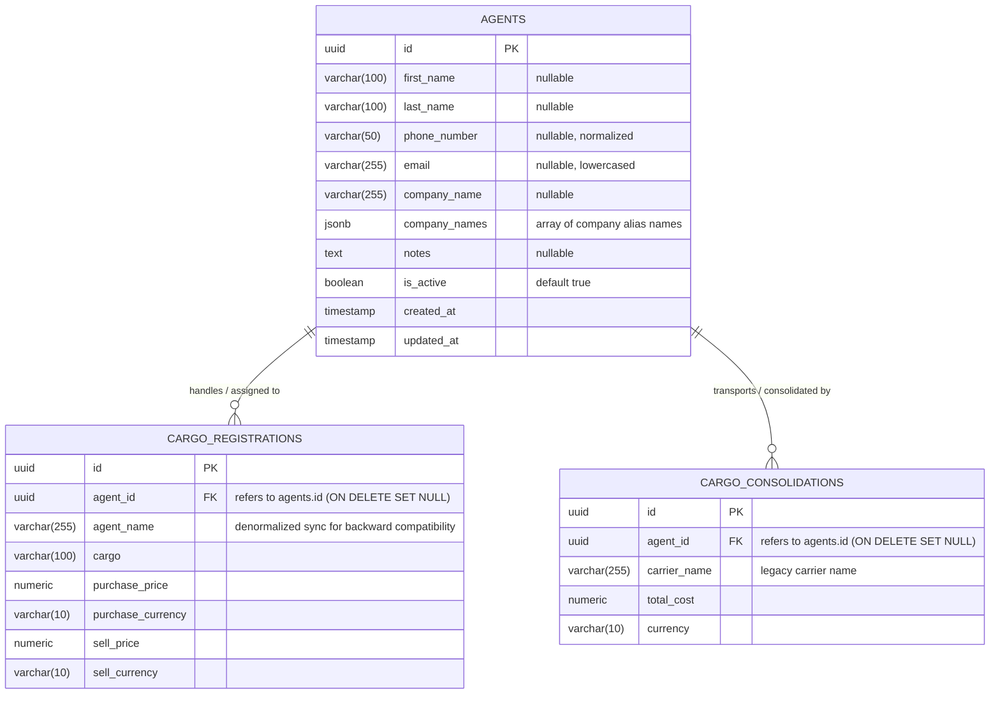

# Yaqeen Backend - Agents Module & Integration Documentation

This document provides a comprehensive specification of the **Agents Module**, its integration with **Cargo Registrations**, **Cargo Consolidations**, the **Dashboard Summary**, and the **Intelligent Agent Deduplication Engine**.

---

## 1. Overview & Business Objectives

Previously, cargo registrations and consolidations relied on free-text string inputs for `agent_name`, which led to spelling variations, typos, and fragmented reporting (e.g., `"Tie Tie"`, `"TieTie"`, `"Tie tie"`, `"tieTie"`, and `"tietie"` were treated as distinct entities).

The **Agents Module** introduces a centralized registry of shipping agents/carriers:

- **Centralized Profiles**: Tracks first name, last name, primary phone number, email address, primary company name, alternative company names (alias list), notes, and active status.
- **Foreign Key Linkage**: Relates `cargo_registrations` and `cargo_consolidations` to canonical `agents` records via `agent_id`.
- **Backward Compatibility**: Automatically resolves and synchronizes legacy `agent_name` fields so historical reporting and existing integrations continue to function seamlessly.
- **Dashboard Accounts Payable**: Enriches creditor and carrier debt summaries with agent entity details (`agentId`, `companyName`, `phoneNumber`, `email`).
- **Intelligent Deduplication Engine**: Automatically identifies identical agent name patterns from existing cargo databases and migrates them into deduplicated, canonical agent profiles.

---

## 2. Access Control & Authorization (RBAC)

All endpoints are protected with `JwtAuthGuard` and `PermissionsGuard`. The system uses the permission key **`agents`**.

### Role Permissions Matrix

| Role         | `can_read` | `can_create` | `can_update` | `can_delete` | Description                                       |
| :----------- | :--------: | :----------: | :----------: | :----------: | :------------------------------------------------ |
| **CEO**      |     ✅     |      ✅      |      ✅      |      ✅      | Full administrative management of all agents.     |
| **ROP**      |     ✅     |      ✅      |      ✅      |      ✅      | Head of Department management of all agents.      |
| **EMPLOYEE** |     ✅     |      ✅      |      ✅      |      ❌      | Can view, create, and edit agents; cannot delete. |

### Error Codes Registry

| Error Key                     | HTTP Status | Description                                                                                           |
| :---------------------------- | :---------: | :---------------------------------------------------------------------------------------------------- |
| `unauthorized`                |     401     | Missing or invalid JWT access token.                                                                  |
| `insufficient_permissions`    |     403     | User role does not have the required permission for the `agents` module.                              |
| `agent_not_found`             |     404     | Target agent record does not exist in the database.                                                   |
| `agent_has_associated_cargos` |     400     | Attempted to hard-delete an agent with active cargo registrations. The agent was deactivated instead. |
| `invalid_phone_number`        |     400     | Phone number format is invalid.                                                                       |
| `invalid_email`               |     400     | Email address format is invalid.                                                                      |

---

## 3. System Architecture & Entity Relationships



---

## 4. REST API Endpoint Specifications

Base route: `/agents`

---

### 4.1. List Agents (Paginated)

Retrieves a paginated list of agents with search, active status filter, and live cargo metrics.

- **URL:** `GET /agents`
- **Permission:** `agents.can_read`
- **Query Parameters:**
  - `page` (optional, integer, default: `1`): Current page number.
  - `limit` (optional, integer, default: `20`, max: `100`): Items per page.
  - `q` (optional, string): Fuzzy search across `first_name`, `last_name`, `company_name`, `phone_number`, `email`, and JSON array `company_names`.
  - `is_active` (optional, boolean): Filter by active status (`true` or `false`).
  - `sort_by` (optional, string, default: `created_at`): Column to sort by (`first_name`, `last_name`, `company_name`, `created_at`, `total_cargos_count`, `active_cargos_count`, `total_payable_amount`).
  - `sort_order` (optional, enum: `'asc'` | `'desc'`, default: `'desc'`).

#### Response Example (`200 OK`)

```json
{
  "data": [
    {
      "id": "0058c7d9-fd30-4326-8e74-6e7e572753b7",
      "first_name": "Tie",
      "last_name": "Tie",
      "display_name": "Tie Tie",
      "phone_number": "+998901234567",
      "email": "tietie@logistics.com",
      "company_name": "TieTie Express Logistics",
      "company_names": ["TieTie Express", "Tie Tie Cargo"],
      "notes": "Reliable road carrier for Yiwu-Tashkent routes",
      "is_active": true,
      "created_at": "2026-09-05T08:52:22.545Z",
      "updated_at": "2026-09-05T08:52:22.545Z",
      "total_cargos_count": 15,
      "active_cargos_count": 3,
      "total_payable_amount": 4250.0
    }
  ],
  "meta": {
    "total": 1,
    "page": 1,
    "limit": 20,
    "totalPages": 1
  }
}
```

---

### 4.2. Dropdown List (Lightweight)

Optimized for populating select dropdowns in cargo registration forms and filter menus.

- **URL:** `GET /agents/dropdown`
- **Permission:** `agents.can_read`
- **Query Parameters:**
  - `q` (optional, string): Search term for filtering results.

#### Response Example (`200 OK`)

```json
[
  {
    "id": "0058c7d9-fd30-4326-8e74-6e7e572753b7",
    "display_name": "Tie Tie",
    "company_name": "TieTie Express Logistics",
    "phone_number": "+998901234567"
  },
  {
    "id": "d801ea6a-00d7-4095-8775-d3fdae18c931",
    "display_name": "Silk Road Cargo",
    "company_name": "Silk Road LLC",
    "phone_number": "+998971112233"
  }
]
```

---

### 4.3. Get Agent by ID

Retrieves full details for a single agent, including aggregated financial and cargo metrics.

- **URL:** `GET /agents/:id`
- **Permission:** `agents.can_read`

#### Response Example (`200 OK`)

```json
{
  "id": "0058c7d9-fd30-4326-8e74-6e7e572753b7",
  "first_name": "Tie",
  "last_name": "Tie",
  "display_name": "Tie Tie",
  "phone_number": "+998901234567",
  "email": "tietie@logistics.com",
  "company_name": "TieTie Express Logistics",
  "company_names": ["TieTie Express", "Tie Tie Cargo"],
  "notes": "Verified partner",
  "is_active": true,
  "created_at": "2026-09-05T08:52:22.545Z",
  "updated_at": "2026-09-05T08:52:22.545Z",
  "total_cargos_count": 15,
  "active_cargos_count": 3,
  "total_payable_amount": 4250.0
}
```

---

### 4.4. Create Agent

Creates a new shipping agent record. At least one of `first_name`, `last_name`, or `company_name` should be provided.

- **URL:** `POST /agents`
- **Permission:** `agents.can_create`

#### Request Body

```json
{
  "first_name": "Farrukh",
  "last_name": "Karimov",
  "phone_number": "+998 90 987 65 43",
  "email": "farrukh.k@translogistics.uz",
  "company_name": "TransLogistics Group LLC",
  "company_names": ["TransLogistics Tashkent", "TLG China Branch"],
  "notes": "Primary agent for container consignments via Dostyk"
}
```

#### Field Specifications

| Field           | Type       | Validation Rules          | Description                                       |
| :-------------- | :--------- | :------------------------ | :------------------------------------------------ |
| `first_name`    | `string`   | Optional, max 100 chars   | Agent's given name.                               |
| `last_name`     | `string`   | Optional, max 100 chars   | Agent's family name.                              |
| `phone_number`  | `string`   | Optional, normalized      | Primary contact phone number.                     |
| `email`         | `string`   | Optional, valid email     | Contact email address (automatically lowercased). |
| `company_name`  | `string`   | Optional, max 255 chars   | Primary company name.                             |
| `company_names` | `string[]` | Optional array of strings | Alternate company aliases or subsidiary names.    |
| `notes`         | `string`   | Optional                  | Free-form notes or comments.                      |

#### Response Example (`201 Created`)

```json
{
  "id": "e4f21051-bd6b-4e63-872e-0fa39ff018be",
  "first_name": "Farrukh",
  "last_name": "Karimov",
  "phone_number": "+998909876543",
  "email": "farrukh.k@translogistics.uz",
  "company_name": "TransLogistics Group LLC",
  "company_names": ["TransLogistics Tashkent", "TLG China Branch"],
  "notes": "Primary agent for container consignments via Dostyk",
  "is_active": true,
  "created_at": "2026-09-05T09:15:00.000Z",
  "updated_at": "2026-09-05T09:15:00.000Z"
}
```

---

### 4.5. Update Agent

Updates an existing agent profile. When `first_name`, `last_name`, or `company_name` are modified, the denormalized `agent_name` on all linked cargo registrations is automatically cascaded and synchronized.

- **URL:** `PATCH /agents/:id`
- **Permission:** `agents.can_update`

#### Request Body (Partial updates accepted)

```json
{
  "company_name": "TransLogistics International LLC",
  "phone_number": "+998 90 999 88 77",
  "is_active": true
}
```

#### Response Example (`200 OK`)

```json
{
  "id": "e4f21051-bd6b-4e63-872e-0fa39ff018be",
  "first_name": "Farrukh",
  "last_name": "Karimov",
  "company_name": "TransLogistics International LLC",
  "phone_number": "+998909998877",
  "email": "farrukh.k@translogistics.uz",
  "company_names": ["TransLogistics Tashkent", "TLG China Branch"],
  "notes": "Primary agent for container consignments via Dostyk",
  "is_active": true,
  "created_at": "2026-09-05T09:15:00.000Z",
  "updated_at": "2026-09-05T09:20:10.000Z"
}
```

---

### 4.6. Delete Agent

Soft-deletes or hard-deletes an agent.

- **Protection Rule:** If the agent has any existing cargo registrations, the endpoint will **not** break data integrity. Instead, it marks `is_active: false` and returns `deactivated: true`.
- If no associated cargos exist, the record is removed from the database.

- **URL:** `DELETE /agents/:id`
- **Permission:** `agents.can_delete`

#### Response Example (Soft-deactivated because of linked cargos)

```json
{
  "success": true,
  "message": "Agent has associated cargos; status set to inactive instead of deletion.",
  "deactivated": true
}
```

#### Response Example (Permanently deleted)

```json
{
  "success": true,
  "message": "Agent successfully deleted."
}
```

---

## 5. Integration with Cargo Registrations

### 5.1. Creating / Updating Cargos with `agent_id`

When creating or updating a cargo registration, frontend applications should provide `agent_id`:

```json
POST /cargo-registrations
{
  "cargo": "Electronics Consignment #402",
  "cargo_type": "FTL",
  "agent_id": "0058c7d9-fd30-4326-8e74-6e7e572753b7",
  "volume": 25.5,
  "weight": 8500,
  "purchase_price": 3200,
  "purchase_currency": "USD",
  "sell_price": 4000,
  "sell_currency": "USD"
}
```

#### Automatic Resolution & Backward Compatibility:

1. When `agent_id` is supplied, the backend fetches the agent record and automatically sets `agent_name` to the agent's display name (e.g. `"Tie Tie"` or `"TransLogistics LLC"`).
2. If legacy code passes only `agent_name`, the backend saves `agent_name` and attempts to link to a matching agent record if one exists.
3. For `FTL` (Full Truck Load) cargo type validation, supplying either `agent_id` or `agent_name` satisfies the mandatory agent requirement.

### 5.2. Reading Cargo Registrations

Queries returning cargo records (`GET /cargo-registrations` and `GET /cargo-registrations/:id`) automatically join the `agents` table and return enriched agent metadata:

```json
{
  "id": "b1710156-f577-4685-89a6-984464402487",
  "cargo": "Cargo Tie Tie",
  "agent_id": "0058c7d9-fd30-4326-8e74-6e7e572753b7",
  "agent_name": "Tie Tie",
  "agent": {
    "id": "0058c7d9-fd30-4326-8e74-6e7e572753b7",
    "first_name": "Tie",
    "last_name": "Tie",
    "company_name": null,
    "company_names": [],
    "phone_number": "+998901234567",
    "email": "tietie@logistics.com"
  }
}
```

### 5.3. Filtering Cargos by Agent

`GET /cargo-registrations` supports filtering by `agent_id`:

```
GET /cargo-registrations?agent_id=0058c7d9-fd30-4326-8e74-6e7e572753b7
```

---

## 6. Integration with Cargo Consolidations

`cargo_consolidations` supports `agent_id` for groupage / consolidated shipments:

- In `POST /cargo-consolidations`, `PATCH /cargo-consolidations/:id`, and inline creation `POST /cargo-consolidations/inline`, `agent_id` is accepted.
- When creating consolidations with attached or newly created inline cargo registrations, `agent_id` is automatically propagated to the child cargo registrations.

---

## 7. Dashboard Summary & Accounts Payable Integration

The debt summary (`GET /dashboard/summary` / `GET /dashboard/creditors-summary`) aggregates accounts payable owed to carriers and agents.

### Enhanced Creditor Entity Information

Creditor items (`creditorsCarrier` in `debtSummary`) now include agent identity fields:

```json
{
  "debtSummary": {
    "totalCreditorCarrierDebt": 12500.0,
    "creditorsCarrier": [
      {
        "agentName": "Tie Tie",
        "agentId": "0058c7d9-fd30-4326-8e74-6e7e572753b7",
        "companyName": "TieTie Express Logistics",
        "phoneNumber": "+998901234567",
        "email": "tietie@logistics.com",
        "totalDebt": 4250.0,
        "currency": "USD"
      }
    ]
  }
}
```

The dashboard endpoint also supports filtering the entire dashboard by agent:

```
GET /dashboard/summary?agent_id=0058c7d9-fd30-4326-8e74-6e7e572753b7
```

---

## 8. Intelligent Agent Deduplication Engine & Migration Script

The deduplication engine ([`scripts/agent-deduplication.engine.ts`](file:///D:/Shakhzod/Javascript/Yaqeen_Backend/scripts/agent-deduplication.engine.ts)) solves messy real-world agent naming discrepancies.

### 8.1. How It Identifies Matching Variations

When encountering variations such as:
`"Tie Tie"`, `"TieTie"`, `"Tie tie"`, `"tieTie"`, `"tietie"`

The engine processes names through a multi-tier clustering pipeline:

1. **Cyrillic-to-Latin Transliteration**: Standardizes Cyrillic inputs (e.g., `"Тие Тие"` -> `"Tie Tie"`).
2. **CamelCase / PascalCase Splitting**: Converts `"TieTie"` or `"tieTie"` into separate tokens `"Tie Tie"`.
3. **Punctuation & Whitespace Normalization**: Strips dashes, periods, quotes, and collapse multiple spaces.
4. **Alphanumeric Slug Generation**: Generates a collapsed lowercase slug:
   - `"Tie Tie"` -> `slug: "tietie"`
   - `"TieTie"` -> `slug: "tietie"`
   - `"Tie tie"` -> `slug: "tietie"`
   - `"tieTie"` -> `slug: "tietie"`
   - `"tietie"` -> `slug: "tietie"`
     **All 5 variations map to the exact same slug**, guaranteeing 100% exact match clustering with zero false positives.
5. **Corporate Noise Stripping & Token Permutations**: Strips common corporate words (`LLC`, `LTD`, `OOO`, `MCHJ`, `CARGO`, `LOGISTICS`, `AGENT`, `TRANS`) to match inverted names (e.g., `"Silk Road Cargo"` and `"Cargo Silk Road"`).
6. **String Similarity Distance**: Uses Jaro-Winkler and Levenshtein similarity (configurable threshold default: `0.88`) for minor typos or phonetic shifts.
7. **Entity Classification & Smart Parsing**:
   - Detects whether a string is a company or a person.
   - Preserves corporate acronym capitalization (e.g., `LLC`, `LTD`, `MCHJ`).
   - Parses person names into `first_name` and `last_name`.

### 8.2. Running the Deduplication Script

Two npm scripts are configured in `package.json`:

#### Dry Run (Inspection Mode - No DB changes)

To inspect existing database records and preview the proposed clusters:

```bash
npm run agents:deduplicate
```

Or with custom flags:

```bash
npx ts-node scripts/deduplicate-and-migrate-agents.ts --dry-run --verbose --threshold 0.85
```

#### Apply Migration (Transactional Database Write)

To create the canonical agent records and link all existing cargo registrations and consolidations:

```bash
npm run agents:migrate
```

Or directly via CLI:

```bash
npx ts-node scripts/deduplicate-and-migrate-agents.ts --apply
```

#### CLI Flags Reference

| Flag                   | Default           | Description                                                                     |
| :--------------------- | :---------------- | :------------------------------------------------------------------------------ |
| `--dry-run`            | Active by default | Inspects data and outputs clusters without modifying the database.              |
| `--apply`              | Off               | Executes the transactional database insert and updates `agent_id` foreign keys. |
| `--threshold <number>` | `0.88`            | Similarity threshold for fuzzy matching (`0.0` to `1.0`).                       |
| `--verbose`            | Off               | Prints detailed token matching and classification diagnostic output.            |

#### Idempotency Guarantee

The migration script is completely idempotent. If run multiple times, it recognizes existing canonical agents in the `agents` table, avoiding duplicates and only linking unlinked cargos.
