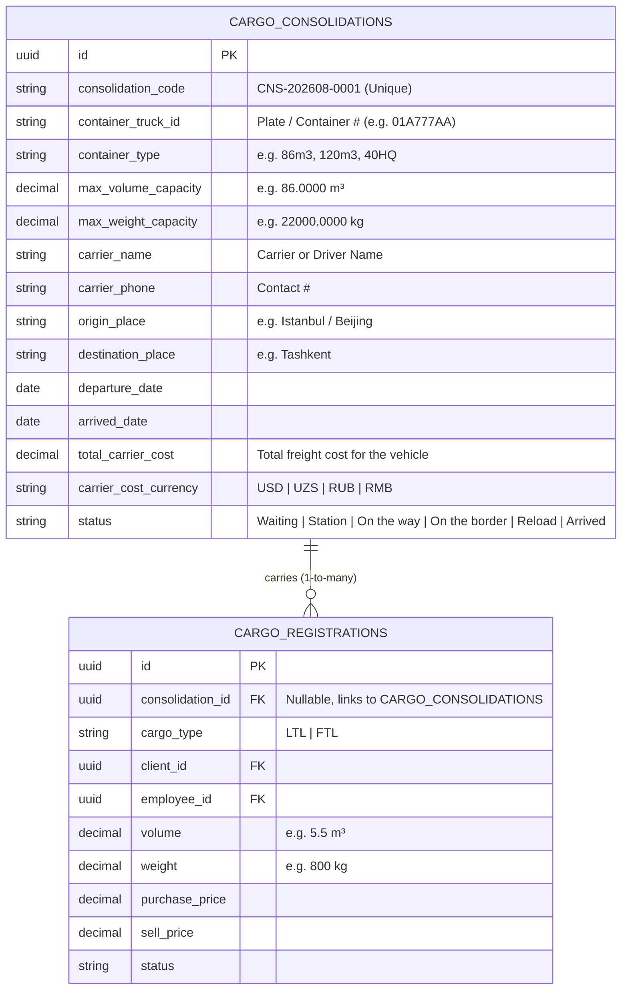

# Cargo Consolidations & Truck Groupage (LTL) API Documentation

This document covers the **Cargo Consolidations (Groupage / Сборный груз)** architecture in the Yaqeen Backend ERP. It explains the data modeling, capacity utilization engine, batch management, API contracts, and the frontend implementation guide for the **["Search or Create" Dropdown]** UI pattern.

---

## 1. Business Context & Architecture Overview

In freight forwarding and logistics:

- **The Commercial Layer (Client LTL Cargos):** Individual orders for each client (e.g., 10 different clients' loads), each with its own volume ($m^3$), weight ($kg$), client ID, sales manager/employee ID, purchase price, and sell price.
- **The Operational Layer (The Consolidated Truck / Container Trip):** The physical vehicle, container code, driver/carrier, route (Origin $\to$ Destination), departure/arrival dates, total truck cost, and capacity limits ($m^3$ volume capacity, $kg$ weight capacity).



---

## 2. Database Schema

### `cargo_consolidations` Table

| Column                                | Type            | Constraints                                           | Description                                                                      |
| :------------------------------------ | :-------------- | :---------------------------------------------------- | :------------------------------------------------------------------------------- |
| `id`                                  | `UUID`          | `PRIMARY KEY`, Default: `uuid_generate_v4()`          | Unique consolidation record identifier                                           |
| `consolidation_code`                  | `VARCHAR(50)`   | `NOT NULL`, `UNIQUE`, Indexed                         | Auto-generated code (e.g., `CNS-202608-0001`) or custom code                     |
| `container_truck_id`                  | `VARCHAR(100)`  | `NOT NULL`, Indexed                                   | Vehicle plate or container number (e.g. `01A777AA`, `TRK-9021`)                  |
| `container_type`                      | `VARCHAR(50)`   | `NULLABLE`                                            | Body/Container type (e.g. `86m3`, `120m3`, `40HQ`, `Tent`)                       |
| `transport_types`                     | `TEXT[]`        | `NOT NULL`, Default: `ARRAY['auto']::text[]`, GIN     | Dedicated multimodal transport types (`auto`, `railway`, `air`, `sea`, `other`)  |
| `max_volume_capacity`                 | `DECIMAL(12,4)` | `NULLABLE`                                            | Maximum volume capacity in $m^3$                                                 |
| `max_weight_capacity`                 | `DECIMAL(12,4)` | `NULLABLE`                                            | Maximum weight capacity in $kg$                                                  |
| `carrier_name`                        | `VARCHAR(255)`  | `NULLABLE`                                            | Transportation company or driver full name                                       |
| `carrier_phone`                       | `VARCHAR(50)`   | `NULLABLE`                                            | Driver/Carrier contact phone number                                              |
| `origin_place`                        | `VARCHAR(255)`  | `NULLABLE`                                            | Origin loading station/city (e.g., `Beijing`, `Istanbul`, `Yiwu`)                |
| `origin_country`                      | `VARCHAR(100)`  | `NULLABLE`                                            | Origin country name (e.g., `China`, `Turkey`)                                    |
| `origin_country_code`                 | `VARCHAR(10)`   | `NULLABLE`                                            | Origin 2-letter ISO country code (`CN`, `TR`)                                    |
| `origin_geoname_id`                   | `INTEGER`       | `NULLABLE`, Indexed                                   | Origin global GeoNames ID                                                        |
| `origin_lat` / `origin_lng`           | `DECIMAL(10,7)` | `NULLABLE`                                            | Origin geographic coordinates                                                    |
| `destination_place`                   | `VARCHAR(255)`  | `NULLABLE`                                            | Final delivery city/customs (e.g., `Tashkent`, `Samarkand`)                      |
| `destination_country`                 | `VARCHAR(100)`  | `NULLABLE`                                            | Destination country name (e.g., `Uzbekistan`)                                    |
| `destination_country_code`            | `VARCHAR(10)`   | `NULLABLE`                                            | Destination 2-letter ISO country code (`UZ`)                                     |
| `destination_geoname_id`              | `INTEGER`       | `NULLABLE`, Indexed                                   | Destination global GeoNames ID                                                   |
| `destination_lat` / `destination_lng` | `DECIMAL(10,7)` | `NULLABLE`                                            | Destination geographic coordinates                                               |
| `load_date` / `loaded_date`           | `DATE`          | `NULLABLE`                                            | Loading completion date (`YYYY-MM-DD`, detail view)                              |
| `departure_date`                      | `DATE`          | `NULLABLE`, Indexed                                   | Truck departure date (`YYYY-MM-DD`)                                              |
| `border_arrival_date`                 | `DATE`          | `NULLABLE`                                            | Border arrival date (`YYYY-MM-DD`, detail view)                                  |
| `tashkent_arrival_date`               | `DATE`          | `NULLABLE`                                            | Tashkent destination arrival date (`YYYY-MM-DD`, detail view)                    |
| `estimated_arrival_date`              | `DATE`          | `NULLABLE`                                            | Expected arrival date (`YYYY-MM-DD`)                                             |
| `arrived_date`                        | `DATE`          | `NULLABLE`, Indexed                                   | Actual arrival date (`YYYY-MM-DD`)                                               |
| `total_carrier_cost`                  | `DECIMAL(14,2)` | `NOT NULL`, Default: `0.00`                           | Full carrier cost paid for the whole truck/container (alias to agent)            |
| `agent`                               | `DECIMAL(14,2)` | `NOT NULL`, Default: `0.00`                           | Agent line-haul / carrier expense amount                                         |
| `agent_currency`                      | `VARCHAR(10)`   | `NOT NULL`, Default: `'USD'`                          | Agent currency (`USD`, `UZS`, `RUB`, `RMB`)                                      |
| `china_warehouse`                     | `DECIMAL(14,2)` | `NOT NULL`, Default: `0.00`                           | China origin warehouse storage / handling expense amount                         |
| `china_warehouse_currency`            | `VARCHAR(10)`   | `NOT NULL`, Default: `'USD'`                          | China warehouse currency (`USD`, `UZS`, `RUB`, `RMB`)                            |
| `company_service`                     | `DECIMAL(14,2)` | `NOT NULL`, Default: `0.00`                           | Internal company operational service expense amount                              |
| `company_service_currency`            | `VARCHAR(10)`   | `NOT NULL`, Default: `'USD'`                          | Company service currency (`USD`, `UZS`, `RUB`, `RMB`)                            |
| `customs_clearance_of_goods`          | `DECIMAL(14,2)` | `NOT NULL`, Default: `0.00`                           | Customs clearance of goods clearance expense amount                              |
| `customs_clearance_of_goods_currency` | `VARCHAR(10)`   | `NOT NULL`, Default: `'USD'`                          | Customs clearance currency (`USD`, `UZS`, `RUB`, `RMB`)                          |
| `cct`                                 | `DECIMAL(14,2)` | `NOT NULL`, Default: `0.00`                           | CCT / Cargo Container Terminal expense amount                                    |
| `cct_currency`                        | `VARCHAR(10)`   | `NOT NULL`, Default: `'USD'`                          | CCT currency (`USD`, `UZS`, `RUB`, `RMB`)                                        |
| `carrier_cost_currency`               | `VARCHAR(10)`   | `NOT NULL`, Default: `'USD'`                          | Fallback currency for truck costs (`USD`, `UZS`, `RUB`, `RMB`)                   |
| `carrier_cost_usd_rate`               | `DECIMAL(14,4)` | `NULLABLE`                                            | Rate snapshot used to convert carrier costs to USD                               |
| `status`                              | `VARCHAR(50)`   | `NOT NULL`, Default: `'Waiting'`, Indexed             | Status: `Waiting`, `Station`, `On the way`, `On the border`, `Reload`, `Arrived` |
| `description`                         | `TEXT`          | `NULLABLE`                                            | Optional notes or customs documentation details                                  |
| `created_by_user_id`                  | `UUID`          | `NULLABLE`, `REFERENCES users(id) ON DELETE SET NULL` | Creator user account                                                             |
| `created_at` / `updated_at`           | `TIMESTAMP`     | `NOT NULL`, Default: `NOW()`                          | Audit timestamps                                                                 |

### `cargo_registrations` Alteration

- Added `consolidation_id UUID NULLABLE REFERENCES cargo_consolidations(id) ON DELETE SET NULL` (Indexed on `consolidation_id`)
- Added `load_code VARCHAR(100) NULLABLE` (Custom string for LTL cargo, detail view only)
- Added `is_turnkey BOOLEAN NOT NULL DEFAULT FALSE` (Turnkey cargo flag, detail view only)

---

## 3. Capacity & Profitability Mathematics

For a consolidation $C$ containing $N$ attached LTL cargo registrations ($r_1, r_2, \dots, r_N$):

### 1. Capacity Aggregation

$$\text{Assigned Volume} = \sum_{i=1}^N r_i.\text{volume}$$
$$\text{Assigned Weight} = \sum_{i=1}^N r_i.\text{weight}$$
$$\text{Remaining Volume} = \max\left(0, C.\text{max\_volume\_capacity} - \text{Assigned Volume}\right)$$
$$\text{Volume Utilization \%} = \left(\frac{\text{Assigned Volume}}{C.\text{max\_volume\_capacity}}\right) \times 100$$

### 2. Consolidated Profitability (Income & Outcome)

Consolidations do not have an individual purchase price; instead, the consolidation's income is the sum of its attached LTL cargos' income (`sell_price`).

$$\text{Consolidation Income (USD)} = \sum_{i=1}^N r_i.\text{sell\_price\_usd}$$

Consolidation Outcomes are the sum of its 5 designated operational expenses:

$$\text{Total Consolidation Expenses (USD)} = \text{agent} + \text{china\_warehouse} + \text{company\_service} + \text{customs\_clearance\_of\_goods} + \text{cct}$$

$$\text{Consolidated Net Margin (USD)} = \text{Consolidation Income (USD)} - \text{Total Consolidation Expenses (USD)}$$

---

## 4. API Endpoints & RBAC Permissions

Base URLs: `/api/v1/consolidations` or `/api/v1/cargo-consolidations` (All routes require `JwtAuthGuard` and `PermissionsGuard`).

### 4.1. Endpoints Reference

| Method   | Endpoint                                                 | Permission                          | Description                                                                                   |
| :------- | :------------------------------------------------------- | :---------------------------------- | :-------------------------------------------------------------------------------------------- |
| `POST`   | `/api/v1/consolidations`                                 | `cargo_consolidations:create`       | Creates a new consolidation truck trip                                                        |
| `GET`    | `/api/v1/consolidations`                                 | `cargo_consolidations:read`         | Paginated list with search, status filters, capacity, financials, and **all assigned cargos** |
| `GET`    | `/api/v1/consolidations/active`                          | `cargo_consolidations:read`         | **Active dropdown endpoint** for frontend Search-or-Create picker                             |
| `GET`    | `/api/v1/consolidations/:consolidation_id`               | `cargo_consolidations:read`         | Full consolidation details with **all assigned client cargos**                                |
| `PATCH`  | `/api/v1/consolidations/:consolidation_id`               | `cargo_consolidations:update`       | Updates consolidation (with optional cascade sync to attached cargos)                         |
| `POST`   | `/api/v1/consolidations/:consolidation_id/assign-cargos` | `cargo_consolidations:assign_cargo` | Batch assigns cargo registrations to this consolidation                                       |
| `POST`   | `/api/v1/consolidations/:consolidation_id/remove-cargos` | `cargo_consolidations:assign_cargo` | Batch unlinks cargo registrations from this consolidation                                     |
| `DELETE` | `/api/v1/consolidations/:consolidation_id`               | `cargo_consolidations:delete`       | Deletes consolidation record (safely resets attached cargos' `consolidation_id = NULL`)       |

_(Note: `/api/v1/cargo-consolidations` and `/api/v1/consolidations` are interchangeable aliases)._

### 4.2. Permissions Matrix (`cargo_consolidations`)

Permissions are managed dynamically in the Role & Permissions matrix under the `cargo_consolidations` module key:

| Permission Action              | Scope / Description                                                                                                                                            |  CEO   |  ROP   | EMPLOYEE |
| :----------------------------- | :------------------------------------------------------------------------------------------------------------------------------------------------------------- | :----: | :----: | :------: |
| **`create`**                   | Register and create new consolidation trucks and trips (`POST /consolidations`)                                                                                | `true` | `true` |  `true`  |
| **`read`** (alias: **`view`**) | View paginated list, active picker dropdown, and single consolidation details (`GET /consolidations`, `GET /consolidations/active`, `GET /consolidations/:id`) | `true` | `true` |  `true`  |
| **`update`**                   | Modify truck plate, route, dates, carrier costs, and transport status (`PATCH /consolidations/:id`)                                                            | `true` | `true` |  `true`  |
| **`assign_cargo`**             | Batch link and detach cargo registrations to/from this consolidation vehicle (`POST /assign-cargos`, `POST /remove-cargos`)                                    | `true` | `true` |  `true`  |
| **`delete`**                   | Permanently delete consolidation trip records (`DELETE /consolidations/:id`)                                                                                   | `true` | `true` | `false`  |

> [!NOTE]
> The backend's `PermissionsGuard` automatically aliases `view` $\leftrightarrow$ `read` and supports `consolidations` $\leftrightarrow$ `cargo_consolidations` interchangeably. If a custom role only grants `update` without explicitly setting `assign_cargo`, `assign_cargo` falls back to `update` permission.

---

## 5. Payloads and Response Schemas

### 5.1. List Consolidations (`GET /api/v1/consolidations`)

Returns a paginated list of all consolidations, complete with their capacity utilization, financials, and the full array of assigned cargo records for each vehicle.

#### Query Parameters

- `page` (optional number, default: 1)
- `limit` (optional number, default: 10)
- `offset` (optional number)
- `status` (optional string): Filter by status (`Waiting`, `Station`, `On the way`, `On the border`, `Reload`, `Arrived`)
- `transport_types` (optional array/string): Filter by one or more transport modalities via comma-separated string or array (`?transport_types=railway,auto`)
- `search` (optional string): Multi-field search (code, truck plate, carrier, origin, destination)
- `origin_place` (optional string)
- `destination_place` (optional string)
- `carrier_name` (optional string)
- `departure_start_date` / `departure_end_date` (optional YYYY-MM-DD)
- `arrived_start_date` / `arrived_end_date` (optional YYYY-MM-DD)
- `sort_by` (optional string, default: `created_at`)
- `sort_order` / `order` (optional: `ASC` | `DESC`, default: `DESC`)

#### Response (`200 OK`)

```json
{
  "meta": {
    "total": 1,
    "total_active": 1,
    "volume_capacity_total": 86.0,
    "volume_capacity_used": 17.5,
    "limit": 10,
    "offset": 0,
    "consolidated_net_margin": {
      "USD": -1600.0,
      "UZS": -20560000.0,
      "RUB": -141793.1,
      "RMB": -11327.82
    }
  },
  "data": [
    {
      "id": "e3b0c442-98fc-1c14-9afb-4c8996fb9242",
      "consolidation_code": "CNS-202608-0001",
      "container_truck_id": "01A777AA",
      "container_type": "86m3",
      "transport_types": ["auto"],
      "status": "Waiting",
      "carrier_name": "Baytur Turkish",
      "carrier_phone": "+998901234567",
      "origin_place": "Istanbul",
      "destination_place": "Tashkent",
      "loaded_date": null,
      "departure_date": "2026-08-25",
      "estimated_arrival_date": "2026-09-02",
      "arrived_date": null,
      "agent": 3500.0,
      "china_warehouse": 200.0,
      "company_service": 100.0,
      "customs_clearance_of_goods": 400.0,
      "cct": 100.0,
      "expenses": {
        "agent": 3500.0,
        "china_warehouse": 200.0,
        "company_service": 100.0,
        "customs_clearance_of_goods": 400.0,
        "cct": 100.0,
        "total": 4300.0,
        "total_usd": 4300.0
      },
      "capacity": {
        "max_volume_m3": 86.0,
        "assigned_volume_m3": 17.5,
        "remaining_volume_m3": 68.5,
        "volume_utilization_percent": 20.35,
        "max_weight_kg": 22000.0,
        "assigned_weight_kg": 4200.0,
        "remaining_weight_kg": 17800.0,
        "weight_utilization_percent": 19.09,
        "total_cargos_count": 2
      },
      "financials": {
        "income": 4800.0,
        "income_usd": 4800.0,
        "total_income_usd": 4800.0,
        "total_sell_usd": 4800.0,
        "outcome": 4300.0,
        "outcome_usd": 4300.0,
        "total_outcome_usd": 4300.0,
        "total_purchase_usd": 0.0,
        "expenses": {
          "agent": 3500.0,
          "china_warehouse": 200.0,
          "company_service": 100.0,
          "customs_clearance_of_goods": 400.0,
          "cct": 100.0,
          "total": 4300.0,
          "total_usd": 4300.0
        },
        "carrier_cost": {
          "amount": 3500.0,
          "currency": "USD",
          "amount_usd": 3500.0
        },
        "consolidated_net_margin": {
          "amount": 500.0,
          "currency": "USD"
        },
        "net_margin_usd": 500.0,
        "net_profit_usd": 500.0
      },
      "description": "Chemicals & Textile groupage batch",
      "cargos": [
        {
          "id": "3fa85f64-5717-4562-b3fc-2c963f66afa6",
          "cargo_type": "LTL",
          "cargo": "Chemical Products",
          "volume": 5.5,
          "weight": 1200.0,
          "container_type": null,
          "container_truck_id": "01A777AA",
          "agent_name": "Baytur Agent",
          "client": {
            "id": "b1b2b3b4-1111-2222-3333-444455556666",
            "name": "AIGUL LLC"
          },
          "employee": {
            "id": "e1e2e3e4-1111-2222-3333-444455556666",
            "name": "Farhod"
          },
          "purchase_price": {
            "amount": 900.0,
            "currency": "USD",
            "amount_usd": 900.0
          },
          "sell_price": {
            "amount": 1600.0,
            "currency": "USD",
            "amount_usd": 1600.0
          },
          "net_yield_usd": 700.0,
          "status": "Waiting",
          "loaded_date": null,
          "arrived_date": null,
          "confirmed_date": "2026-08-20",
          "purchase_date": "2026-08-20",
          "sell_date": "2026-08-20",
          "created_at": "2026-08-21T10:00:00.000Z",
          "updated_at": "2026-08-21T10:00:00.000Z"
        }
      ],
      "created_at": "2026-08-21T10:15:00.000Z",
      "updated_at": "2026-08-21T10:15:00.000Z"
    }
  ]
}
```

---

### 5.2. Get Single Consolidation Details (`GET /api/v1/consolidations/:consolidation_id`)

Retrieves full operational and financial details of a specific consolidation (identified by UUID or `consolidation_code`), along with the complete array of assigned cargos.

#### Response (`200 OK`)

```json
{
  "id": "e3b0c442-98fc-1c14-9afb-4c8996fb9242",
  "consolidation_code": "CNS-202608-0001",
  "container_truck_id": "01A777AA",
  "container_type": "86m3",
  "status": "Loading",
  "carrier_name": "Baytur Turkish",
  "carrier_phone": "+998901234567",
  "origin_place": "Istanbul",
  "destination_place": "Tashkent",
  "loaded_date": null,
  "departure_date": "2026-08-25",
  "estimated_arrival_date": "2026-09-02",
  "arrived_date": null,
  "agent": 3500.0,
  "china_warehouse": 200.0,
  "company_service": 100.0,
  "customs_clearance_of_goods": 400.0,
  "cct": 100.0,
  "expenses": {
    "agent": 3500.0,
    "china_warehouse": 200.0,
    "company_service": 100.0,
    "customs_clearance_of_goods": 400.0,
    "cct": 100.0,
    "total": 4300.0,
    "total_usd": 4300.0
  },
  "capacity": {
    "max_volume_m3": 86.0,
    "assigned_volume_m3": 17.5,
    "remaining_volume_m3": 68.5,
    "volume_utilization_percent": 20.35,
    "max_weight_kg": 22000.0,
    "assigned_weight_kg": 4200.0,
    "remaining_weight_kg": 17800.0,
    "weight_utilization_percent": 19.09,
    "total_cargos_count": 2
  },
  "financials": {
    "income": 4800.0,
    "income_usd": 4800.0,
    "total_income_usd": 4800.0,
    "total_sell_usd": 4800.0,
    "outcome": 4300.0,
    "outcome_usd": 4300.0,
    "total_outcome_usd": 4300.0,
    "total_purchase_usd": 0.0,
    "expenses": {
      "agent": 3500.0,
      "china_warehouse": 200.0,
      "company_service": 100.0,
      "customs_clearance_of_goods": 400.0,
      "cct": 100.0,
      "total": 4300.0,
      "total_usd": 4300.0
    },
    "carrier_cost": {
      "amount": 3500.0,
      "currency": "USD",
      "amount_usd": 3500.0
    },
    "consolidated_net_margin": {
      "amount": 500.0,
      "currency": "USD"
    },
    "net_margin_usd": 500.0,
    "net_profit_usd": 500.0
  },
  "description": "Chemicals & Textile groupage batch",
  "cargos": [
    {
      "id": "3fa85f64-5717-4562-b3fc-2c963f66afa6",
      "cargo_type": "LTL",
      "cargo": "Chemical Products",
      "volume": 5.5,
      "weight": 1200.0,
      "container_type": null,
      "container_truck_id": "01A777AA",
      "agent_name": "Baytur Agent",
      "client": {
        "id": "b1b2b3b4-1111-2222-3333-444455556666",
        "name": "AIGUL LLC"
      },
      "employee": {
        "id": "e1e2e3e4-1111-2222-3333-444455556666",
        "name": "Farhod"
      },
      "purchase_price": {
        "amount": 900.0,
        "currency": "USD",
        "amount_usd": 900.0
      },
      "sell_price": {
        "amount": 1600.0,
        "currency": "USD",
        "amount_usd": 1600.0
      },
      "net_yield_usd": 700.0,
      "status": "Waiting",
      "loaded_date": null,
      "arrived_date": null,
      "confirmed_date": "2026-08-20",
      "purchase_date": "2026-08-20",
      "sell_date": "2026-08-20",
      "created_at": "2026-08-21T10:00:00.000Z",
      "updated_at": "2026-08-21T10:00:00.000Z"
    }
  ],
  "created_at": "2026-08-21T10:15:00.000Z",
  "updated_at": "2026-08-21T10:15:00.000Z"
}
```

---

### 5.3. Create Consolidation (`POST /api/v1/consolidations`)

#### Request Body

```json
{
  "consolidation_code": "CNS-202608-0001", // Optional. Auto-generated if omitted.
  "container_truck_id": "01A777AA", // Required. Truck plate or container #
  "container_type": "86m3", // Optional
  "transport_types": ["auto"], // Optional array: ["auto", "railway", "air", "sea", "other"]
  "max_volume_capacity": 86.0, // Optional. Max volume in m³
  "max_weight_capacity": 22000.0, // Optional. Max weight in kg
  "carrier_name": "Baytur Turkish", // Optional. Carrier or driver name
  "carrier_phone": "+998901234567", // Optional
  "origin_place": "Istanbul", // Optional
  "destination_place": "Tashkent", // Optional
  "departure_date": "2026-08-25", // Optional (YYYY-MM-DD)
  "estimated_arrival_date": "2026-09-02", // Optional (YYYY-MM-DD)
  "total_carrier_cost": 3500, // Optional. Truck freight cost
  "carrier_cost_currency": "USD", // Optional. "USD" | "UZS" | "RUB" | "RMB"
  "status": "Waiting", // Optional. Default "Waiting"
  "description": "Chemicals & Textile groupage batch",
  "cargo_registration_ids": [
    // Optional. Attach existing cargos immediately
    "3fa85f64-5717-4562-b3fc-2c963f66afa6",
    "7c9e6679-7425-40de-944b-e07fc1f90ae7"
  ]
}
```

#### Response (`201 Created`)

```json
{
  "id": "e3b0c442-98fc-1c14-9afb-4c8996fb9242",
  "consolidation_code": "CNS-202608-0001",
  "container_truck_id": "01A777AA",
  "container_type": "86m3",
  "transport_types": ["auto"],
  "status": "Loading",
  "carrier_name": "Baytur Turkish",
  "carrier_phone": "+998901234567",
  "origin_place": "Istanbul",
  "destination_place": "Tashkent",
  "loaded_date": null,
  "departure_date": "2026-08-25",
  "estimated_arrival_date": "2026-09-02",
  "arrived_date": null,
  "capacity": {
    "max_volume_m3": 86.0,
    "assigned_volume_m3": 17.5,
    "remaining_volume_m3": 68.5,
    "volume_utilization_percent": 20.35,
    "max_weight_kg": 22000.0,
    "assigned_weight_kg": 4200.0,
    "remaining_weight_kg": 17800.0,
    "weight_utilization_percent": 19.09,
    "total_cargos_count": 2
  },
  "financials": {
    "total_sell_usd": 4800.0,
    "total_purchase_usd": 2900.0,
    "carrier_cost": {
      "amount": 3500.0,
      "currency": "USD",
      "amount_usd": 3500.0
    },
    "consolidated_net_margin": {
      "amount": -1600.0,
      "currency": "USD"
    }
  },
  "description": "Chemicals & Textile groupage batch",
  "cargos": [
    {
      "id": "3fa85f64-5717-4562-b3fc-2c963f66afa6",
      "cargo_type": "LTL",
      "cargo": "Chemical Products",
      "volume": 5.5,
      "weight": 1200.0,
      "client": {
        "id": "b1b2b3b4-1111-2222-3333-444455556666",
        "name": "AIGUL LLC"
      },
      "employee": {
        "id": "e1e2e3e4-1111-2222-3333-444455556666",
        "name": "Farhod"
      },
      "purchase_price": {
        "amount": 900.0,
        "currency": "USD",
        "amount_usd": 900.0
      },
      "sell_price": {
        "amount": 1600.0,
        "currency": "USD",
        "amount_usd": 1600.0
      },
      "net_yield_usd": 700.0,
      "status": "Waiting",
      "loaded_date": null,
      "arrived_date": null,
      "confirmed_date": "2026-08-20",
      "created_at": "2026-08-21T10:00:00.000Z"
    }
  ],
  "created_at": "2026-08-21T10:15:00.000Z",
  "updated_at": "2026-08-21T10:15:00.000Z"
}
```

---

### 5.2. Active Dropdown List (`GET /api/cargo-consolidations/active`)

Purpose-built for the UI autocomplete / searchable select picker. Returns active (non-completed) trucks with ready-to-render labels and remaining capacities.

#### Query Parameters

- `search` (optional string): Filter by truck plate, consolidation code, carrier, origin, or destination.

#### Response (`200 OK`)

```json
[
  {
    "id": "e3b0c442-98fc-1c14-9afb-4c8996fb9242",
    "consolidation_code": "CNS-202608-0001",
    "container_truck_id": "01A777AA",
    "container_type": "86m3",
    "status": "Waiting",
    "carrier_name": "Baytur Turkish",
    "origin_place": "Istanbul",
    "destination_place": "Tashkent",
    "departure_date": "2026-08-25",
    "total_cargos_count": 2,
    "max_volume_capacity": 86.0,
    "assigned_volume": 17.5,
    "remaining_volume": 68.5,
    "volume_utilization_percent": 20.35,
    "max_weight_capacity": 22000.0,
    "assigned_weight": 4200.0,
    "remaining_weight": 17800.0,
    "label": "01A777AA [CNS-202608-0001] - 17.5/86.0 m³ (Istanbul -> Tashkent) • Waiting"
  }
]
```

---

### 5.3. Update Consolidation (`PATCH /api/cargo-consolidations/:id`)

Supports cascading status/date updates to all child cargos.

#### Request Body

```json
{
  "status": "Arrived",
  "arrived_date": "2026-08-30",
  "transport_types": ["railway", "auto"],
  "sync_status_to_cargos": true, // Automatically updates status = 'Arrived' on all attached cargos
  "sync_dates_to_cargos": true, // Automatically updates arrived_date = '2026-08-30' on all attached cargos
  "sync_transport_types_to_cargos": true // Automatically syncs transport_types to all attached cargos
}
```

---

### 5.4. Batch Assign Cargos (`POST /api/cargo-consolidations/:id/assign-cargos`)

Assigns existing cargo registrations into this consolidation truck. Automatically sets `consolidation_id`, `container_truck_id`, `container_type`, and inherits `transport_types` on all specified cargo rows.

```json
{
  "cargo_registration_ids": [
    "3fa85f64-5717-4562-b3fc-2c963f66afa6",
    "7c9e6679-7425-40de-944b-e07fc1f90ae7"
  ]
}
```

---

### 5.5. Batch Remove Cargos (`POST /api/cargo-consolidations/:id/remove-cargos`)

Safely detaches cargos from the truck (sets `consolidation_id = NULL`):

```json
{
  "cargo_registration_ids": ["3fa85f64-5717-4562-b3fc-2c963f66afa6"]
}
```

---

## 6. Integration in Cargo Registrations (`/api/cargo-registrations`)

The Cargo Registrations module natively integrates with Consolidations:

- **LTL Cargo (`cargo_type === 'LTL'`):** Strictly requires linking to a consolidation (either an existing `consolidation_id` or an inline `new_consolidation`). The operational fields (`transport_types`, `container_truck_id`, `agent_name`, origin & destination locations, `loaded_date`, `arrived_date`, `status`, `purchase_price = 0`, and `purchase_currency`) are directly inherited and synced from the assigned consolidation vehicle.
- **FTL Cargo (`cargo_type === 'FTL'`):** Operates as an independent container/truck charter where direct inputs (`container_type`, `container_truck_id`, `agent_name`, `purchase_price`, `purchase_currency`, origin/destination, dates, etc.) are provided directly on the cargo record.

### 6.1. Creating a Cargo Registration with Consolidation Link

You have **2 primary workflows** for creating an LTL cargo registration:

#### Option A: Link Existing Consolidation Truck (User picks an active truck from dropdown)

When creating an LTL cargo, you only supply the commercial load details (`volume`, `weight`, `load_code`, `is_turnkey`, `cargo`, `sell_price`, `sell_currency`, `client_id`, `employee_id`) and the selected `consolidation_id`.

```json
{
  "cargo_type": "LTL",
  "volume": 5.5,
  "weight": 800.0,
  "load_code": "LC-1024",
  "is_turnkey": false,
  "consolidation_id": "e3b0c442-98fc-1c14-9afb-4c8996fb9242",
  "cargo": "Chemicals",
  "sell_price": 1300,
  "sell_currency": "USD",
  "client_id": "b1b2b3b4-1111-2222-3333-444455556666",
  "employee_id": "e1e2e3e4-1111-2222-3333-444455556666"
}
```

> [!NOTE]
> `container_truck_id`, `agent_name` (carrier name), `transport_types`, `origin_city`, `destination_city`, `loaded_date`, `arrived_date`, `status`, `purchase_price = 0.00`, and `purchase_currency` are **automatically inherited** from the consolidation truck!

#### Option B: Inline Creation (User clicks "+ Create New Truck" inside the modal)

If the truck trip does not exist yet, you can create the consolidation inline with full operational specs:

```json
{
  "cargo_type": "LTL",
  "volume": 8.0,
  "weight": 1100.0,
  "load_code": "LC-2048",
  "is_turnkey": true,
  "new_consolidation": {
    "container_truck_id": "01B888BB",
    "container_type": "120m3",
    "transport_types": ["auto"],
    "max_volume_capacity": 120.0,
    "max_weight_capacity": 24000.0,
    "carrier_name": "Silk Road Express",
    "carrier_phone": "+998901234567",
    "origin_place": "Guangzhou",
    "destination_place": "Tashkent",
    "load_date": "2026-08-28",
    "departure_date": "2026-08-28",
    "estimated_arrival_date": "2026-09-05",
    "total_carrier_cost": 4500,
    "carrier_cost_currency": "USD",
    "status": "Waiting"
  },
  "cargo": "Fabrics",
  "sell_price": 1900,
  "sell_currency": "USD",
  "client_id": "b1b2b3b4-1111-2222-3333-444455556666"
}
```

_(The backend creates the consolidation truck and links this cargo in a single atomic transaction!)_

### 6.2. Querying Cargo Registrations with Consolidation Filter

- Filter by specific consolidation: `GET /api/cargo-registrations?consolidation_id=e3b0c442-98fc...`
- Filter by assigned status: `GET /api/cargo-registrations?has_consolidation=true` (or `false` for unassigned LTL items)

### 6.3. Cargo Registration Response Structure

Every cargo registration object in list (`GET /cargo-registrations`) and details (`GET /cargo-registrations/:id`) includes the `consolidation` object:

```json
{
  "id": "cargo-uuid-1",
  "cargo_type": "LTL",
  "volume": 5.5,
  "weight": 800.0,
  "container_truck_id": "01A777AA",
  "consolidation_id": "e3b0c442-98fc-1c14-9afb-4c8996fb9242",
  "consolidation": {
    "id": "e3b0c442-98fc-1c14-9afb-4c8996fb9242",
    "consolidation_code": "CNS-202608-0001",
    "container_truck_id": "01A777AA",
    "status": "Loading",
    "carrier_name": "Baytur Turkish"
  },
  "status": "Waiting"
}
```

---

## 7. Frontend Guide: [The "Search or Create" Dropdown Approach]

To implement this on the frontend without building a brand new page:

```
┌────────────────────────────────────────────────────────────────────────┐
│  Add / Edit Cargo Registration Modal                                   │
├────────────────────────────────────────────────────────────────────────┤
│  Cargo Type:   (*) LTL      ( ) FTL                                    │
│  Client:       [ Select Client (e.g. AIGUL LLC)                      ▼]│
│  Cargo:        [ Chemical Products                                   ] │
│  Volume/Weight:[ 5.50 m³               ]  [ 800 kg                   ] │
│  Buy Price:    [ 900 USD               ]  Sell: [ 1,300 USD          ] │
│                                                                        │
│  Truck / Group:[ 01A777AA [CNS-202608-0001] - 17.5/86 m³ • Loading  ▼]│ ◄── Searchable Dropdown
│                ├─ 01A777AA [CNS-202608-0001] (68.5 m³ remaining)      │
│                ├─ 01B888BB [CNS-202608-0002] (92.0 m³ remaining)      │
│                └─ [+ Register New Truck / Trip] ──────────────────────┼──► Opens tiny inline sub-form
└────────────────────────────────────────────────────────────────────────┘
```

### Step-by-Step UI Component Logic

1. **On Modal Open:**
   Fetch active trucks from `GET /api/cargo-consolidations/active`. Populate your Searchable Select (e.g., `react-select`, HeroUI Autocomplete, Antd Select).
2. **If user selects an existing truck:**
   Set `formData.consolidation_id = selected.id`. (Optionally display a green capacity badge: `68.5 m³ available`).
3. **If user types a new truck number or clicks "+ Register New Truck":**
   Toggle an inline expander asking for:
   - Truck Plate Number (`container_truck_id`)
   - Truck Body/Type (`container_type` e.g., `86m3`, `120m3`)
   - Max Volume Capacity (`max_volume_capacity` e.g. `86`)
   - Carrier Name & Departure Date
     On submit, pass `new_consolidation: { ... }` in the cargo registration payload.
4. **In the Existing Cargo Table:**
   Display a badge next to the cargo: `[ 🚚 01A777AA ]`.
   Clicking the badge applies `?consolidation_id=<id>` to instantly see all other client loads in the same truck!
