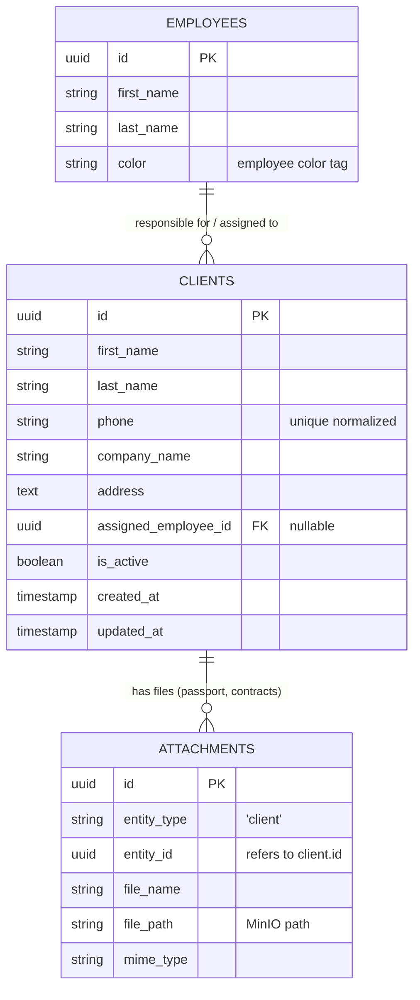

# Yaqeen Backend - Clients API Documentation

This document provides detailed specifications of the **Clients API endpoints** for the **Yaqeen Backend**. It is designed to assist frontend developers in integrating client profile management, color-coding/tagging, employee assignment, document attachment retrieval, and permission controls with Role-Based Access Control (RBAC).

---

## 1. Access Control & Authorization Rules

The backend employs a combination of the global `JwtAuthGuard` and `RolesGuard` to secure endpoints.

### Role Hierarchies

- **CEO / ROP (Administrators):** Have full write, update, delete, and read permissions on all client records, employee assignments, and color statistics (`can_work_with_all_clients: true`).
- **EMPLOYEE (Standard Staff):** Read permissions to view and search clients assigned to their linked employee profile (`can_work_with_all_clients: false` by default).

### Security Exceptions Registry

| Location Key                            | HTTP Code | Scenario                                                                                               |
| :-------------------------------------- | :-------- | :----------------------------------------------------------------------------------------------------- |
| `unauthorized`                          | 401       | JWT token is missing, expired, or invalid.                                                             |
| `role_missing`                          | 403       | Authenticated user payload contains no role identifier.                                                |
| `insufficient_role`                     | 403       | User attempting operations without required role permission.                                           |
| `permission_denied_for_other_employees` | 403       | User without `can_work_with_all_clients` attempting to view/modify/delete other employee's client.     |
| `reassignment_prohibited`               | 403       | User without `can_work_with_all_clients` attempting to reassign client to another employee.            |
| `user_not_linked_to_employee`           | 400       | User without `can_work_with_all_clients` attempting client operations without linked employee profile. |
| `client_not_found`                      | 404       | Target client record does not exist in the database.                                                   |
| `assigned_employee_not_found`           | 404       | Provided `assigned_employee_id` does not match any existing employee.                                  |
| `client_phone_exists`                   | 400       | A client with the given phone number already exists in the system.                                     |

---

## 2. System Architecture & Entity Relationships

The following entity diagram illustrates the structural relationships between clients, assigned employees, and attachment document archives:



---

## 3. Core Logic & Automatic Workflows

### 3.1. Unified Color-Tag & Employee Inheritance Logic

Client color tags are now combined with responsible employee color tags:

1. **Inherited Employee Color Tag**: When a client is assigned to a responsible employee (`assigned_employee_id` is set), the client automatically shares the assigned employee's `color` property.
2. **Default Unassigned Gray Color Tag (`#808080`)**: If no employee is assigned (`assigned_employee_id` is `null`), the client automatically defaults to the "Unassigned" gray color tag (`#808080`).
3. **No Direct Client Color Configuration**: Clients no longer have a custom/independent `color` property stored or set during registration/update. Forms must request a responsible employee instead of a color tag. The system returns the computed tag via `effective_color`.

### 3.2. Phone Normalization & Duplication Check

- Phone numbers passed in requests (e.g., `+998 (90) 123-45-67`) are automatically normalized to digits only (`998901234567`) before checking against existing records to prevent duplicate client entries.

### 3.3. Document & Passport Attachments

- Client files (e.g., passport scans, contracts) uploaded via `/attachments/upload` with `entity_type: 'client'` and `entity_id: <client_uuid>` are automatically aggregated and embedded as an `attachments` array in `GET /clients` and `GET /clients/:id` responses.

---

## 4. REST API Endpoint Specifications

---

### 4.1. List Clients

Retrieves a paginated list of clients filtered by employee assignment, color tag, search term, or active status.

- **Endpoint:** `GET /clients`
- **Guards:** `JwtAuthGuard`, `RolesGuard`
- **Allowed Roles:** `CEO`, `ROP`, `EMPLOYEE`

#### Query Parameters

| Parameter              | Type      | Required | Description                                                                                        |
| :--------------------- | :-------- | :------- | :------------------------------------------------------------------------------------------------- |
| `search`               | `string`  | No       | Search query matching first name, last name, company name, or phone.                               |
| `assigned_employee_id` | `UUID`    | No       | Filter clients assigned to a specific employee.                                                    |
| `color`                | `string`  | No       | Filter clients by color tag code (matches employee color tag or `#808080` for unassigned clients). |
| `is_active`            | `boolean` | No       | Filter active (`true`) or inactive (`false`) clients.                                              |
| `page`                 | `number`  | No       | Page number (default: `1`).                                                                        |
| `limit`                | `number`  | No       | Items per page (default: `20`, max: `100`).                                                        |

#### Success Response (200 OK)

```json
{
  "data": [
    {
      "id": "a3b1c2d4-e5f6-7890-abcd-ef1234567890",
      "first_name": "Jasur",
      "last_name": "Yoldoshev",
      "phone": "+998901234567",
      "company_name": "Global Cargo Logistics LLC",
      "address": "Tashkent city, Yunusabad district",
      "assigned_employee_id": "b1a2c3d4-e5f6-7890-abcd-ef1234567890",
      "is_active": true,
      "created_at": "2026-07-20T12:00:00.000Z",
      "updated_at": "2026-07-20T12:00:00.000Z",
      "effective_color": "#FF0000",
      "assigned_employee": {
        "id": "b1a2c3d4-e5f6-7890-abcd-ef1234567890",
        "first_name": "Rustam",
        "last_name": "Rasulov",
        "phone": "+998909876543",
        "color": "#FF0000"
      },
      "attachments": [
        {
          "id": "c1d2e3f4-5678-90ab-cdef-1234567890ab",
          "entity_type": "client",
          "entity_id": "a3b1c2d4-e5f6-7890-abcd-ef1234567890",
          "file_name": "passport_scan.pdf",
          "file_path": "attachments/client/passport_scan.pdf",
          "file_size": 204800,
          "mime_type": "application/pdf"
        }
      ]
    }
  ],
  "pagination": {
    "total": 1,
    "page": 1,
    "limit": 20,
    "totalPages": 1
  }
}
```

---

### 4.2. Get Color Distribution Statistics

Returns aggregate count statistics of active clients grouped by effective color codes and assigned employees.

- **Endpoint:** `GET /clients/stats/color-distribution`
- **Guards:** `JwtAuthGuard`, `RolesGuard`
- **Allowed Roles:** `CEO`, `ROP`

#### Success Response (200 OK)

```json
{
  "total_clients": 300,
  "by_color": [
    {
      "color": "#FF0000",
      "count": 20
    },
    {
      "color": "#808080",
      "count": 15
    }
  ],
  "by_employee": [
    {
      "employee_id": "b1a2c3d4-e5f6-7890-abcd-ef1234567890",
      "employee_name": "Rustam Rasulov",
      "default_color": "#FF0000",
      "count": 20
    },
    {
      "employee_id": null,
      "employee_name": "Unassigned",
      "default_color": "#808080",
      "count": 15
    }
  ]
}
```

---

### 4.3. Get Client by ID

Retrieves single client record with detailed assigned employee profile and attached document list.

- **Endpoint:** `GET /clients/:id`
- **Guards:** `JwtAuthGuard`, `RolesGuard`
- **Allowed Roles:** `CEO`, `ROP`, `EMPLOYEE`

#### Path Parameters

- `id` (`UUID`, required) - Target client UUID.

#### Error Responses

- `404 Not Found`:
  ```json
  {
    "statusCode": 404,
    "message": "Client not found.",
    "location": "client_not_found"
  }
  ```

---

### 4.4. Create Client

Registers a new client record. Prompts for a responsible employee (`assigned_employee_id`). Client inherits employee's color tag automatically (or `#808080` if left unassigned).

- **Endpoint:** `POST /clients`
- **Guards:** `JwtAuthGuard`, `RolesGuard`
- **Allowed Roles:** `CEO`, `ROP`

#### Request Body

```json
{
  "first_name": "Jasur",
  "last_name": "Yoldoshev",
  "phone": "+998901234567",
  "company_name": "Global Cargo Logistics LLC",
  "address": "Tashkent city, Yunusabad district",
  "assigned_employee_id": "b1a2c3d4-e5f6-7890-abcd-ef1234567890",
  "is_active": true
}
```

#### Validation Rules

- `first_name` (string, required, length: 2-100)
- `last_name` (string, required, length: 2-100)
- `phone` (string, required, international phone format e.g. `+998901234567`)
- `company_name` (string, required, length: 2-200)
- `address` (string, optional)
- `assigned_employee_id` (UUID, optional)
- `is_active` (boolean, optional, default: `true`)

---

### 4.5. Update Client

Updates existing client profile details or reassigns to another responsible employee.

- **Endpoint:** `PUT /clients/:id`
- **Guards:** `JwtAuthGuard`, `RolesGuard`
- **Allowed Roles:** `CEO`, `ROP`

#### Path Parameters

- `id` (`UUID`, required)

#### Request Body

Accepts partial fields of `CreateClientDto`.

---

### 4.6. Delete Client

Deletes target client record.

- **Endpoint:** `DELETE /clients/:id`
- **Guards:** `JwtAuthGuard`, `RolesGuard`
- **Allowed Roles:** `CEO`, `ROP`

#### Response

- `204 No Content` on successful deletion.
