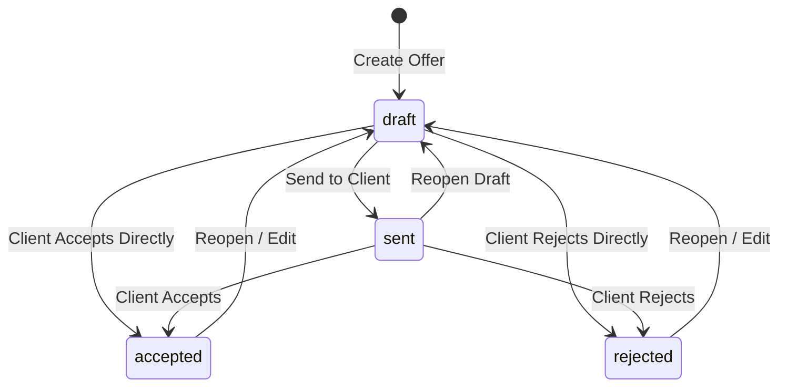

# Commercial Offers Generator — Technical & API Documentation

> **Module Version:** 1.0.0  
> **Base Path:** `/api/v1/commercial-offers`  
> **Authentication:** JWT Bearer Token required (`JwtAuthGuard`)  
> **Authorization:** Role-Based Access Control (`PermissionsGuard` + `@RequirePermission`)

---

## 1. Overview & Architecture

The **Commercial Offers Generator** module manages commercial freight proposals, quotation auto-numbering, status lifecycles, and branded PDF exports for Yaqeen Logistics.

### Key Capabilities

- **Auto-Incrementing Offer Numbers**: Formatted as `YQ-YYYY-NNNN` (e.g., `YQ-2026-0001`), scoped annually.
- **Client Auto-Integration**: Supply optional `client_id` to auto-fill `client_name` and `client_company` from the `clients` directory.
- **Status Lifecycle Control**: State machine controlling transitions between `draft`, `sent`, `accepted`, and `rejected`.
- **One-Click Duplication**: Clone existing offers into new draft proposals.
- **PDF Export Engine**: Vector-based PDF generation via `pdfkit` featuring corporate indigo styling, visual route diagrams, structured pricing tables, inclusions/exclusions lists, terms, and signature blocks.
- **Dashboard Analytics**: Revenue aggregation and status counts.

---

## 2. Database Schema (`commercial_offers`)

| Column Name         | DB Type         | TS Type          | Nullable | Constraints & Description                             |
| ------------------- | --------------- | ---------------- | -------- | ----------------------------------------------------- |
| `id`                | `uuid`          | `string`         | **No**   | Primary key (`uuid_generate_v4()`)                    |
| `offer_number`      | `varchar(50)`   | `string`         | **No**   | Unique offer identifier (`YQ-YYYY-NNNN`)              |
| `client_id`         | `uuid`          | `string \| null` | **Yes**  | Foreign key referencing `clients(id)`                 |
| `client_name`       | `varchar(255)`  | `string`         | **No**   | Full client contact name                              |
| `client_company`    | `varchar(255)`  | `string`         | **No**   | Client organization name                              |
| `origin`            | `varchar(255)`  | `string`         | **No**   | Freight origin location                               |
| `destination`       | `varchar(255)`  | `string`         | **No**   | Freight destination location                          |
| `cargo_description` | `text`          | `string \| null` | **Yes**  | Cargo specification summary                           |
| `cargo_weight`      | `numeric(10,2)` | `number \| null` | **Yes**  | Cargo weight in kg                                    |
| `cargo_volume`      | `numeric(10,2)` | `number \| null` | **Yes**  | Cargo volume in m³                                    |
| `price_usd`         | `numeric(12,2)` | `number`         | **No**   | Proposal total price in USD                           |
| `price_local`       | `numeric(15,2)` | `number`         | **No**   | Proposal total price in UZS                           |
| `inclusions`        | `jsonb`         | `string[]`       | **Yes**  | Included services list                                |
| `exclusions`        | `jsonb`         | `string[]`       | **Yes**  | Excluded services list                                |
| `terms`             | `text`          | `string \| null` | **Yes**  | Terms, conditions, and payment policy                 |
| `status`            | `varchar(20)`   | `string`         | **No**   | Status enum (`draft`, `sent`, `accepted`, `rejected`) |
| `created_by`        | `uuid`          | `string`         | **No**   | Foreign key referencing `users(id)`                   |
| `created_at`        | `timestamptz`   | `Date \| string` | **No**   | Record creation timestamp                             |
| `updated_at`        | `timestamptz`   | `Date \| string` | **No**   | Record last update timestamp                          |

---

## 3. Status Lifecycle State Machine



### Transition Validation Matrix

| Current State | Target State                    | Allowed? | Error `location` on Failure |
| ------------- | ------------------------------- | -------- | --------------------------- |
| `draft`       | `sent`, `accepted`, `rejected`  | **Yes**  | —                           |
| `sent`        | `accepted`, `rejected`, `draft` | **Yes**  | —                           |
| `accepted`    | `draft`                         | **Yes**  | —                           |
| `accepted`    | `sent`, `rejected`              | **No**   | `invalid_status_transition` |
| `rejected`    | `draft`                         | **Yes**  | —                           |
| `rejected`    | `sent`, `accepted`              | **No**   | `invalid_status_transition` |

---

## 4. Role-Based Access Control (RBAC)

All endpoints require a valid JWT passed in the `Authorization: Bearer <token>` header.

### Permissions

- **CEO Role**: Bypasses all permission checks automatically.
- **Other Roles**: Enforced by `PermissionsGuard` checking the `commercial_offers` permission key:
  - `read`: View list, view single, get summary stats, download PDF.
  - `create`: Create new offer, duplicate offer.
  - `update`: Edit offer details, update offer status.
  - `delete`: Delete offer.

---

## 5. API Endpoints Reference

### 5.1 GET `/api/v1/commercial-offers/stats/summary`

Retrieves aggregated statistics for commercial offers dashboard.

- **Permission**: `commercial_offers:read`
- **Query Parameters**: None

#### Success Response (`200 OK`)

```json
{
  "total_offers": 15,
  "by_status": {
    "draft": 5,
    "sent": 4,
    "accepted": 4,
    "rejected": 2
  },
  "accepted_revenue": {
    "total_usd": 125000.0,
    "total_local": 1625000000.0
  }
}
```

---

### 5.2 GET `/api/v1/commercial-offers`

Retrieves a paginated list of commercial offers matching optional search and filter criteria.

- **Permission**: `commercial_offers:read`

#### Query Parameters (`QueryCommercialOfferDto`)

| Field        | Type     | Required | Default | Validation Rules & Description                                                              |
| ------------ | -------- | -------- | ------- | ------------------------------------------------------------------------------------------- |
| `page`       | `string` | No       | `"1"`   | Page number (1-based)                                                                       |
| `limit`      | `string` | No       | `"20"`  | Results per page (min 1, max 100)                                                           |
| `search`     | `string` | No       | —       | Search term across `offer_number`, `client_name`, `client_company`, `origin`, `destination` |
| `status`     | `string` | No       | —       | Must be one of: `draft`, `sent`, `accepted`, `rejected`                                     |
| `client_id`  | `string` | No       | —       | Filter by client UUID                                                                       |
| `created_by` | `string` | No       | —       | Filter by creator user UUID                                                                 |
| `date_from`  | `string` | No       | —       | Created at or after date string                                                             |
| `date_to`    | `string` | No       | —       | Created at or before date string                                                            |

#### Success Response (`200 OK`)

```json
{
  "data": [
    {
      "id": "e43b8112-9c12-4c22-b5e1-8848123abcde",
      "offer_number": "YQ-2026-0001",
      "client_id": "9b1deb4d-3b7d-4bad-9bdd-2b0d7b3dcb6d",
      "client_name": "Rustam Rasulov",
      "client_company": "Orient Cargo LLC",
      "origin": "Tashkent",
      "destination": "Shanghai",
      "cargo_description": "Electronics components",
      "cargo_weight": 1500.5,
      "cargo_volume": 12.3,
      "price_usd": 5000.0,
      "price_local": 65000000.0,
      "inclusions": ["Freight transport", "Insurance"],
      "exclusions": ["Customs duties"],
      "terms": "50% advance, 50% upon delivery",
      "status": "draft",
      "created_by": "aa111111-1111-1111-1111-111111111111",
      "creator_name": "admin_user",
      "created_at": "2026-07-28T10:00:00.000Z",
      "updated_at": "2026-07-28T10:00:00.000Z"
    }
  ],
  "pagination": {
    "total": 1,
    "page": 1,
    "limit": 20,
    "totalPages": 1
  }
}
```

---

### 5.3 GET `/api/v1/commercial-offers/:id`

Retrieves detailed information for a single commercial offer.

- **Permission**: `commercial_offers:read`
- **Path Parameter**: `:id` (UUID v4)

#### Success Response (`200 OK`)

```json
{
  "id": "e43b8112-9c12-4c22-b5e1-8848123abcde",
  "offer_number": "YQ-2026-0001",
  "client_id": "9b1deb4d-3b7d-4bad-9bdd-2b0d7b3dcb6d",
  "client_name": "Rustam Rasulov",
  "client_company": "Orient Cargo LLC",
  "origin": "Tashkent",
  "destination": "Shanghai",
  "cargo_description": "Electronics components",
  "cargo_weight": 1500.5,
  "cargo_volume": 12.3,
  "price_usd": 5000.0,
  "price_local": 65000000.0,
  "inclusions": ["Freight transport", "Insurance"],
  "exclusions": ["Customs duties"],
  "terms": "50% advance, 50% upon delivery",
  "status": "draft",
  "created_by": "aa111111-1111-1111-1111-111111111111",
  "creator_name": "admin_user",
  "created_at": "2026-07-28T10:00:00.000Z",
  "updated_at": "2026-07-28T10:00:00.000Z"
}
```

#### Error Response (`404 Not Found`)

```json
{
  "statusCode": 404,
  "message": "Commercial offer not found.",
  "error": "NotFoundException",
  "timestamp": "2026-07-28T12:00:00.000Z",
  "location": "offer_not_found",
  "path": "/api/v1/commercial-offers/e43b8112-9c12-4c22-b5e1-000000000000"
}
```

---

### 5.4 POST `/api/v1/commercial-offers`

Creates a new commercial offer proposal.

- **Permission**: `commercial_offers:create`

#### Request Body (`CreateCommercialOfferDto`)

| Field               | Type       | Required | Validation Rules                          | Description                                          |
| ------------------- | ---------- | -------- | ----------------------------------------- | ---------------------------------------------------- |
| `client_id`         | `string`   | No       | `@IsUUID('4')`                            | Existing client UUID. Auto-populates contact details |
| `client_name`       | `string`   | **Yes**  | `@IsString()`, `@Length(2, 100)`          | Contact person full name                             |
| `client_company`    | `string`   | **Yes**  | `@IsString()`, `@Length(2, 200)`          | Client company name                                  |
| `origin`            | `string`   | **Yes**  | `@IsString()`, `@Length(2, 100)`          | Shipping origin city/country                         |
| `destination`       | `string`   | **Yes**  | `@IsString()`, `@Length(2, 100)`          | Shipping destination city/country                    |
| `cargo_description` | `string`   | No       | `@IsString()`                             | Free-text cargo specifications                       |
| `cargo_weight`      | `number`   | No       | `@IsNumber()`, `@Min(0)`                  | Weight in kilograms                                  |
| `cargo_volume`      | `number`   | No       | `@IsNumber()`, `@Min(0)`                  | Volume in cubic meters                               |
| `price_usd`         | `number`   | **Yes**  | `@IsNumber()`, `@Min(0)`                  | Total offer price in USD                             |
| `price_local`       | `number`   | **Yes**  | `@IsNumber()`, `@Min(0)`                  | Total offer price in UZS                             |
| `inclusions`        | `string[]` | No       | `@IsArray()`, `@IsString({ each: true })` | List of included services                            |
| `exclusions`        | `string[]` | No       | `@IsArray()`, `@IsString({ each: true })` | List of excluded services                            |
| `terms`             | `string`   | No       | `@IsString()`                             | Proposal terms & payment conditions                  |

#### Success Response (`201 Created`)

Returns created offer object identical to `GET /:id` with `status` defaulted to `"draft"`.

#### Error Cases

- **`client_not_found` (`404 Not Found`)**: Provided `client_id` does not exist in `clients` table.
- **`validation_failed` (`400 Bad Request`)**: Payload validation errors (missing required fields, out-of-range values).

---

### 5.5 PUT `/api/v1/commercial-offers/:id`

Updates fields of an existing commercial offer proposal.

- **Permission**: `commercial_offers:update`
- **Path Parameter**: `:id` (UUID v4)

#### Request Body (`UpdateCommercialOfferDto`)

All fields are optional equivalents of `CreateCommercialOfferDto`.

#### Success Response (`200 OK`)

Returns updated offer object identical to `GET /:id`.

#### Error Cases

- **`offer_not_found` (`404 Not Found`)**: Target offer ID does not exist.
- **`client_not_found` (`404 Not Found`)**: Updated `client_id` does not exist.
- **`validation_failed` (`400 Bad Request`)**: Field validation failure.

---

### 5.6 PATCH `/api/v1/commercial-offers/:id/status`

Updates the lifecycle status of a commercial offer proposal.

- **Permission**: `commercial_offers:update`
- **Path Parameter**: `:id` (UUID v4)

#### Request Body (`UpdateOfferStatusDto`)

| Field    | Type     | Required | Validation Rules                                   |
| -------- | -------- | -------- | -------------------------------------------------- |
| `status` | `string` | **Yes**  | `@IsIn(['draft', 'sent', 'accepted', 'rejected'])` |

#### Success Response (`200 OK`)

Returns updated offer object showing new `status`.

#### Error Response (`400 Bad Request` — Invalid Transition)

```json
{
  "statusCode": 400,
  "message": "Cannot transition from \"accepted\" to \"sent\". Allowed transitions: draft.",
  "error": "BadRequestException",
  "timestamp": "2026-07-28T12:00:00.000Z",
  "location": "invalid_status_transition",
  "path": "/api/v1/commercial-offers/e43b8112-9c12-4c22-b5e1-8848123abcde/status"
}
```

---

### 5.7 POST `/api/v1/commercial-offers/:id/duplicate`

Duplicates an existing proposal into a fresh draft with a newly generated offer number (`YQ-YYYY-NNNN`).

- **Permission**: `commercial_offers:create`
- **Path Parameter**: `:id` (UUID v4)
- **Request Body**: None

#### Success Response (`200 OK`)

Returns newly created duplicate offer object with `status: "draft"` and fresh `offer_number`.

#### Error Cases

- **`offer_not_found` (`404 Not Found`)**: Source offer ID does not exist.

---

### 5.8 GET `/api/v1/commercial-offers/:id/pdf`

Generates and downloads the official PDF document for a commercial offer.

- **Permission**: `commercial_offers:read`
- **Path Parameter**: `:id` (UUID v4)

#### Response Headers

```http
Content-Type: application/pdf
Content-Disposition: attachment; filename="YQ-2026-0001.pdf"
Content-Length: <buffer_length>
```

#### Success Response (`200 OK`)

Binary stream containing the `%PDF-` document data.

#### Error Cases

- **`offer_not_found` (`404 Not Found`)**: Target offer ID does not exist.

---

### 5.9 DELETE `/api/v1/commercial-offers/:id`

Deletes a commercial offer.

- **Permission**: `commercial_offers:delete`
- **Path Parameter**: `:id` (UUID v4)

#### Success Response (`204 No Content`)

Empty body.

#### Error Cases

- **`offer_not_found` (`404 Not Found`)**: Target offer ID does not exist.

---

## 6. Complete Error Location Code Reference Table

The `location` field in error responses provides exact error categorization for frontend applications.

| HTTP Status | Error Class                    | `location` Value            | Exact Trigger Condition & Description                                                                                                                                      |
| ----------- | ------------------------------ | --------------------------- | -------------------------------------------------------------------------------------------------------------------------------------------------------------------------- |
| `400`       | `BadRequestException`          | `validation_failed`         | One or more class-validator DTO field constraints failed (e.g. invalid string length, negative number, invalid status enum). `message` contains constraint detail strings. |
| `400`       | `BadRequestException`          | `invalid_status_transition` | Attempted status change violates state machine rules (e.g. attempting to move directly from `accepted` to `sent`).                                                         |
| `400`       | `BadRequestException`          | `bad_request`               | Path parameter fails type parsing (e.g., passing a non-UUID string like `abc` to `:id`).                                                                                   |
| `401`       | `UnauthorizedException`        | `unauthorized`              | Missing, malformed, or expired JWT token in `Authorization` header.                                                                                                        |
| `403`       | `ForbiddenException`           | `forbidden`                 | Authenticated user lacks required permission (`commercial_offers:read`, `create`, `update`, `delete`) and is not a `CEO`.                                                  |
| `404`       | `NotFoundException`            | `offer_not_found`           | Target offer ID does not exist in `commercial_offers` table.                                                                                                               |
| `404`       | `NotFoundException`            | `client_not_found`          | Provided `client_id` does not exist in `clients` table.                                                                                                                    |
| `404`       | `NotFoundException`            | `not_found`                 | Requested URI route does not exist.                                                                                                                                        |
| `500`       | `InternalServerErrorException` | `internal_error`            | Unhandled database exception or internal server error.                                                                                                                     |
