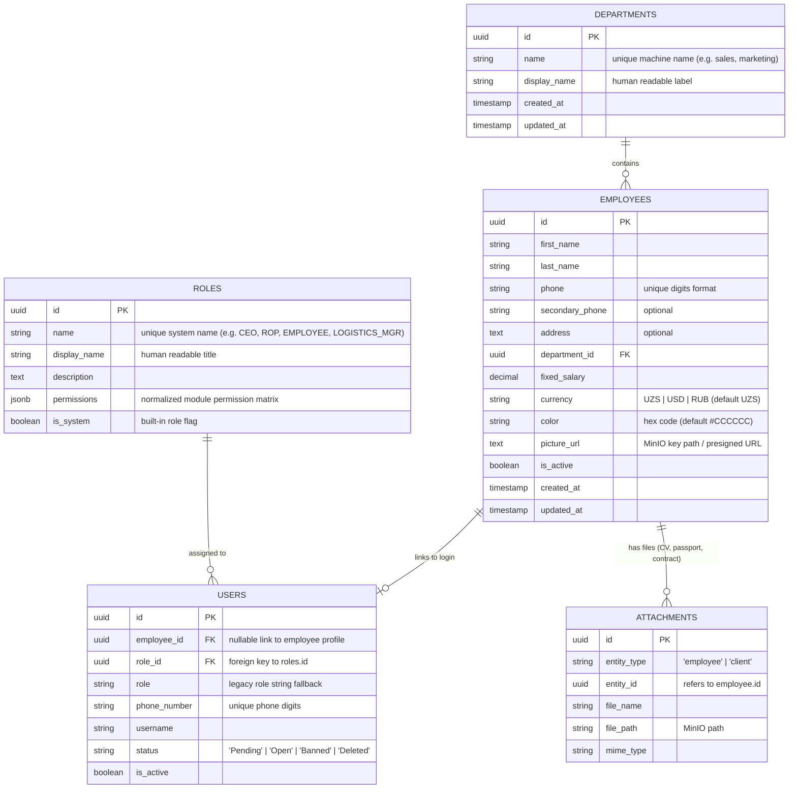

# Yaqeen Backend - Employees & Departments API Documentation

This document provides detailed specifications of the **Departments** and **Employees** API endpoints for the **Yaqeen Backend**. It is designed to assist frontend developers in integrating employee management, department assignments, profile picture uploads, and permission controls with dynamic Role-Based Access Control (RBAC).

---

## 1. Access Control & Authorization Rules

The backend secures all endpoints using the global `JwtAuthGuard` combined with a custom `PermissionsGuard` and `@RequirePermission()` decorators.

### Dynamic Role-Based Access Control (RBAC)

Access permissions are decoupled from static user strings and driven by dynamic, database-backed roles (`roles` table). Each user account linked to an employee profile is assigned a role via `users.role_id -> roles.id`.

- **System Roles:** Seeded built-in roles (`CEO`, `ROP`, `EMPLOYEE`).
- **Custom Roles:** Custom operational roles created via the Roles API (e.g., `LOGISTICS_MANAGER`, `FINANCE_AUDITOR`).
- **Superuser Bypass:** Users with `role: 'CEO'` or `role_name: 'CEO'` bypass module permission checks automatically.

### Scoped Module Permissions

Permissions for Employees and Departments operations are evaluated against two core system modules:

1. **`employees` Module:**
   - `employees:create` — Permission to create new employee profiles (`POST /employees`) and auto-link user accounts with assigned role specifications.
   - `employees:read` — Permission to list all employees (`GET /employees`) and search employee records.
   - `employees:update` — Permission to edit employee details (`PUT /employees/:id`), change active status, or update role assignments (`role_id`).
   - `employees:delete` — Permission to remove employee profiles (`DELETE /employees/:id`).

2. **`departments` Module:**
   - `departments:create` — Permission to create new departments (`POST /departments`).
   - `departments:read` — Permission to list (`GET /departments`) and view department details (`GET /departments/:id`).
   - `departments:update` — Permission to update department names (`PUT /departments/:id`).
   - `departments:delete` — Permission to delete departments (`DELETE /departments/:id`).

### Self-Service & Ownership Scope Exceptions

- **Own Profile Access (`GET /employees/me` & `GET /employees/:id`):** Authenticated staff members can view their own profile, permissions matrix, and linked employee record without requiring administrative `employees:read` permission.
- **Profile Picture Management (`POST/DELETE /employees/me/picture` & `/employees/:id/picture`):** Employees can upload or remove their own profile avatar image. Updating another employee's picture requires `employees:update` permission or `CEO` status.

### Security Exceptions Registry

If authorization or validation rules fail, the API returns standard error responses:

| Location Key               | HTTP Code        | Scenario / Cause                                                                                                                         |
| :------------------------- | :--------------- | :--------------------------------------------------------------------------------------------------------------------------------------- |
| `unauthorized`             | 401 Unauthorized | JWT token is missing, expired, or invalid.                                                                                               |
| `insufficient_permissions` | 403 Forbidden    | User lacks the required `module:action` permission (e.g., standard employee attempting to create a department or edit another employee). |
| `employee_profile_missing` | 404 Not Found    | Authenticated user does not have an associated employee profile record in the database.                                                  |
| `role_not_found`           | 400 Bad Request  | The specified `role_id` (or `role` string) does not exist in the database.                                                               |
| `role_id_required`         | 400 Bad Request  | Creating an employee profile omitted the required `role_id` parameter.                                                                   |
| `employee_phone_exists`    | 400 Bad Request  | An employee profile already exists with the specified phone number.                                                                      |

---

## 2. System Architecture & Entity Relationships

The following entity relationship diagram illustrates how departments, employees, user accounts, dynamic roles, and document attachments connect within the system:



---

## 3. Core Logic & Automatic Workflows

### 3.1. Automatic User Linkage, Pending User Creation & Role Scoping

When an administrator creates a new employee profile via `POST /employees` specifying a valid `role_id` and phone number (e.g., `+998 90 123-45-67`):

1. **Phone Normalization:** The phone number is normalized to digits only (e.g., `998901234567`).
2. **Role Verification:** The backend verifies that `role_id` exists in the `roles` table.
3. **Existing User Account Linking:** The system searches the `users` table for an existing account matching the phone digits. If found, it updates the user's `employee_id`, `role_id` (foreign key link to role), and `role` string.
4. **Pending User Auto-Creation:** If no user account exists, the system automatically creates a new user record in the `users` table with:
   - `status`: `'Pending'`
   - `role_id`: `<resolved_role_uuid>`
   - `role`: `<resolved_role_name>`
   - `employee_id`: `<newly_created_employee_uuid>`
   - `password_hash`: `''` (allowing completion of registration via OTP).

### 3.1b. Telegram Registration Auto-Creation

When a user completes phone number sharing in the Telegram Bot:

1. Save mapping in `telegram_contacts`.
2. **Pending User Auto-Creation:** If no user record exists for the phone number, auto-creates a user record in `'Pending'` status with `employee_id = null` and `role` mapped to default system role `'EMPLOYEE'`.
3. **No Employee Profile Creation:** No employee profile is created during bot registration; administrative employee profile creation links the user account later.

### 3.2. Deactivation Sync

When an employee's status (`is_active`) is set to `false` via `PUT /employees/:id`:

1. Employee `is_active` set to `false`.
2. The system executes a transaction updating any linked user record (`employee_id = id`) to set `is_active = false` and `status = 'Banned'`, instantly revoking login authorization.
3. Reactivating (`is_active = true`) sets user `is_active = true` and resets `status = 'Open'`.

### 3.3. Profile Picture Uploads with MinIO Presigned URLs & Redis Caching

1. **Presigned MinIO URLs Expiry:** Avatar URLs are generated with a 15-minute (900 seconds) expiration period.
2. **Redis Caching:** URLs are cached in Redis under `employee:picture_url:<employee_id>` with a TTL of 14 minutes (840 seconds).
3. **Cache Eviction:** Uploading or deleting an avatar removes the object from MinIO and invalidates the Redis cache key instantly.

---

## 4. Departments Endpoints Reference

### 4.1. List All Departments

Retrieve a list of all company departments, ordered alphabetically by display name. Each department includes an `employee_count` field indicating exactly how many employees are assigned to it (including inactive employees). Departments without any staff return `employee_count: 0`.

- **Route:** `/departments`
- **Method:** `GET`
- **Access:** `Private` (Requires `departments:read` permission)
- **Success Status:** `200 OK`

#### Success Response (200 OK)

```json
[
  {
    "id": "07d223ca-4167-47f7-a929-61d47a3628a7",
    "name": "sales",
    "display_name": "Sales",
    "employee_count": 12,
    "created_at": "2026-07-19T12:20:42.232Z",
    "updated_at": "2026-07-19T12:20:42.232Z"
  },
  {
    "id": "f5e3fbdf-ae9f-4a23-8834-b51ce5499441",
    "name": "sborniy",
    "display_name": "Sborniy",
    "employee_count": 0,
    "created_at": "2026-07-19T12:20:42.220Z",
    "updated_at": "2026-07-19T12:20:42.220Z"
  }
]
```

#### Response Fields

| Field            | Type     | Description                                                                                                  |
| :--------------- | :------- | :----------------------------------------------------------------------------------------------------------- |
| `id`             | `string` | Department UUID (`departments.id`).                                                                          |
| `name`           | `string` | Unique machine name (e.g. `sales`).                                                                          |
| `display_name`   | `string` | Human-readable label used for ordering.                                                                      |
| `employee_count` | `number` | Number of employees assigned to the department (`employees.department_id = departments.id`). `0` when empty. |
| `created_at`     | `string` | ISO timestamp of record creation.                                                                            |
| `updated_at`     | `string` | ISO timestamp of last update.                                                                                |

> **Note:** `employee_count` counts **all** assigned employee records, regardless of their `is_active` status.

---

### 4.2. Get Department Details

Retrieve details of a single department using its unique UUID.

- **Route:** `/departments/:id`
- **Method:** `GET`
- **Access:** `Private` (Requires `departments:read` permission)
- **Success Status:** `200 OK`

---

### 4.3. Create Department

Create a new organizational department.

- **Route:** `/departments`
- **Method:** `POST`
- **Access:** `Private` (Requires `departments:create` permission)
- **Success Status:** `201 Created`

#### Request Body Schema

| Field          | Type     | Required | Constraints                                                       | Description                     |
| :------------- | :------- | :------- | :---------------------------------------------------------------- | :------------------------------ |
| `name`         | `string` | Yes      | 2-100 characters, lowercase letters, numbers, hyphens/underscores | Machine name of department.     |
| `display_name` | `string` | Yes      | 2-100 characters                                                  | Human-readable department name. |

---

### 4.4. Update Department

Modify department details.

- **Route:** `/departments/:id`
- **Method:** `PUT`
- **Access:** `Private` (Requires `departments:update` permission)
- **Success Status:** `200 OK`

---

### 4.5. Delete Department

Remove a department from the system.

- **Route:** `/departments/:id`
- **Method:** `DELETE`
- **Access:** `Private` (Requires `departments:delete` permission)
- **Success Status:** `204 No Content`

---

## 5. Employees Endpoints Reference

### 5.1. Get Authenticated Employee Profile (`GET /employees/me`)

Retrieves complete profile details of the currently authenticated user, including user status, assigned role details, full dynamic module permissions matrix, and linked employee profile.

- **Route:** `/employees/me`
- **Method:** `GET`
- **Access:** `Authenticated` (Any valid JWT user token)
- **Success Status:** `200 OK`

#### Success Response (200 OK) Example

```json
{
  "id": "31eadb44-e6d7-4d5f-b649-295b793fab43",
  "first_name": "Jasur",
  "last_name": "Yoldoshev",
  "phone": "+998331112233",
  "phone_number": "998331112233",
  "secondary_phone": null,
  "address": "Tashkent, Uzbekistan",
  "department_id": "07d223ca-4167-47f7-a929-61d47a3628a7",
  "fixed_salary": 800,
  "currency": "UZS",
  "color": "#FF5733",
  "picture_url": "http://127.0.0.1:9000/yaqeen-attachments/avatars/employee_31eadb44_...png",
  "is_active": true,
  "created_at": "2026-07-19T21:45:00.123Z",
  "updated_at": "2026-07-23T12:00:00.000Z",
  "department_name": "sales",
  "department_display_name": "Sales",
  "user_id": "d36cd0fe-bf3b-448d-964c-5b214eef86e4",
  "username": "998331112233",
  "user_role": "LOGISTICS_MANAGER",
  "user_status": "Open",
  "role_id": "a9b8c7d6-5432-10fe-dcba-9876543210fe",
  "permissions": {
    "clients": { "create": false, "read": true, "update": true, "delete": false },
    "employees": { "create": false, "read": true, "update": false, "delete": false },
    "departments": { "create": false, "read": true, "update": false, "delete": false },
    "cargo_kpi": { "create": true, "read": true, "update": true, "delete": true },
    "finance": { "create": false, "read": false, "update": false, "delete": false },
    "commercial_offers": { "create": true, "read": true, "update": true, "delete": false },
    "tasks": { "create": true, "read": true, "update": true, "delete": true },
    "currency": { "create": false, "read": true, "update": false, "delete": false },
    "attachments": { "create": true, "read": true, "update": true, "delete": false },
    "roles": { "create": false, "read": false, "update": false, "delete": false }
  },
  "user": {
    "id": "d36cd0fe-bf3b-448d-964c-5b214eef86e4",
    "phone_number": "998331112233",
    "username": "998331112233",
    "role": "LOGISTICS_MANAGER",
    "role_id": "a9b8c7d6-5432-10fe-dcba-9876543210fe",
    "status": "Open",
    "is_active": true,
    "role_details": {
      "id": "a9b8c7d6-5432-10fe-dcba-9876543210fe",
      "name": "LOGISTICS_MANAGER",
      "display_name": "Logistics & Cargo Manager",
      "description": "Custom role for cargo operations team leads",
      "is_system": false,
      "permissions": { ... }
    },
    "permissions": { ... }
  },
  "employee": {
    "id": "31eadb44-e6d7-4d5f-b649-295b793fab43",
    "first_name": "Jasur",
    "last_name": "Yoldoshev",
    "phone": "+998331112233",
    "department": {
      "id": "07d223ca-4167-47f7-a929-61d47a3628a7",
      "name": "sales",
      "display_name": "Sales"
    }
  }
}
```

---

### 5.2. List All Employees (Paginated & Filtered)

Retrieve a paginated list of all employees along with current month plan completion (two-direction LTL & FTL specs) and multi-currency net yield revenues.

- **Route:** `/api/v1/employees`
- **Method:** `GET`
- **Access:** `Private` (Requires `employees:read` permission)
- **Success Status:** `200 OK`

#### Query Parameters (All optional):

- `department_id` (UUID): Filter by department UUID.
- `search` (string): Search by employee first name, last name, or phone.
- `page` (number, default: 1): Page number.
- `limit` (number, default: 10): Items per page.
- `offset` (number): Direct offset override.

> [!NOTE]
> This endpoint operates strictly on the **current calendar month** for `plan_completed` / `plan_completion` metrics and `total_revenue` multi-currency figures. All `total_revenue` metrics (in `meta.total_revenue` and each employee's `data[].total_revenue`) represent **net yields only** (calculated as `sell_price - purchase_price` / `margin` converted to target currency using snapshot/CBU exchange rates, rather than gross sales prices).

#### Success Response (200 OK) Example

```json
{
  "meta": {
    "total": 12,
    "offset": 0,
    "limit": 10,
    "open_employees": 10,
    "plan_completed": {
      "ltl_completion": 85.5,
      "ftl_completion": 110.0
    },
    "total_revenue": {
      "USD": 125000.0,
      "UZS": 95000000.0,
      "RUB": 450000.0
    }
  },
  "data": [
    {
      "id": "31eadb44-e6d7-4d5f-b649-295b793fab43",
      "full_name": "Jasur Yoldoshev",
      "role_name": "Logistics & Cargo Manager",
      "department_name": "Sales",
      "status": "Open",
      "total_revenue": {
        "USD": 55000.0,
        "UZS": 25000000.0,
        "RUB": 120000.0
      },
      "plan_completion": {
        "ltl_completion": 90.0,
        "ftl_completion": 110.0
      },
      "total_assigned_employees": 8,
      "color": "#FF5733"
    }
  ]
}
```

---

### 5.3. Get Single Employee Details

Retrieve complete details of a single employee.

- **Route:** `/employees/:id`
- **Method:** `GET`
- **Access:** `Private` (Requires `employees:read` permission, OR owner employee accessing their own profile)
- **Success Status:** `200 OK`

---

### 5.4. Create Employee Profile & Assign Role

Create a new employee profile in the system and auto-link/create a user account with assigned role specifications.

- **Route:** `/employees`
- **Method:** `POST`
- **Access:** `Private` (Requires `employees:create` permission)
- **Success Status:** `201 Created`

#### Request Body Schema (`CreateEmployeeDto`)

| Field             | Type     | Required | Constraints                                 | Description                                         |
| :---------------- | :------- | :------- | :------------------------------------------ | :-------------------------------------------------- |
| `role_id`         | `string` | **Yes**  | Valid UUID (4)                              | UUID of role assigned to user account (`roles.id`). |
| `role`            | `string` | No       | Text string                                 | Legacy role string fallback / system name.          |
| `first_name`      | `string` | **Yes**  | 2-100 characters                            | Employee's first name.                              |
| `last_name`       | `string` | **Yes**  | 2-100 characters                            | Employee's last name.                               |
| `phone`           | `string` | **Yes**  | International format (`+998XXXXXXXXX`)      | Unique phone number.                                |
| `secondary_phone` | `string` | No       | International format                        | Secondary contact number.                           |
| `address`         | `string` | No       | Text                                        | Residential address.                                |
| `department_id`   | `string` | **Yes**  | Valid UUID                                  | Department reference (`departments.id`).            |
| `fixed_salary`    | `string` | No       | Numeric string (e.g. `1500.00`)             | Base monthly salary.                                |
| `currency`        | `string` | No       | `'UZS' \| 'USD' \| 'RUB'` (default `'UZS'`) | Currency of fixed salary.                           |
| `color`           | `string` | No       | Valid Hex Code (`#FF5733`)                  | Color tag for the employee.                         |

_Example Payload:_

```json
{
  "role_id": "e0b1c2d3-4567-89ab-cdef-0123456789ab",
  "role": "EMPLOYEE",
  "first_name": "Jasur",
  "last_name": "Yoldoshev",
  "phone": "+998331112233",
  "department_id": "07d223ca-4167-47f7-a929-61d47a3628a7",
  "fixed_salary": "800.00",
  "currency": "UZS",
  "color": "#FF5733"
}
```

#### Success Response (201 Created)

```json
{
  "id": "31eadb44-e6d7-4d5f-b649-295b793fab43",
  "first_name": "Jasur",
  "last_name": "Yoldoshev",
  "phone": "+998331112233",
  "secondary_phone": null,
  "address": null,
  "department_id": "07d223ca-4167-47f7-a929-61d47a3628a7",
  "fixed_salary": "800.00",
  "currency": "UZS",
  "color": "#FF5733",
  "is_active": true,
  "created_at": "2026-07-19T21:45:00.123Z",
  "updated_at": "2026-07-19T21:45:00.123Z"
}
```

#### Error Responses

- **400 Bad Request (`location: "role_id_required"`)** — `role_id` was omitted in body.
- **400 Bad Request (`location: "role_not_found"`)** — Specified `role_id` does not exist in `roles` table.
- **400 Bad Request (`location: "employee_phone_exists"`)** — Employee with phone number already exists.
- **404 Not Found (`location: "department_not_found"`)** — `department_id` is invalid.

---

### 5.5. Update Employee Details & Role Assignment

Modify fields of an existing employee or update the user's role assignment.

- **Route:** `/employees/:id`
- **Method:** `PUT`
- **Access:** `Private` (Requires `employees:update` permission)
- **Success Status:** `200 OK`

#### Request Body Schema (`UpdateEmployeeDto`)

All fields in `/employees` `POST` body are accepted as optional, plus:

| Field       | Type      | Required | Constraints       | Description                                           |
| :---------- | :-------- | :------- | :---------------- | :---------------------------------------------------- |
| `role_id`   | `string`  | No       | Valid UUID (4)    | Re-assign user account to new role UUID (`roles.id`). |
| `role`      | `string`  | No       | Text string       | Legacy role string fallback / system name.            |
| `is_active` | `boolean` | No       | `true` or `false` | Enable/disable employee and sync with user login.     |

_Example Payload:_

```json
{
  "role_id": "a9b8c7d6-5432-10fe-dcba-9876543210fe",
  "fixed_salary": "950.00"
}
```

---

### 5.6. Delete Employee Profile

Completely remove an employee record from the database.

- **Route:** `/employees/:id`
- **Method:** `DELETE`
- **Access:** `Private` (Requires `employees:delete` permission)
- **Success Status:** `244 No Content` (Returns `204 OK` with empty body)

---

### 5.7. Upload Profile Picture

Upload or update an employee's profile picture avatar image.

- **Routes:**
  - `POST /employees/me/picture` (Upload current user's profile picture)
  - `POST /employees/:id/picture` (Upload picture for employee by ID)
- **Method:** `POST` (`multipart/form-data`)
- **Access:** Owner employee or `employees:update` permission.
- **Success Status:** `201 Created`

---

### 5.8. Delete Profile Picture

Remove an employee's profile picture avatar from MinIO storage and clear the DB reference.

- **Routes:**
  - `DELETE /employees/me/picture` (Delete current user's profile picture)
  - `DELETE /employees/:id/picture` (Delete picture for employee by ID)
- **Method:** `DELETE`
- **Access:** Owner employee or `employees:update` permission.
- **Success Status:** `200 OK`
