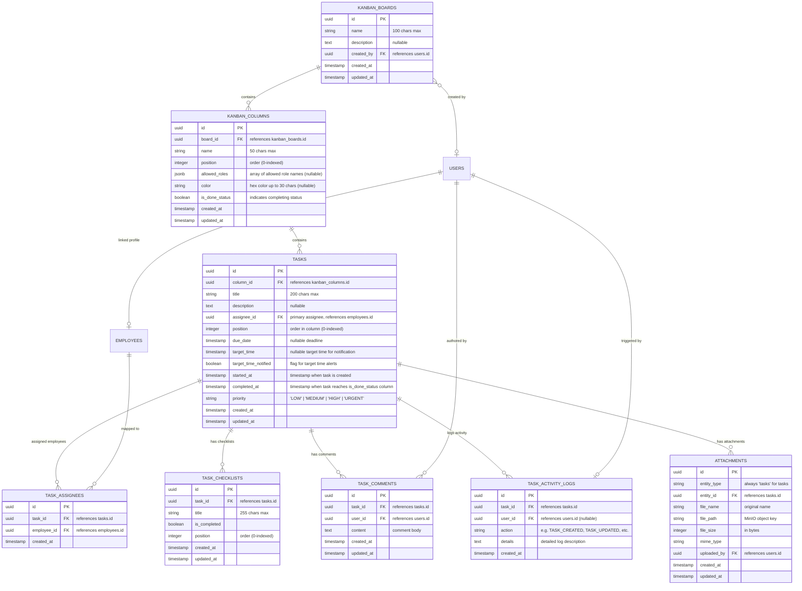

# Yaqeen Backend - Kanban Board & Tasks Module Documentation

This document provides complete, authoritative specifications for the **Kanban Board & Tasks Module** in the **Yaqeen Backend**. It outlines the data model, database schemas, role-based access controls (including custom column transition permissions), task assignment, comments, checklist management, MinIO file attachments, background cron schedulers, activity tracking, and comprehensive frontend integration details.

---

## 1. Module Architecture & Database Schema

The module implements a nested Kanban project management structure:

- A **Board** has multiple **Columns** (or statuses).
- A **Column** has multiple **Tasks**.
- A **Task** can have multiple **Assignees** (mapped via junction table), multiple **Checklist Items**, multiple **Comments**, multiple **Attachments**, and an audit trail of **Activity Logs**.

### 1.1. Entity Relationship Diagram (ERD)



---

### 1.2. Database Tables Detail

#### 1.2.1. `kanban_boards` Table

Stores boards created to host tasks and columns.

| Field Name    | Data Type      | Constraints              | Default              | Description                     |
| :------------ | :------------- | :----------------------- | :------------------- | :------------------------------ |
| `id`          | `uuid`         | Primary Key              | `uuid_generate_v4()` | Unique identifier.              |
| `name`        | `varchar(100)` | Not Null                 | -                    | Name of the board.              |
| `description` | `text`         | Nullable                 | -                    | Optional context notes.         |
| `created_by`  | `uuid`         | Foreign Key (`users.id`) | `SET NULL`           | Creator user account reference. |
| `created_at`  | `timestamp`    | Not Null                 | `NOW()`              | Creation timestamp.             |
| `updated_at`  | `timestamp`    | Not Null                 | `NOW()`              | Last updated timestamp.         |

#### 1.2.2. `kanban_columns` Table

Represents task statuses/columns within a board.

| Field Name       | Data Type     | Constraints                      | Default              | Description                                             |
| :--------------- | :------------ | :------------------------------- | :------------------- | :------------------------------------------------------ |
| `id`             | `uuid`        | Primary Key                      | `uuid_generate_v4()` | Unique identifier.                                      |
| `board_id`       | `uuid`        | Foreign Key (`kanban_boards.id`) | `CASCADE`, Not Null  | Owning board identifier.                                |
| `name`           | `varchar(50)` | Not Null                         | -                    | Column status name (e.g. `'In Progress'`).              |
| `position`       | `integer`     | Not Null                         | -                    | Order placement value (0-indexed).                      |
| `allowed_roles`  | `jsonb`       | Nullable                         | -                    | Array of allowed role names (e.g. `["CEO", "ROP"]`).    |
| `color`          | `varchar(30)` | Nullable                         | -                    | Custom Hex color code (e.g. `'#10B981'`).               |
| `is_done_status` | `boolean`     | Not Null                         | `false`              | Marks if tasks in this column are considered completed. |
| `created_at`     | `timestamp`   | Not Null                         | `NOW()`              | Creation timestamp.                                     |
| `updated_at`     | `timestamp`   | Not Null                         | `NOW()`              | Last updated timestamp.                                 |

#### 1.2.3. `tasks` Table

Stores Kanban task cards.

| Field Name             | Data Type      | Constraints                       | Default              | Description                                                               |
| :--------------------- | :------------- | :-------------------------------- | :------------------- | :------------------------------------------------------------------------ |
| `id`                   | `uuid`         | Primary Key                       | `uuid_generate_v4()` | Unique identifier.                                                        |
| `column_id`            | `uuid`         | Foreign Key (`kanban_columns.id`) | `CASCADE`, Not Null  | Active column/status placement.                                           |
| `title`                | `varchar(200)` | Not Null                          | -                    | Title text.                                                               |
| `description`          | `text`         | Nullable                          | -                    | Detailed text body.                                                       |
| `assignee_id`          | `uuid`         | Foreign Key (`employees.id`)      | `SET NULL`           | Primary assignee (legacy/primary fallback).                               |
| `position`             | `integer`      | Not Null                          | -                    | Vertical index within its column (0-indexed).                             |
| `due_date`             | `timestamp`    | Nullable                          | -                    | Absolute completion deadline.                                             |
| `target_time`          | `timestamp`    | Nullable                          | -                    | Expected notification warning time.                                       |
| `target_time_notified` | `boolean`      | Not Null                          | `false`              | Flag tracking if target_time warning has fired.                           |
| `started_at`           | `timestamp`    | Nullable                          | `NOW()`              | Timestamp when task execution began.                                      |
| `completed_at`         | `timestamp`    | Nullable                          | -                    | Timestamp populated automatically when column has `is_done_status: true`. |
| `priority`             | `varchar(20)`  | Not Null                          | `'MEDIUM'`           | Urgency level: `'LOW'`, `'MEDIUM'`, `'HIGH'`, `'URGENT'`.                 |
| `created_at`           | `timestamp`    | Not Null                          | `NOW()`              | Creation timestamp.                                                       |
| `updated_at`           | `timestamp`    | Not Null                          | `NOW()`              | Last updated timestamp.                                                   |

#### 1.2.4. `task_assignees` Table

Junction table mapping tasks to multiple employees.

| Field Name    | Data Type   | Constraints                  | Default              | Description                      |
| :------------ | :---------- | :--------------------------- | :------------------- | :------------------------------- |
| `id`          | `uuid`      | Primary Key                  | `uuid_generate_v4()` | Unique record identifier.        |
| `task_id`     | `uuid`      | Foreign Key (`tasks.id`)     | `CASCADE`, Not Null  | Assigned task.                   |
| `employee_id` | `uuid`      | Foreign Key (`employees.id`) | `CASCADE`, Not Null  | Assigned employee profile.       |
| `created_at`  | `timestamp` | Not Null                     | `NOW()`              | Mapping creation timestamp.      |
| _Composite_   | `Unique`    | `['task_id', 'employee_id']` | -                    | Restricts duplicate assignments. |

#### 1.2.5. `task_checklists` Table

Interactive checklist checkboxes nested within tasks.

| Field Name     | Data Type      | Constraints              | Default              | Description                        |
| :------------- | :------------- | :----------------------- | :------------------- | :--------------------------------- |
| `id`           | `uuid`         | Primary Key              | `uuid_generate_v4()` | Unique identifier.                 |
| `task_id`      | `uuid`         | Foreign Key (`tasks.id`) | `CASCADE`, Not Null  | Owning task.                       |
| `title`        | `varchar(255)` | Not Null                 | -                    | Checklist action text description. |
| `is_completed` | `boolean`      | Not Null                 | `false`              | Checked state flag.                |
| `position`     | `integer`      | Not Null                 | `0`                  | Order of list display.             |
| `created_at`   | `timestamp`    | Not Null                 | `NOW()`              | Creation timestamp.                |
| `updated_at`   | `timestamp`    | Not Null                 | `NOW()`              | Last updated timestamp.            |

#### 1.2.6. `task_comments` Table

Interactive logs of user discussion on a task.

| Field Name   | Data Type   | Constraints              | Default              | Description                 |
| :----------- | :---------- | :----------------------- | :------------------- | :-------------------------- |
| `id`         | `uuid`      | Primary Key              | `uuid_generate_v4()` | Unique identifier.          |
| `task_id`    | `uuid`      | Foreign Key (`tasks.id`) | `CASCADE`, Not Null  | Linked task.                |
| `user_id`    | `uuid`      | Foreign Key (`users.id`) | `CASCADE`, Not Null  | Author user account.        |
| `content`    | `text`      | Not Null                 | -                    | Comment Markdown/text body. |
| `created_at` | `timestamp` | Not Null                 | `NOW()`              | Comment timestamp.          |
| `updated_at` | `timestamp` | Not Null                 | `NOW()`              | Last update timestamp.      |

#### 1.2.7. `task_activity_logs` Table

Audit logs representing the historical edition timeline of task modifications.

| Field Name   | Data Type     | Constraints              | Default              | Description                                        |
| :----------- | :------------ | :----------------------- | :------------------- | :------------------------------------------------- |
| `id`         | `uuid`        | Primary Key              | `uuid_generate_v4()` | Unique identifier.                                 |
| `task_id`    | `uuid`        | Foreign Key (`tasks.id`) | `CASCADE`, Not Null  | Related task.                                      |
| `user_id`    | `uuid`        | Foreign Key (`users.id`) | `SET NULL`, Nullable | Actor user account (null for cron system changes). |
| `action`     | `varchar(50)` | Not Null                 | -                    | Event type key (e.g. `'TASK_CREATED'`).            |
| `details`    | `text`        | Nullable                 | -                    | Human-readable audit text summary.                 |
| `created_at` | `timestamp`   | Not Null                 | `NOW()`              | Log entry timestamp.                               |

---

## 2. Permissions Scoping & Security Model

The Yaqeen platform uses two layers of access control validation for the Kanban board and Tasks module: **Global Role Permissions** and **Column-Specific Status Permissions**.

### 2.1. Global RBAC Permissions (`tasks` module key)

A user's linked role contains a permissions matrix. The `'tasks'` module controls global access to boards, columns, and tasks:

| Operation                                                           | Required Permission Action | Scope                                                              |
| :------------------------------------------------------------------ | :------------------------- | :----------------------------------------------------------------- |
| Create Board, Column, Task                                          | `tasks:create`             | Access to write operations creating new boards, columns, or tasks. |
| Read/View Boards, Tasks, Logs                                       | `tasks:read`               | Access to fetch list endpoints or retrieve nested task details.    |
| Edit Board, Column, Task Details, Comments, Checklists, Attachments | `tasks:update`             | Access to make modifications on existing records.                  |
| Delete Board, Column, Task                                          | `tasks:delete`             | Access to permanently delete tasks, columns, or boards.            |

#### Default System Roles Access Levels

- **`CEO` (Chief Executive Officer)**: Bypasses the authorization guard entirely. Has superuser access to all actions (`create`, `read`, `update`, `delete`).
- **`ROP` (Head of Sales / Operations)**: Fully enabled for all actions (`create: true`, `read: true`, `update: true`, `delete: true`).
- **`EMPLOYEE` (Standard Employee)**: Restrained access. Standard employees have permissions `create: true`, `read: true`, `update: true`, `delete: false`. They **cannot** delete boards, columns, or tasks.

---

### 2.2. Column-Specific Status Permissions (`allowed_roles`)

To support strict operational pipelines (e.g., only Managers being allowed to move tasks to a "Released" status), columns support granular role constraints:

1. Every column can store an array of role names in `allowed_roles` (e.g. `["CEO", "ROP"]`).
2. When creating a task directly in a column (`POST /tasks`) or moving a task to a column (`PATCH /tasks/:id/move` or `PUT /tasks/:id`), the backend validates permissions:
   - If `allowed_roles` is not empty, the current user's role string is checked against it.
   - If the user's role is not in the column's `allowed_roles` array (and is not `'CEO'`), the operation is rejected.
   - Rejection throws a **`403 Forbidden`** with `location: "status_permission_denied"`.

```
               [ Task Move Request ]
                         │
              Is User Role == 'CEO'?
               /                \
             Yes                 No
             /                    \
     [Access Granted]    Does Column have "allowed_roles"?
                            /               \
                          Yes                No
                          /                   \
         Is User Role in "allowed_roles"?   [Access Granted]
                     /          \
                   Yes           No
                   /              \
           [Access Granted]    [403 Forbidden]
```

---

### 2.3. Owner-Specific Actions Guard

- **Task Comment Deletion**:
  - A user is only authorized to delete a comment if they are the author of that comment (`comment.user_id === user.id`).
  - If a user attempts to delete someone else's comment, the request fails with a **`403 Forbidden`** and `location: "forbidden_comment_deletion"`.

---

## 3. Target Time & Due Date Scheduler (Background Cron)

The backend runs a scheduler that operates continuously in the background to monitor deadlines and send reminders.

### 3.1. Cron Job Specifications

- **Frequency**: Every minute (`@Cron(EVERY_MINUTE)`).
- **Evaluation Criteria**:
  The scheduler queries the database to find all tasks matching:
  - Task is not completed: `completed_at` is `NULL`.
  - Task has not sent a notification yet: `target_time_notified` is `false`.
  - The current timestamp `NOW()` is greater than or equal to `target_time` **OR** `due_date`.
- **Logic Sequence**:
  1. Identifies the candidate tasks matching the filter.
  2. For each task, fetches the list of assigned employees (`task_assignees`).
  3. Iterates over assignees, resolving each `employee.id` to their normalized phone number.
  4. Looks up mapped Telegram chat IDs in the `telegram_contacts` table.
  5. Sends a Telegram markdown alert to each assigned employee:
     > ⏰ **Target Time Reached!**
     > Task "**[Task Title]**" has reached its target completion time.
     > **Target Time**: `[Timestamp]`
  6. Updates the database record to set `target_time_notified = true`.
  7. Inserts an entry into `task_activity_logs` with `action: 'TARGET_TIME_REACHED_NOTIFIED'` and details `"Target time notification dispatched to assigned employees."`.

---

## 4. Task Activity Audit Logs Registry

Every state-modifying action on a task writes an entry to `task_activity_logs`. Below is the registry of action names and descriptions:

| Log Action                     | Details Content Pattern                                                                                                    | Trigger Point                                                                     |
| :----------------------------- | :------------------------------------------------------------------------------------------------------------------------- | :-------------------------------------------------------------------------------- |
| `TASK_CREATED`                 | `Task "[Title]" created in column "[Column Name]".`                                                                        | Task is initially created via `POST /tasks`.                                      |
| `TASK_UPDATED`                 | List of updated fields, comma-separated (e.g. `Status changed to "Done", Title changed to "...", Task assignees updated`). | Fields are altered via `PUT /tasks/:id` or `PATCH /tasks/:id/move`.               |
| `CHECKLIST_ITEM_ADDED`         | `Checklist item "[Title]" added.`                                                                                          | New checklist item created via `POST /tasks/:id/checklists`.                      |
| `CHECKLIST_ITEM_UPDATED`       | `Checklist item "[Title]" updated (completed: true/false).`                                                                | Checklist item toggled or title modified via `PUT /tasks/:id/checklists/:itemId`. |
| `CHECKLIST_ITEM_DELETED`       | `Checklist item removed.`                                                                                                  | Checklist item deleted via `DELETE /tasks/:id/checklists/:itemId`.                |
| `COMMENT_ADDED`                | `Comment added to task.`                                                                                                   | Comment is posted via `POST /tasks/:id/comments`.                                 |
| `TARGET_TIME_REACHED_NOTIFIED` | `Target time notification dispatched to assigned employees.`                                                               | Automated cron job alerts employees and registers completion flag.                |

---

## 5. REST API Endpoints Specification

All endpoints require a valid Bearer JWT: `Authorization: Bearer <access_token>`.

### 5.1. Boards Management API (Base Route: `/kanban/boards`)

#### 5.1.1. Create Board

Creates a new board and automatically seeds 4 default workflow columns: `"To Do"`, `"In Progress"`, `"Review"`, and `"Done"`.

- **Method:** `POST`
- **Route:** `/kanban/boards`
- **Access:** `Private` (Requires `tasks:create` permission)
- **Request Body:**
  ```json
  {
    "name": "Operations Board",
    "description": "Board for logistics operations tracking"
  }
  ```
- **Success Status:** `201 Created`
- **Response Example:**
  ```json
  {
    "id": "2d8f9b90-1c00-4b53-9a3d-4c3e80eefb12",
    "name": "Operations Board",
    "description": "Board for logistics operations tracking",
    "created_by": "a0013d8c-ffbb-4b36-bf40-42fcf55444a1",
    "created_at": "2026-07-23T17:30:00.000Z",
    "updated_at": "2026-07-23T17:30:00.000Z"
  }
  ```

#### 5.1.2. List Boards

Lists all boards in the system, sorted by creation date descending.

- **Method:** `GET`
- **Route:** `/kanban/boards`
- **Access:** `Private` (Requires `tasks:read` permission)
- **Success Status:** `200 OK`
- **Response Example:**
  ```json
  [
    {
      "id": "2d8f9b90-1c00-4b53-9a3d-4c3e80eefb12",
      "name": "Operations Board",
      "description": "Board for logistics operations tracking",
      "created_by": "a0013d8c-ffbb-4b36-bf40-42fcf55444a1",
      "created_at": "2026-07-23T17:30:00.000Z",
      "updated_at": "2026-07-23T17:30:00.000Z"
    }
  ]
  ```

#### 5.1.3. Get Board Details

Fetches a board by ID with its columns and nested tasks. Includes task checklist summaries, assignees, and attachments.

- **Method:** `GET`
- **Route:** `/kanban/boards/:id`
- **Access:** `Private` (Requires `tasks:read` permission)
- **Path Parameters:** `id` (UUID, required)
- **Success Status:** `200 OK`
- **Response Example:**
  ```json
  {
    "id": "2d8f9b90-1c00-4b53-9a3d-4c3e80eefb12",
    "name": "Operations Board",
    "description": "Board for logistics operations tracking",
    "createdBy": "a0013d8c-ffbb-4b36-bf40-42fcf55444a1",
    "columns": [
      {
        "id": "9c8b7a6d-e5f4-3c2b-1a0e-9f8e7d6c5b4a",
        "boardId": "2d8f9b90-1c00-4b53-9a3d-4c3e80eefb12",
        "name": "To Do",
        "position": 0,
        "color": "#3B82F6",
        "isDoneStatus": false,
        "allowedRoles": null,
        "tasks": [
          {
            "id": "7bf3b3fa-0941-477d-8153-2947df0cb21d",
            "columnId": "9c8b7a6d-e5f4-3c2b-1a0e-9f8e7d6c5b4a",
            "title": "Prepare cargo declaration documents",
            "description": "Fill customs docs and upload drafts",
            "priority": "HIGH",
            "assigneeId": "5f9b90de-3d4c-47ea-a2bb-2d7c5beea231",
            "assignees": [
              {
                "id": "5f9b90de-3d4c-47ea-a2bb-2d7c5beea231",
                "firstName": "Sherzod",
                "lastName": "Karimov",
                "color": "#3B82F6"
              }
            ],
            "position": 0,
            "dueDate": "2026-07-25T18:00:00.000Z",
            "targetTime": "2026-07-25T12:00:00.000Z",
            "startedAt": "2026-07-23T17:35:00.000Z",
            "completedAt": null,
            "checklists": [
              {
                "id": "d0e1f2a3-b4c5-6d7e-8f90-112233445566",
                "title": "Download Form 10A",
                "isCompleted": true,
                "position": 0
              },
              {
                "id": "e0f1a2b3-c4d5-6e7f-9011-223344556677",
                "title": "Sign with Electronic Signature",
                "isCompleted": false,
                "position": 1
              }
            ],
            "attachments": [
              {
                "id": "f0a1b2c3-d4e5-6f7a-8b9c-0123456789ab",
                "fileName": "customs_template.pdf",
                "filePath": "attachments/tasks/7bf3b3fa-0941-477d-8153-2947df0cb21d/f0a1b2c3-d4e5-6f7a-8b9c-0123456789ab.pdf",
                "fileSize": 124536,
                "mimeType": "application/pdf"
              }
            ],
            "createdAt": "2026-07-23T17:35:00.000Z",
            "updatedAt": "2026-07-23T17:35:00.000Z"
          }
        ],
        "createdAt": "2026-07-23T17:30:00.000Z",
        "updatedAt": "2026-07-23T17:30:00.000Z"
      }
    ],
    "createdAt": "2026-07-23T17:30:00.000Z",
    "updatedAt": "2026-07-23T17:30:00.000Z"
  }
  ```

#### 5.1.4. Update Board

- **Method:** `PUT`
- **Route:** `/kanban/boards/:id`
- **Access:** `Private` (Requires `tasks:update` permission)
- **Path Parameters:** `id` (UUID, required)
- **Request Body:**
  ```json
  {
    "name": "Global Cargo Operations Board",
    "description": "Updated cargo tracking board"
  }
  ```
- **Success Status:** `200 OK`
- **Response Example:**
  ```json
  {
    "id": "2d8f9b90-1c00-4b53-9a3d-4c3e80eefb12",
    "name": "Global Cargo Operations Board",
    "description": "Updated cargo tracking board",
    "created_by": "a0013d8c-ffbb-4b36-bf40-42fcf55444a1",
    "created_at": "2026-07-23T17:30:00.000Z",
    "updated_at": "2026-07-23T17:40:00.000Z"
  }
  ```

#### 5.1.5. Delete Board

- **Method:** `DELETE`
- **Route:** `/kanban/boards/:id`
- **Access:** `Private` (Requires `tasks:delete` permission)
- **Path Parameters:** `id` (UUID, required)
- **Success Status:** `204 No Content`

---

### 5.2. Columns Management API (Base Route: `/kanban/columns`)

#### 5.2.1. Create Column

- **Method:** `POST`
- **Route:** `/kanban/columns`
- **Access:** `Private` (Requires `tasks:create` permission)
- **Request Body:**
  ```json
  {
    "board_id": "2d8f9b90-1c00-4b53-9a3d-4c3e80eefb12",
    "name": "Audit Verification",
    "position": 4,
    "allowed_roles": ["CEO", "ROP"],
    "color": "#F59E0B",
    "is_done_status": false
  }
  ```
- **Success Status:** `201 Created`
- **Response Example:**
  ```json
  {
    "id": "3e9f0a1b-2c3d-4e5f-6a7b-8c9d0e1f2a3b",
    "board_id": "2d8f9b90-1c00-4b53-9a3d-4c3e80eefb12",
    "name": "Audit Verification",
    "position": 4,
    "allowed_roles": ["CEO", "ROP"],
    "color": "#F59E0B",
    "is_done_status": false,
    "created_at": "2026-07-23T17:45:00.000Z",
    "updated_at": "2026-07-23T17:45:00.000Z"
  }
  ```

#### 5.2.2. Update Column

Updates column properties. Note: Changing `allowed_roles` restricts column transition permission dynamically.

- **Method:** `PUT`
- **Route:** `/kanban/columns/:id`
- **Access:** `Private` (Requires `tasks:update` permission)
- **Path Parameters:** `id` (UUID, required)
- **Request Body:**
  ```json
  {
    "name": "Manager Verification",
    "allowed_roles": ["CEO", "ROP"],
    "color": "#EF4444"
  }
  ```
- **Success Status:** `200 OK`
- **Response Example:**
  ```json
  {
    "id": "3e9f0a1b-2c3d-4e5f-6a7b-8c9d0e1f2a3b",
    "board_id": "2d8f9b90-1c00-4b53-9a3d-4c3e80eefb12",
    "name": "Manager Verification",
    "position": 4,
    "allowed_roles": ["CEO", "ROP"],
    "color": "#EF4444",
    "is_done_status": false,
    "created_at": "2026-07-23T17:45:00.000Z",
    "updated_at": "2026-07-23T17:48:00.000Z"
  }
  ```

#### 5.2.3. Reorder Columns

Updates positions of all columns within a board based on a sorted array of IDs.

- **Method:** `PUT`
- **Route:** `/kanban/columns/reorder/board/:boardId`
- **Access:** `Private` (Requires `tasks:update` permission)
- **Path Parameters:** `boardId` (UUID, required)
- **Request Body:**
  ```json
  {
    "column_ids": [
      "9c8b7a6d-e5f4-3c2b-1a0e-9f8e7d6c5b4a",
      "3e9f0a1b-2c3d-4e5f-6a7b-8c9d0e1f2a3b"
    ]
  }
  ```
- **Success Status:** `200 OK`
- **Response Example:**
  ```json
  [
    {
      "id": "9c8b7a6d-e5f4-3c2b-1a0e-9f8e7d6c5b4a",
      "boardId": "2d8f9b90-1c00-4b53-9a3d-4c3e80eefb12",
      "name": "To Do",
      "position": 0,
      "allowed_roles": null,
      "color": null,
      "is_done_status": false
    },
    {
      "id": "3e9f0a1b-2c3d-4e5f-6a7b-8c9d0e1f2a3b",
      "boardId": "2d8f9b90-1c00-4b53-9a3d-4c3e80eefb12",
      "name": "Manager Verification",
      "position": 1,
      "allowed_roles": ["CEO", "ROP"],
      "color": "#EF4444",
      "is_done_status": false
    }
  ]
  ```

#### 5.2.4. Delete Column

- **Method:** `DELETE`
- **Route:** `/kanban/columns/:id`
- **Access:** `Private` (Requires `tasks:delete` permission)
- **Path Parameters:** `id` (UUID, required)
- **Success Status:** `204 No Content`

---

### 5.3. Tasks Management API (Base Route: `/tasks`)

#### 5.3.1. Create Task

Creates a task card. The assignee array is synchronized automatically with the `task_assignees` junction table. If `checklists` are provided, they are populated during task creation.

- **Method:** `POST`
- **Route:** `/tasks`
- **Access:** `Private` (Requires `tasks:create` permission)
- **Request Body:**
  ```json
  {
    "column_id": "9c8b7a6d-e5f4-3c2b-1a0e-9f8e7d6c5b4a",
    "title": "Prepare Customs Declaration",
    "description": "Upload declaration and cross-reference values.",
    "assignee_id": "5f9b90de-3d4c-47ea-a2bb-2d7c5beea231",
    "assignee_ids": [
      "5f9b90de-3d4c-47ea-a2bb-2d7c5beea231",
      "6a7c8d9e-1b2c-3d4e-5f6a-7b8c9d0e1f2a"
    ],
    "priority": "HIGH",
    "due_date": "2026-07-30T18:00:00.000Z",
    "target_time": "2026-07-29T12:00:00.000Z",
    "checklists": [
      {
        "title": "Import Excel sheet data",
        "is_completed": false,
        "position": 0
      }
    ]
  }
  ```
- **Success Status:** `201 Created`
- **Response Example:**
  See standard task details response structure in `GET /tasks/:id`

#### 5.3.2. List Tasks

Lists tasks. Supports query parameters for filtering and pagination:

- `column_id` (UUID): Filters tasks in a column.
- `assignee_id` (UUID): Filters tasks assigned to specific employee.
- `priority` (String): Filters by priority (`LOW`/`MEDIUM`/`HIGH`/`URGENT`).
- `search` (String): Case-insensitive search on title and description.
- `limit` (Number): Items per page (default: `50`, max: `100`).
- `offset` (Number): Offset for pagination.
- `page` (Number): 1-based page number.
- `group_by_column` (Boolean): Set to `true` to return status-grouped board layout.

Adheres to the standardized `{ meta, data }` response envelope structure and includes breakdown counts per column (`column_counts`):

- **Method:** `GET`
- **Route:** `/tasks`
- **Access:** `Private` (Requires `tasks:read` permission)
- **Success Status:** `200 OK`
- **Response Example:**
  ```json
  {
    "meta": {
      "total": 100,
      "limit": 50,
      "offset": 0,
      "page": 1,
      "totalPages": 2,
      "column_counts": {
        "9c8b7a6d-e5f4-3c2b-1a0e-9f8e7d6c5b4a": 20,
        "3e9f0a1b-2c3d-4e5f-6a7b-8c9d0e1f2a3b": 10,
        "7bf3b3fa-0941-477d-8153-2947df0cb21d": 70
      }
    },
    "data": [
      {
        "id": "7bf3b3fa-0941-477d-8153-2947df0cb21d",
        "columnId": "9c8b7a6d-e5f4-3c2b-1a0e-9f8e7d6c5b4a",
        "columnName": "To Do",
        "columnColor": "#3B82F6",
        "columnPosition": 0,
        "columnIsDoneStatus": false,
        "title": "Prepare Customs Declaration",
        "description": "Upload declaration and cross-reference values.",
        "priority": "HIGH",
        "position": 0,
        "dueDate": "2026-07-30T18:00:00.000Z",
        "targetTime": "2026-07-29T12:00:00.000Z",
        "startedAt": "2026-07-23T17:30:00.000Z",
        "completedAt": null,
        "createdAt": "2026-07-23T17:30:00.000Z",
        "updatedAt": "2026-07-23T17:30:00.000Z"
      }
    ]
  }
  ```

#### 5.3.3. Viewable Tasks (Board View Grouped by Column Status)

Returns tasks pre-grouped by column ID for board rendering (Kanban style). Each column group includes `metrics.total_tasks` (total count of tasks in DB for that column) and `metrics.loaded_tasks` (count of tasks loaded in current page):

- **Method:** `GET`
- **Route:** `/tasks/viewable`
- **Access:** `Private` (Requires `tasks:read` permission)
- **Success Status:** `200 OK`
- **Response Example:**
  ```json
  {
    "meta": {
      "total": 100,
      "limit": 50,
      "offset": 0,
      "page": 1,
      "totalPages": 2,
      "column_counts": {
        "9c8b7a6d-e5f4-3c2b-1a0e-9f8e7d6c5b4a": 20,
        "3e9f0a1b-2c3d-4e5f-6a7b-8c9d0e1f2a3b": 10
      }
    },
    "data": {
      "9c8b7a6d-e5f4-3c2b-1a0e-9f8e7d6c5b4a": {
        "column": {
          "id": "9c8b7a6d-e5f4-3c2b-1a0e-9f8e7d6c5b4a",
          "board_id": "2d8f9b90-1c00-4b53-9a3d-4c3e80eefb12",
          "name": "To Do",
          "position": 0,
          "color": "#3B82F6",
          "is_done_status": false
        },
        "metrics": {
          "total_tasks": 20,
          "loaded_tasks": 5
        },
        "tasks": [/* Array of tasks */]
      }
    }
  }
  ```

#### 5.3.4. Get Task Details

Retrieves complete details of a task card including nested checklists, comments, attachments, activityLogs, and assignees.

- **Method:** `GET`
- **Route:** `/tasks/:id`
- **Access:** `Private` (Requires `tasks:read` permission)
- **Path Parameters:** `id` (UUID, required)
- **Success Status:** `200 OK`
- **Response Example:**
  ```json
  {
    "id": "7bf3b3fa-0941-477d-8153-2947df0cb21d",
    "columnId": "9c8b7a6d-e5f4-3c2b-1a0e-9f8e7d6c5b4a",
    "columnName": "To Do",
    "columnColor": "#3B82F6",
    "title": "Prepare Customs Declaration",
    "description": "Upload declaration and cross-reference values.",
    "priority": "HIGH",
    "position": 0,
    "dueDate": "2026-07-30T18:00:00.000Z",
    "targetTime": "2026-07-29T12:00:00.000Z",
    "startedAt": "2026-07-23T17:35:00.000Z",
    "completedAt": null,
    "targetTimeNotified": false,
    "assigneeId": "5f9b90de-3d4c-47ea-a2bb-2d7c5beea231",
    "assignees": [
      {
        "id": "5f9b90de-3d4c-47ea-a2bb-2d7c5beea231",
        "firstName": "Sherzod",
        "lastName": "Karimov",
        "phone": "+998901234567",
        "color": "#3B82F6"
      }
    ],
    "checklists": [
      {
        "id": "d0e1f2a3-b4c5-6d7e-8f90-112233445566",
        "title": "Import Excel sheet data",
        "isCompleted": false,
        "position": 0
      }
    ],
    "attachments": [
      {
        "id": "f0a1b2c3-d4e5-6f7a-8b9c-0123456789ab",
        "fileName": "declaration_draft.xlsx",
        "filePath": "attachments/tasks/7bf3b3fa-0941-477d-8153-2947df0cb21d/f0a1b2c3-d4e5-6f7a-8b9c-0123456789ab.xlsx",
        "fileSize": 45120,
        "mimeType": "application/vnd.openxmlformats-officedocument.spreadsheetml.sheet",
        "uploadedBy": "a0013d8c-ffbb-4b36-bf40-42fcf55444a1",
        "createdAt": "2026-07-23T17:36:00.000Z",
        "updatedAt": "2026-07-23T17:36:00.000Z"
      }
    ],
    "comments": [
      {
        "id": "d98f7a6b-c5e4-2f3b-1a0e-9d8c7b6a5e4d",
        "content": "Please verify values against cargo invoice",
        "userId": "a0013d8c-ffbb-4b36-bf40-42fcf55444a1",
        "username": "rop_admin",
        "createdAt": "2026-07-23T17:40:00.000Z"
      }
    ],
    "activityLogs": [
      {
        "id": "e9a0f1b2-c3d4-4e5f-6a7b-8c9d0e1f2a3b",
        "userId": "a0013d8c-ffbb-4b36-bf40-42fcf55444a1",
        "action": "TASK_CREATED",
        "details": "Task \"Prepare Customs Declaration\" created in column \"To Do\".",
        "createdAt": "2026-07-23T17:35:00.000Z"
      }
    ],
    "createdAt": "2026-07-23T17:35:00.000Z",
    "updatedAt": "2026-07-23T17:40:00.000Z"
  }
  ```

#### 5.3.4. Update Task Details

Alters task fields. If `column_id` changes to a column marked as `is_done_status = true`, `completed_at` is set to `NOW()`. If `column_id` shifts back, `completed_at` resets to `null`. Resets `target_time_notified` to `false` if `target_time` is modified.

- **Method:** `PUT`
- **Route:** `/tasks/:id`
- **Access:** `Private` (Requires `tasks:update` permission)
- **Path Parameters:** `id` (UUID, required)
- **Request Body:**
  ```json
  {
    "title": "Final Customs Declaration",
    "priority": "URGENT",
    "target_time": "2026-07-29T16:00:00.000Z"
  }
  ```
- **Success Status:** `200 OK`
- **Response Example:**
  Returns the updated task details model (identical to `GET /tasks/:id`).

#### 5.3.5. Move Task (Kanban Transition)

Performs column shifts or position changes. Validates dynamic column access permissions using the active user role.

- **Method:** `PATCH`
- **Route:** `/tasks/:id/move`
- **Access:** `Private` (Requires `tasks:update` permission)
- **Path Parameters:** `id` (UUID, required)
- **Request Body:**
  ```json
  {
    "column_id": "3e9f0a1b-2c3d-4e5f-6a7b-8c9d0e1f2a3b",
    "position": 0
  }
  ```
- **Success Status:** `200 OK`
- **Response Example:**
  Returns the updated task details (identical to `GET /tasks/:id`).

#### 5.3.6. Delete Task

- **Method:** `DELETE`
- **Route:** `/tasks/:id`
- **Access:** `Private` (Requires `tasks:delete` permission)
- **Path Parameters:** `id` (UUID, required)
- **Success Status:** `204 No Content`

---

### 5.4. Checklists API (Sub-routes of `/tasks`)

#### 5.4.1. Add Checklist Item

- **Method:** `POST`
- **Route:** `/tasks/:id/checklists`
- **Access:** `Private` (Requires `tasks:update` permission)
- **Path Parameters:** `id` (Task UUID, required)
- **Request Body:**
  ```json
  {
    "title": "Verify container seal number",
    "is_completed": false,
    "position": 1
  }
  ```
- **Success Status:** `201 Created`
- **Response Example:**
  ```json
  {
    "id": "e0b1c2a3-f4b5-6c7d-8e9f-011223344556",
    "title": "Verify container seal number",
    "isCompleted": false,
    "position": 1
  }
  ```

#### 5.4.2. Update Checklist Item

- **Method:** `PUT`
- **Route:** `/tasks/:id/checklists/:itemId`
- **Access:** `Private` (Requires `tasks:update` permission)
- **Path Parameters:**
  - `id` (Task UUID, required)
  - `itemId` (Checklist item UUID, required)
- **Request Body:**
  ```json
  {
    "is_completed": true
  }
  ```
- **Success Status:** `200 OK`
- **Response Example:**
  ```json
  {
    "id": "e0b1c2a3-f4b5-6c7d-8e9f-011223344556",
    "title": "Verify container seal number",
    "isCompleted": true,
    "position": 1
  }
  ```

#### 5.4.3. Delete Checklist Item

- **Method:** `DELETE`
- **Route:** `/tasks/:id/checklists/:itemId`
- **Access:** `Private` (Requires `tasks:update` permission)
- **Path Parameters:**
  - `id` (Task UUID, required)
  - `itemId` (Checklist item UUID, required)
- **Success Status:** `204 No Content`

---

### 5.5. Comments API

#### 5.5.1. Add Comment

- **Method:** `POST`
- **Route:** `/tasks/:id/comments`
- **Access:** `Private` (Requires `tasks:update` permission)
- **Path Parameters:** `id` (Task UUID, required)
- **Request Body:**
  ```json
  {
    "content": "Invoice amounts match declaration exactly."
  }
  ```
- **Success Status:** `201 Created`
- **Response Example:**
  ```json
  {
    "id": "f8a7b6c5-d4e3-2f1b-0a9e-8d7c6b5a4e3d",
    "content": "Invoice amounts match declaration exactly.",
    "userId": "a0013d8c-ffbb-4b36-bf40-42fcf55444a1",
    "username": "rop_admin",
    "createdAt": "2026-07-23T18:00:00.000Z"
  }
  ```

#### 5.5.2. Delete Comment

- **Method:** `DELETE`
- **Route:** `/tasks/comments/:commentId`
- **Access:** `Private` (Requires `tasks:update` permission)
- **Path Parameters:** `commentId` (Comment UUID, required)
- **Rules:** Only the comment author can delete it. Attempting to delete another user's comment results in a `403 Forbidden` (`forbidden_comment_deletion`).
- **Success Status:** `204 No Content`

---

### 5.6. Task Attachments API

#### 5.6.1. Upload Task Attachment

Uploads a task-related document. Files are saved in MinIO inside `attachments/tasks/[taskId]/[fileId][extension]` path. Maximum file size allowed is **50MB**. Executable file extensions (e.g. `.exe`, `.dll`, `.bat`, `.sh`, `.cmd`, `.msi`) are rejected.

- **Method:** `POST`
- **Route:** `/tasks/:id/attachments`
- **Access:** `Private` (Requires `tasks:update` permission)
- **Content-Type:** `multipart/form-data`
- **Path Parameters:** `id` (Task UUID, required)
- **Multipart Field:** `file` (Binary File Buffer)
- **Success Status:** `201 Created`
- **Response Example:**
  ```json
  {
    "id": "f0a1b2c3-d4e5-6f7a-8b9c-0123456789ab",
    "entityType": "tasks",
    "entityId": "7bf3b3fa-0941-477d-8153-2947df0cb21d",
    "fileName": "customs_template.pdf",
    "filePath": "attachments/tasks/7bf3b3fa-0941-477d-8153-2947df0cb21d/f0a1b2c3-d4e5-6f7a-8b9c-0123456789ab.pdf",
    "fileSize": 124536,
    "mimeType": "application/pdf",
    "uploadedBy": "a0013d8c-ffbb-4b36-bf40-42fcf55444a1",
    "createdAt": "2026-07-23T17:36:00.000Z",
    "updatedAt": "2026-07-23T17:36:00.000Z"
  }
  ```

#### 5.6.2. Download Attachment (Global Endpoint)

Retrieves a secure, temporary, pre-signed download link generated by MinIO.

- **Method:** `GET`
- **Route:** `/attachments/:id/download`
- **Access:** `Private` (Requires `attachments:read` permission)
- **Path Parameters:** `id` (Attachment UUID, required)
- **Query Parameters:** `expiry` (Integer, Optional - Expiration duration in seconds)
- **Success Status:** `200 OK`
- **Response Example:**
  ```json
  {
    "downloadUrl": "https://minio.yaqeen.internal/bucket/attachments/tasks/7bf3b3fa-0941-477d-8153-2947df0cb21d/f0a1b2c3-d4e5-6f7a-8b9c-0123456789ab.pdf?X-Amz-Algorithm=AWS4-HMAC-SHA256&X-Amz-Credential=..."
  }
  ```

#### 5.6.3. Delete Attachment (Global Endpoint)

Deletes the attachment metadata record from the database and removes the corresponding file from MinIO storage.

- **Method:** `DELETE`
- **Route:** `/attachments/:id`
- **Access:** `Private` (Requires `attachments:delete` permission)
- **Path Parameters:** `id` (Attachment UUID, required)
- **Success Status:** `204 No Content`

---

## 6. Security Exceptions & Error Registry

Below is a complete index of module-specific error locations, HTTP statuses, and error causes:

| Location Key                 | HTTP Code         | Cause / Description                                                                       |
| :--------------------------- | :---------------- | :---------------------------------------------------------------------------------------- |
| `insufficient_permissions`   | `403 Forbidden`   | The user lacks the global `'tasks'` permission module action needed.                      |
| `status_permission_denied`   | `403 Forbidden`   | User lacks column-level access permissions to create/move task to `allowed_roles` column. |
| `forbidden_comment_deletion` | `403 Forbidden`   | Attempted to delete a comment authored by another user.                                   |
| `task_not_found`             | `404 Not Found`   | Target task ID does not exist in the database.                                            |
| `column_not_found`           | `404 Not Found`   | Target column ID does not exist in the database.                                          |
| `board_not_found`            | `404 Not Found`   | Target board ID does not exist in the database.                                           |
| `checklist_item_not_found`   | `404 Not Found`   | Target checklist item ID does not exist or isn't nested under the specified task.         |
| `comment_not_found`          | `404 Not Found`   | Target comment ID does not exist.                                                         |
| `attachment_not_found`       | `404 Not Found`   | Target attachment ID does not exist.                                                      |
| `file_missing`               | `400 Bad Request` | No file payload was provided in multipart body.                                           |
| `file_too_large`             | `400 Bad Request` | Provided file size exceeds the 50MB limit.                                                |
| `dangerous_file_type`        | `400 Bad Request` | Provided file extension resides in the executable blacklist.                              |
| `invalid_assignee_ids`       | `400 Bad Request` | One or more specified task assignee employee IDs do not exist in the database.            |

---

## 7. Frontend Integration & UI Rendering Guidelines

Frontend web applications (e.g., built using React, Vue, Next.js) should use this permissions scope to build a dynamic, bulletproof user interface.

### 7.1. Global Task CRUD Rendering

- **Task Deletion**: Only show the Task Delete action/button on cards or details modal if `userPermissions.tasks.delete === true`. Since `EMPLOYEE` role has `tasks.delete = false`, standard employees will never see these buttons.
- **Board/Column Configurations**: Hide options to add columns, delete columns, or modify board structures unless `userPermissions.tasks.update === true` (and `tasks.delete === true` for deleting columns).

### 7.2. Column Drag-and-Drop Authorization

When constructing a drag-and-drop board (e.g., using `React Beautiful DND` or `@dnd-kit`):

1. **Dynamic Visual Indicators**:
   When the user starts dragging a task, check every column's `allowed_roles`:
   - If the user's role is not in the column's `allowed_roles` array (and user is not a `'CEO'`), style the column with a visual lock overlay, and set `isDropDisabled = true` on the drop container.
2. **Task Creation Form Scoping**:
   Disable or hide specific columns in the column selector dropdown of the "Create Task" form if the user's role is not authorized.
3. **State Rollback on Transition Failures**:
   Implement optimistic updates on the client. If a task transition fails due to a network error or a `403 Forbidden` (`status_permission_denied`), rollback the task state immediately:
   ```typescript
   // Pseudo-code implementation structure
   const onDragEnd = async (result) => {
     const { source, destination, draggableId } = result;
     if (!destination) return;

     // 1. Save backup state for rollback
     const backupState = { ...boardState };

     // 2. Perform optimistic update on UI
     optimisticallyMoveTask(draggableId, source, destination);

     try {
       // 3. Make API call
       await api.patch(`/tasks/${draggableId}/move`, {
         column_id: destination.droppableId,
         position: destination.index,
       });
       showToast('Task moved successfully', 'success');
     } catch (error) {
       // 4. Handle permission errors and rollback
       console.error(error);
       setBoardState(backupState); // Rollback

       if (error.response?.data?.location === 'status_permission_denied') {
         showToast(
           'Access Denied: You do not have permission to transition tasks to this column.',
           'error',
         );
       } else {
         showToast('Failed to move task. Reverting change.', 'error');
       }
     }
   };
   ```

### 7.3. Interactive Task Details Component Scoping

- **Checklist Interaction**: Checkboxes for tasks must be disabled unless `userPermissions.tasks.update === true`.
- **Comment Deletion Indicator**:
  When rendering comments inside the detail dialog, compare `comment.userId` with the logged-in user's account ID:
  ```html
  <div class="comment-item">
    <span>{comment.username}</span>
    <p>{comment.content}</p>

    <!-- Render trash button only for comment author -->
    <button
      v-if="comment.userId === currentUserId"
      @click="deleteComment(comment.id)"
    >
      Delete Comment
    </button>
  </div>
  ```
- **Attachments Drop Zone**:
  Disable drag-and-drop file uploaders in the detail dialog if `userPermissions.tasks.update === false`. When rendering files:
  - Embed file preview elements dynamically based on mime types (e.g. `image/*` renders thumbnail images directly; others render formatted icons).
  - Open presigned URLs in a new browser tab:
    ```typescript
    const handleDownload = async (attachmentId: string) => {
      const response = await api.get(`/attachments/${attachmentId}/download`);
      window.open(response.data.downloadUrl, '_blank');
    };
    ```
- **Priority Visuals**:
  Render task priority badges with standard HSL or Hex styles matching the brand identity:
  - `LOW`: Light gray/slate, indicating low priority.
  - `MEDIUM`: Cool blue/azure.
  - `HIGH`: Amber orange, signaling action required soon.
  - `URGENT`: Bright crimson/red with warning icons.
- **Completeness Marker**:
  If a task resides in a column where `is_done_status === true`, render a prominent completed icon (e.g. green checkmark badge) next to the title. Show the localized date when it was resolved: `"Completed at [formatted completedAt]"` instead of the standard due date banner.
