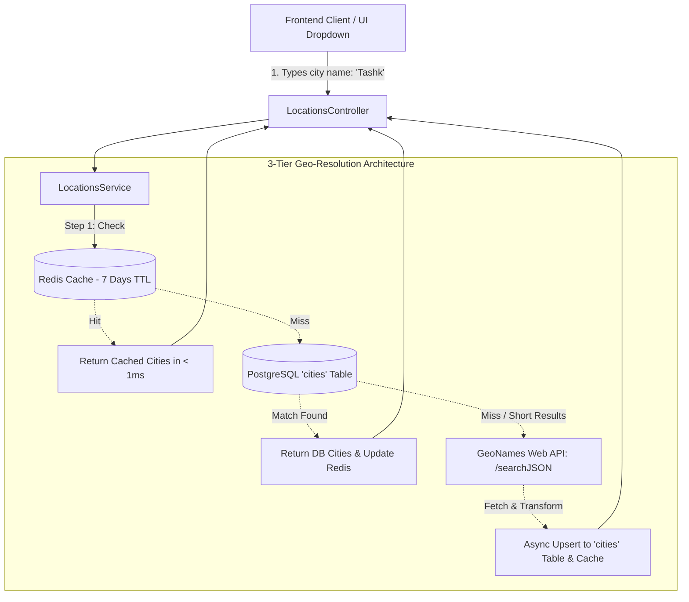

# Locations, Route Intelligence & Duplicate Prevention API Documentation

This document covers the **Locations Module**, **GeoNames Integration**, **Origin/Destination Route Intelligence**, **Duplicate Prevention**, and **Idempotency Engine** in the Yaqeen Backend ERP.

---

## 1. Executive Summary & Business Context

In cross-border international logistics (covering Uzbekistan, Central Asia, China, Turkey, Russia, Europe, and the Middle East), accurate origin and destination metadata is critical for:

1. **Accurate Route Tracking & Navigation**: Tracking cargo origin cities (e.g., Guangzhou, Yiwu, Istanbul) to destination delivery hubs (e.g., Tashkent, Samarkand, Almaty) with standardized naming, ISO country codes, geographic coordinates, and 1-click Google Maps route directions.
2. **Fast Autocomplete & Offline Resilience**: Providing sub-millisecond autocomplete for frontend city selectors using pre-seeded logistics hubs, local Postgres database indexing, Redis caching, and live fallback to the global GeoNames database.
3. **Duplicate Submission Prevention**: Enabling proactive frontend pre-flight duplicate warnings and backend duplicate blocks to eliminate accidental double-entries without preventing legitimate multiple shipments in the same truck.
4. **Network Double-Click / Idempotency Protection**: Preventing duplicate database records caused by rapid button clicks or network retries via Redis-backed idempotency keys.



---

## 2. Geo-Resolution Architecture

The system uses a **3-Tier Cascade Engine** for location searching and resolution:

### Tier 1: Redis Caching Layer

- **Cache Key Format**: `locations:cities:search:<query>:<country_code>:<limit>` and `locations:cities:id:<geoname_id>`
- **TTL**: 7 days (604,800 seconds).
- **Latency**: Sub-millisecond response time.

### Tier 2: PostgreSQL Local Database (`cities` table)

- Pre-seeded with major high-frequency logistics hubs across China, Turkey, Uzbekistan, Kazakhstan, Russia, UAE, and Europe.
- Accelerated with lower-case functional expression indexes (`LOWER(name)`, `LOWER(ascii_name)`) for case-insensitive `ILIKE` and exact matches.

### Tier 3: GeoNames Live Web Service

- If local search yields insufficient results and query length $\ge 2$, the backend queries the GeoNames `/searchJSON` endpoint (filtered by feature class `P` for populated places, ordered by population).
- Fetched results are instantly transformed into standard DTOs and **asynchronously upserted** into the local PostgreSQL `cities` table (`ON CONFLICT (geoname_id) DO UPDATE`), ensuring the local database grows smarter over time.

---

## 3. Database Schema

### A. `cities` Master Table (Migration `20260821210000`)

| Column                      | Type            | Constraints                                  | Description                                          |
| :-------------------------- | :-------------- | :------------------------------------------- | :--------------------------------------------------- |
| `id`                        | `UUID`          | `PRIMARY KEY`, Default: `uuid_generate_v4()` | Unique internal city UUID                            |
| `geoname_id`                | `INTEGER`       | `NULLABLE`, `UNIQUE`, Indexed                | Global GeoNames ID                                   |
| `name`                      | `VARCHAR(255)`  | `NOT NULL`, Indexed                          | City display name (e.g. `Tashkent`, `Guangzhou`)     |
| `ascii_name`                | `VARCHAR(255)`  | `NULLABLE`, Indexed                          | Plain ASCII name for search                          |
| `country_name`              | `VARCHAR(100)`  | `NULLABLE`                                   | Full country name (e.g. `Uzbekistan`, `China`)       |
| `country_code`              | `VARCHAR(10)`   | `NULLABLE`, Indexed                          | 2-letter ISO Country Code (e.g. `UZ`, `CN`, `TR`)    |
| `admin1_name`               | `VARCHAR(255)`  | `NULLABLE`                                   | Region/State/Province (e.g. `Guangdong`, `Zhejiang`) |
| `latitude`                  | `DECIMAL(10,7)` | `NULLABLE`                                   | Geographic latitude                                  |
| `longitude`                 | `DECIMAL(10,7)` | `NULLABLE`                                   | Geographic longitude                                 |
| `timezone`                  | `VARCHAR(100)`  | `NULLABLE`                                   | IANA Timezone identifier (e.g. `Asia/Tashkent`)      |
| `population`                | `BIGINT`        | `NULLABLE`                                   | Population count (used for sorting relevance)        |
| `created_at` / `updated_at` | `TIMESTAMP`     | `NOT NULL`, Default: `NOW()`                 | Audit timestamps                                     |

**Indexes**:

- `CREATE INDEX idx_cities_lower_name ON cities (LOWER(name));`
- `CREATE INDEX idx_cities_lower_ascii ON cities (LOWER(ascii_name));`
- `CREATE INDEX cities_country_code_index ON cities (country_code);`

---

### B. `cargo_registrations` Route Schema Additions

| Column                     | Type            | Constraints         | Description                                         |
| :------------------------- | :-------------- | :------------------ | :-------------------------------------------------- |
| `origin_city`              | `VARCHAR(255)`  | `NULLABLE`          | Name of the departure city (e.g. `Yiwu`)            |
| `origin_country`           | `VARCHAR(100)`  | `NULLABLE`          | Name of departure country (e.g. `China`)            |
| `origin_country_code`      | `VARCHAR(10)`   | `NULLABLE`          | 2-letter ISO country code (`CN`)                    |
| `origin_geoname_id`        | `INTEGER`       | `NULLABLE`, Indexed | GeoNames ID for origin city                         |
| `origin_lat`               | `DECIMAL(10,7)` | `NULLABLE`          | Origin latitude                                     |
| `origin_lng`               | `DECIMAL(10,7)` | `NULLABLE`          | Origin longitude                                    |
| `destination_city`         | `VARCHAR(255)`  | `NULLABLE`          | Name of the arrival/delivery city (e.g. `Tashkent`) |
| `destination_country`      | `VARCHAR(100)`  | `NULLABLE`          | Name of delivery country (e.g. `Uzbekistan`)        |
| `destination_country_code` | `VARCHAR(10)`   | `NULLABLE`          | 2-letter ISO country code (`UZ`)                    |
| `destination_geoname_id`   | `INTEGER`       | `NULLABLE`, Indexed | GeoNames ID for destination city                    |
| `destination_lat`          | `DECIMAL(10,7)` | `NULLABLE`          | Destination latitude                                |
| `destination_lng`          | `DECIMAL(10,7)` | `NULLABLE`          | Destination longitude                               |

**Indexes**:

- `CREATE INDEX idx_cargo_reg_lower_origin_city ON cargo_registrations (LOWER(origin_city));`
- `CREATE INDEX idx_cargo_reg_lower_dest_city ON cargo_registrations (LOWER(destination_city));`
- `CREATE INDEX idx_cargo_reg_origin_dest ON cargo_registrations (origin_city, destination_city);`
- `CREATE INDEX cargo_registrations_origin_geoname_id_index ON cargo_registrations (origin_geoname_id);`
- `CREATE INDEX cargo_registrations_destination_geoname_id_index ON cargo_registrations (destination_geoname_id);`

---

### C. `cargo_consolidations` Route Schema Additions

| Column                     | Type            | Constraints         | Description                  |
| :------------------------- | :-------------- | :------------------ | :--------------------------- |
| `origin_place`             | `VARCHAR(255)`  | `NULLABLE`          | Legacy/text origin name      |
| `origin_country`           | `VARCHAR(100)`  | `NULLABLE`          | Origin country name          |
| `origin_country_code`      | `VARCHAR(10)`   | `NULLABLE`          | Origin ISO country code      |
| `origin_geoname_id`        | `INTEGER`       | `NULLABLE`, Indexed | Origin GeoNames ID           |
| `origin_lat`               | `DECIMAL(10,7)` | `NULLABLE`          | Origin latitude              |
| `origin_lng`               | `DECIMAL(10,7)` | `NULLABLE`          | Origin longitude             |
| `destination_place`        | `VARCHAR(255)`  | `NULLABLE`          | Legacy/text destination name |
| `destination_country`      | `VARCHAR(100)`  | `NULLABLE`          | Destination country name     |
| `destination_country_code` | `VARCHAR(10)`   | `NULLABLE`          | Destination ISO country code |
| `destination_geoname_id`   | `INTEGER`       | `NULLABLE`, Indexed | Destination GeoNames ID      |
| `destination_lat`          | `DECIMAL(10,7)` | `NULLABLE`          | Destination latitude         |
| `destination_lng`          | `DECIMAL(10,7)` | `NULLABLE`          | Destination longitude        |

---

## 4. Locations API Specification

### Base Path: `/api/v1/locations`

All endpoints require standard `Bearer <JWT_TOKEN>` authentication.

---

### A. Autocomplete & Search Cities

#### `GET /api/v1/locations/cities`

Searches cities with ranking by query match priority and population.

**Query Parameters**:

| Parameter | Type     | Required | Default     | Description                                                                                      |
| :-------- | :------- | :------- | :---------- | :----------------------------------------------------------------------------------------------- |
| `q`       | `string` | No       | `""`        | Search prefix or full name (e.g. `Tash`, `Guangz`, `Samarkand`). If empty, returns popular hubs. |
| `country` | `string` | No       | `undefined` | 2-letter ISO country code filter (e.g. `UZ`, `CN`, `TR`, `KZ`, `RU`, `AE`).                      |
| `limit`   | `number` | No       | `15`        | Maximum results to return (Min: 1, Max: 50).                                                     |

**Example Request**:

```http
GET /api/v1/locations/cities?q=Yiw&country=CN&limit=5 HTTP/1.1
Authorization: Bearer <JWT_TOKEN>
```

**Example Response (200 OK)**:

```json
[
  {
    "geoname_id": 1787687,
    "name": "Yiwu",
    "ascii_name": "Yiwu",
    "country_name": "China",
    "country_code": "CN",
    "admin1_name": "Zhejiang",
    "latitude": 29.31506,
    "longitude": 120.07676,
    "timezone": "Asia/Shanghai",
    "population": 1859390,
    "display_name": "Yiwu, Zhejiang, China (CN)"
  }
]
```

---

### B. Get Popular Logistics Hubs

#### `GET /api/v1/locations/cities/popular`

Returns a curated list of top logistics hubs across Central Asia, China, Turkey, Russia, Europe, and the UAE for instant dropdown display before the user types anything.

**Example Request**:

```http
GET /api/v1/locations/cities/popular HTTP/1.1
Authorization: Bearer <JWT_TOKEN>
```

**Example Response (200 OK)**:

```json
[
  {
    "geoname_id": 1512569,
    "name": "Tashkent",
    "ascii_name": "Tashkent",
    "country_name": "Uzbekistan",
    "country_code": "UZ",
    "admin1_name": "Toshkent Shahri",
    "latitude": 41.26465,
    "longitude": 69.21627,
    "timezone": "Asia/Tashkent",
    "population": 1978028,
    "display_name": "Tashkent, Uzbekistan (UZ)"
  },
  {
    "geoname_id": 1809858,
    "name": "Guangzhou",
    "ascii_name": "Guangzhou",
    "country_name": "China",
    "country_code": "CN",
    "admin1_name": "Guangdong",
    "latitude": 23.12744,
    "longitude": 113.25052,
    "timezone": "Asia/Shanghai",
    "population": 18676605,
    "display_name": "Guangzhou, Guangdong, China (CN)"
  },
  {
    "geoname_id": 745044,
    "name": "Istanbul",
    "ascii_name": "Istanbul",
    "country_name": "Turkey",
    "country_code": "TR",
    "admin1_name": "Istanbul",
    "latitude": 41.01384,
    "longitude": 28.94966,
    "timezone": "Europe/Istanbul",
    "population": 14804116,
    "display_name": "Istanbul, Turkey (TR)"
  }
]
```

---

### C. Get City by GeoNames ID

#### `GET /api/v1/locations/cities/:geonameId`

Look up precise city coordinates, timezone, region, and country by its global GeoNames ID.

**Example Request**:

```http
GET /api/v1/locations/cities/1512569 HTTP/1.1
Authorization: Bearer <JWT_TOKEN>
```

**Example Response (200 OK)**:

```json
{
  "geoname_id": 1512569,
  "name": "Tashkent",
  "ascii_name": "Tashkent",
  "country_name": "Uzbekistan",
  "country_code": "UZ",
  "admin1_name": "Toshkent Shahri",
  "latitude": 41.26465,
  "longitude": 69.21627,
  "timezone": "Asia/Tashkent",
  "population": 1978028,
  "display_name": "Tashkent, Uzbekistan (UZ)"
}
```

---

## 5. Cargo Registrations Route & Location API

### A. Creating Cargo with Origin & Destination

#### `POST /api/v1/cargo-registrations`

When registering cargo, pass the origin and destination fields (or selected `origin_geoname_id` / `destination_geoname_id`). The backend automatically canonicalizes the city names and fills coordinates and Google Maps links.

**Request Body (JSON)**:

```json
{
  "cargo_type": "FTL",
  "container_truck_id": "01A777AA",
  "agent_name": "Silk Road Carrier LLC",
  "cargo": "Textile and Fabrics",
  "client_id": "8e3b4a21-9951-40ef-a442-123456789abc",
  "confirmed_date": "2026-08-20",
  "purchase_price": 2500,
  "purchase_currency": "USD",
  "sell_price": 3200,
  "sell_currency": "USD",
  "origin_city": "Yiwu",
  "origin_country": "China",
  "origin_country_code": "CN",
  "origin_geoname_id": 1787687,
  "destination_city": "Tashkent",
  "destination_country": "Uzbekistan",
  "destination_country_code": "UZ",
  "destination_geoname_id": 1512569,
  "prevent_duplicate": true,
  "idempotency_key": "user123-ord9982-20260822-1"
}
```

**Response (201 Created)**:

```json
{
  "id": "c7a8b5e2-4112-4c28-98e7-111122223333",
  "cargo_type": "FTL",
  "container_truck_id": "01A777AA",
  "agent_name": "Silk Road Carrier LLC",
  "cargo": "Textile and Fabrics",
  "origin": {
    "city": "Yiwu",
    "country": "China",
    "country_code": "CN",
    "geoname_id": 1787687,
    "latitude": 29.31506,
    "longitude": 120.07676,
    "display_name": "Yiwu, China (CN)",
    "google_maps_url": "https://www.google.com/maps/search/?api=1&query=29.31506,120.07676"
  },
  "destination": {
    "city": "Tashkent",
    "country": "Uzbekistan",
    "country_code": "UZ",
    "geoname_id": 1512569,
    "latitude": 41.26465,
    "longitude": 69.21627,
    "display_name": "Tashkent, Uzbekistan (UZ)",
    "google_maps_url": "https://www.google.com/maps/search/?api=1&query=41.26465,69.21627"
  },
  "route": {
    "origin": "Yiwu",
    "destination": "Tashkent",
    "origin_display": "Yiwu, China",
    "destination_display": "Tashkent, Uzbekistan",
    "google_maps_dir_url": "https://www.google.com/maps/dir/?api=1&origin=29.31506,120.07676&destination=41.26465,69.21627"
  },
  "origin_city": "Yiwu",
  "origin_country": "China",
  "origin_country_code": "CN",
  "origin_geoname_id": 1787687,
  "destination_city": "Tashkent",
  "destination_country": "Uzbekistan",
  "destination_country_code": "UZ",
  "destination_geoname_id": 1512569,
  "confirmed_date": "2026-08-20",
  "purchase_price": {
    "amount": 2500,
    "currency": "USD",
    "amount_usd": 2500,
    "amount_uzs": 29716800,
    "date": "2026-08-20"
  },
  "sell_price": {
    "amount": 3200,
    "currency": "USD",
    "amount_usd": 3200,
    "amount_uzs": 38037504,
    "date": "2026-08-22"
  },
  "net_yield": {
    "amount": 700,
    "currency": "USD",
    "amount_usd": 700,
    "amount_uzs": 8320704
  },
  "status": "Waiting",
  "created_at": "2026-08-22T05:28:00.000Z"
}
```

---

### B. Filtering Cargo Registrations by Route

#### `GET /api/v1/cargo-registrations`

The listing endpoint supports exact and partial route filtering:

| Filter Parameter           | Type                | Description                                             |
| :------------------------- | :------------------ | :------------------------------------------------------ |
| `origin_city`              | `string`            | Case-insensitive match on origin city                   |
| `origin_country_code`      | `string`            | 2-letter origin ISO country code (e.g. `CN`, `TR`)      |
| `origin_geoname_id`        | `string` / `number` | Exact origin GeoNames ID                                |
| `destination_city`         | `string`            | Case-insensitive match on destination city              |
| `destination_country_code` | `string`            | 2-letter destination ISO country code (e.g. `UZ`, `KZ`) |
| `destination_geoname_id`   | `string` / `number` | Exact destination GeoNames ID                           |

**Example Request**:

```http
GET /api/v1/cargo-registrations?origin_city=Yiwu&destination_country_code=UZ&limit=20 HTTP/1.1
Authorization: Bearer <JWT_TOKEN>
```

---

## 6. Duplicate Prevention & Idempotency

### A. Pre-Flight Duplicate Check Endpoint

#### `POST /api/v1/cargo-registrations/check-duplicate`

Allows the frontend form to check in real-time whether an identical cargo registration already exists before the user clicks "Submit".

**Request Body (JSON)**:

```json
{
  "client_id": "8e3b4a21-9951-40ef-a442-123456789abc",
  "cargo": "Textile and Fabrics",
  "container_truck_id": "01A777AA",
  "cargo_type": "FTL",
  "origin_city": "Yiwu",
  "destination_city": "Tashkent",
  "confirmed_date": "2026-08-20",
  "purchase_price": 2500
}
```

**Response - Duplicate Found (200 OK)**:

```json
{
  "is_duplicate": true,
  "existing_cargo_id": "c7a8b5e2-4112-4c28-98e7-111122223333",
  "message": "An identical cargo entry \"Textile and Fabrics\" (Yiwu -> Tashkent) with the exact same price and truck was already registered."
}
```

**Response - Clean (200 OK)**:

```json
{
  "is_duplicate": false,
  "existing_cargo_id": null,
  "message": null
}
```

---

### B. In-Line Duplicate Enforcement (`prevent_duplicate`)

When `prevent_duplicate: true` is included in `POST /api/v1/cargo-registrations`, the backend will execute duplicate check inside the transaction. If an exact match is detected, the request is rejected with `400 Bad Request`:

```json
{
  "statusCode": 400,
  "message": "An identical cargo entry \"Textile and Fabrics\" (Yiwu -> Tashkent) with the exact same price and truck was already registered.",
  "location": "duplicate_cargo_detected",
  "existing_cargo_id": "c7a8b5e2-4112-4c28-98e7-111122223333"
}
```

---

### C. Idempotency Key Engine (`idempotency_key`)

To protect against double-clicks, slow mobile networks, and automatic frontend retries:

1. The frontend generates a unique string (e.g. `idempotency_key: "uuidv4()"` or `client_id + timestamp`).
2. The backend stores the created cargo ID in Redis under `cargo_registrations:idempotency:<key>` with a 24-hour expiration.
3. If the server receives a subsequent request with the same `idempotency_key`, it instantly returns the previously created record without inserting a second row into PostgreSQL.

---

## 7. Environment Configuration

Add the following environment variables to your `.env` file:

```dotenv
# ==============================================================================
# GEONAMES LOCATION SERVICE CONFIGURATION
# ==============================================================================
GEONAMES_USERNAME=yaqeen_logistics
GEONAMES_API_URL=http://api.geonames.org
```

> [!NOTE]
> Free GeoNames accounts can make up to 20,000 requests per day and 1,000 per hour. Thanks to the 3-tier caching and local DB persistence in Yaqeen Backend, external GeoNames API calls are only made once per unique search query, reducing external API consumption by over 99%.

---

## 8. Frontend Integration Guide

### TypeScript Interfaces

```typescript
export interface CityOption {
  geoname_id: number | null;
  name: string;
  ascii_name: string | null;
  country_name: string | null;
  country_code: string | null;
  admin1_name: string | null;
  latitude: number | null;
  longitude: number | null;
  timezone: string | null;
  population: number | null;
  display_name: string;
}

export interface RouteInfo {
  origin: string | null;
  destination: string | null;
  origin_display: string | null;
  destination_display: string | null;
  google_maps_dir_url: string | null;
}

export interface LocationDetail {
  city: string | null;
  country: string | null;
  country_code: string | null;
  geoname_id: number | null;
  latitude: number | null;
  longitude: number | null;
  display_name: string | null;
  google_maps_url: string | null;
}
```

### React Autocomplete Example

```tsx
import React, { useState, useEffect } from 'react';
import axios from 'axios';

export const CityAutocomplete: React.FC<{
  label: string;
  value: CityOption | null;
  onChange: (city: CityOption | null) => void;
}> = ({ label, value, onChange }) => {
  const [query, setQuery] = useState('');
  const [options, setOptions] = useState<CityOption[]>([]);
  const [loading, setLoading] = useState(false);

  // Fetch popular hubs on mount
  useEffect(() => {
    axios.get('/api/v1/locations/cities/popular').then((res) => {
      setOptions(res.data);
    });
  }, []);

  // Debounced search when user types
  useEffect(() => {
    if (!query || query.trim().length === 0) return;
    const timeout = setTimeout(async () => {
      setLoading(true);
      try {
        const res = await axios.get('/api/v1/locations/cities', {
          params: { q: query, limit: 10 },
        });
        setOptions(res.data);
      } finally {
        setLoading(false);
      }
    }, 250);

    return () => clearTimeout(timeout);
  }, [query]);

  return (
    <div className="city-autocomplete">
      <label>{label}</label>
      <input
        type="text"
        placeholder="Type city (e.g. Tashkent, Yiwu, Istanbul)..."
        value={value ? value.display_name : query}
        onChange={(e) => {
          onChange(null);
          setQuery(e.target.value);
        }}
      />
      {options.length > 0 && !value && (
        <ul className="dropdown-list">
          {options.map((opt) => (
            <li
              key={opt.geoname_id || opt.name}
              onClick={() => {
                onChange(opt);
                setQuery('');
              }}
            >
              <strong>{opt.name}</strong>, {opt.country_name} (
              {opt.country_code})
            </li>
          ))}
        </ul>
      )}
    </div>
  );
};
```
