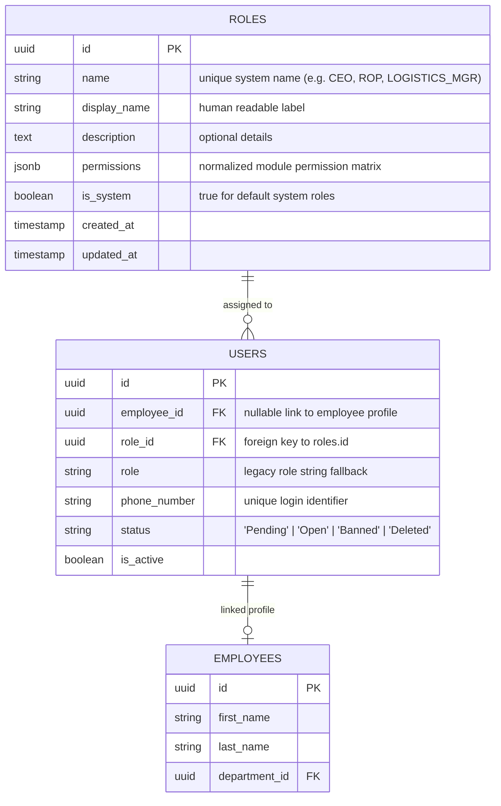

# Yaqeen Backend - Roles & Permissions (RBAC) API Documentation

This document provides complete, authoritative specifications for the **Roles & Permissions (Role-Based Access Control / RBAC) Module** in the **Yaqeen Backend**. It outlines the security architecture, system module taxonomy, permission enforcement guard, and full REST API reference for dynamic role management.

---

## 1. System Architecture & Entity Relationships

The Yaqeen Backend implements a flexible, database-backed **Dynamic Role-Based Access Control (RBAC)** architecture. Permissions are assigned to roles as structured JSON objects, and users are directly linked to roles via a foreign key (`users.role_id -> roles.id`).

### Entity Relationship Diagram (ERD)



### Database Schema (`roles` table)

| Field          | Type           | Modifiers                                 | Description                                                                       |
| :------------- | :------------- | :---------------------------------------- | :-------------------------------------------------------------------------------- |
| `id`           | `uuid`         | Primary Key, default `uuid_generate_v4()` | Unique identifier for the role.                                                   |
| `name`         | `varchar(100)` | Unique, Not Null                          | System machine name (e.g. `'CEO'`, `'ROP'`, `'EMPLOYEE'`, `'LOGISTICS_MANAGER'`). |
| `display_name` | `varchar(100)` | Not Null                                  | Human-readable title displayed in frontend forms and tables.                      |
| `description`  | `text`         | Nullable                                  | Description of responsibilities and scope of the role.                            |
| `permissions`  | `jsonb`        | Not Null, default `{}`                    | Key-value store of module-level CRUD permissions.                                 |
| `is_system`    | `boolean`      | Not Null, default `false`                 | Indicates immutable built-in system roles (`CEO`, `ROP`, `EMPLOYEE`).             |
| `created_at`   | `timestamp`    | Default `NOW()`                           | Record creation timestamp.                                                        |
| `updated_at`   | `timestamp`    | Default `NOW()`                           | Record last modification timestamp.                                               |

---

## 2. System Modules Taxonomy & Permission Definition

Permissions in the Yaqeen Backend are structured around **10 core system modules**. Every module supports up to 4 granular CRUD action flags: `create`, `read`, `update`, and `delete`.

### Available System Modules (`GET /roles/modules`)

| Module Key             | Label                         | Scope & Description                                                                   |
| :--------------------- | :---------------------------- | :------------------------------------------------------------------------------------ |
| `clients`              | Clients Management            | Access to client catalog, company profiles, contacts, and client tags.                |
| `employees`            | Employee Management           | Access to employee profiles, salary details, onboarding, and profile pictures.        |
| `departments`          | Department Management         | Access to organizational department listings, creation, and department edits.         |
| `cargo_kpi`            | Cargo KPI                     | Access to cargo transaction records, shipments, metrics, and KPI target calculations. |
| `cargo_registrations`  | Cargo Registrations           | Access to client cargo loads, price currencies, and registering cargo.                |
| `cargo_consolidations` | Cargo Consolidations & Trucks | Access to truck trips, groupage capacity planning, assigning cargos, and tracking.    |
| `finance`              | Finance & Expenses            | Access to financial expense logs, income/expense reports, and ledger entries.         |
| `commercial_offers`    | Commercial Offers             | Access to commercial offer generation, price quotes, PDFs, and client proposals.      |
| `tasks`                | Kanban Tasks & Board          | Access to workspace task boards, columns, cards, task status, and comments.           |
| `currency`             | Currency Rates                | Access to exchange rate configurations and Central Bank sync settings.                |
| `attachments`          | Attachments & Documents       | Access to uploading, viewing presigned URLs, and deleting MinIO document files.       |
| `roles`                | Role & Permissions Management | Access to creating, viewing, updating, and deleting custom roles and permissions.     |

### CRUD Action Definitions

Each action flag inside a module object represents an explicit authorization rule:

- **`create` (`boolean`)**: Grants permission to add new records in the module (e.g., POST endpoints).
- **`read` / `view` (`boolean`)**: Grants permission to view listings, search, and retrieve details of existing records (e.g., GET endpoints).
- **`update` (`boolean`)**: Grants permission to edit or modify existing records (e.g., PUT / PATCH endpoints).
- **`delete` (`boolean`)**: Grants permission to permanently delete or soft-archive records (e.g., DELETE endpoints).
- **`assign_cargo` (`boolean`)**: Special permission in `cargo_consolidations` to batch assign/remove cargo registrations to/from trucks.
- **`register_for_everyone` (`boolean`)**: Special permission in `cargo_registrations` allowing users to register cargos under other employees.
- **`can_work_with_all_clients` (`boolean`)**: Special permission in `clients` allowing users to view and work with all clients.

---

## 3. Built-in System Roles & Default Permission Matrix

The system seeds 3 built-in **System Roles** (`is_system: true`). System roles cannot be deleted, and their machine `name` cannot be altered.

```json
{
  "create": true,
  "read": true,
  "update": true,
  "delete": true
}
```

### System Role Permission Matrix

| Module Key                 | Action                                                   |   CEO (Chief Executive Officer)   |      ROP (Head of Sales / Ops)       |       EMPLOYEE (Standard Staff)       |
| :------------------------- | :------------------------------------------------------- | :-------------------------------: | :----------------------------------: | :-----------------------------------: |
| **`clients`**              | `create` / `read` / `update` / `delete`                  | `true` / `true` / `true` / `true` |  `true` / `true` / `true` / `true`   |  `false` / `true` / `true` / `false`  |
| **`employees`**            | `create` / `read` / `update` / `delete`                  | `true` / `true` / `true` / `true` | `false` / `true` / `true` / `false`  | `false` / `true` / `false` / `false`  |
| **`departments`**          | `create` / `read` / `update` / `delete`                  | `true` / `true` / `true` / `true` | `false` / `true` / `false` / `false` | `false` / `true` / `false` / `false`  |
| **`cargo_kpi`**            | `create` / `read` / `update` / `delete`                  | `true` / `true` / `true` / `true` |  `true` / `true` / `true` / `true`   | `false` / `true` / `false` / `false`  |
| **`cargo_registrations`**  | `create` / `read` / `update` / `delete`                  | `true` / `true` / `true` / `true` |  `true` / `true` / `true` / `true`   |  `true` / `true` / `true` / `false`   |
| **`cargo_consolidations`** | `create` / `read` / `update` / `delete` / `assign_cargo` | `true` / `true` / `true` / `true` |  `true` / `true` / `true` / `true`   |  `true` / `true` / `true` / `false`   |
| **`finance`**              | `create` / `read` / `update` / `delete`                  | `true` / `true` / `true` / `true` | `false` / `true` / `false` / `false` | `false` / `false` / `false` / `false` |
| **`commercial_offers`**    | `create` / `read` / `update` / `delete`                  | `true` / `true` / `true` / `true` |  `true` / `true` / `true` / `true`   |  `true` / `true` / `false` / `false`  |
| **`tasks`**                | `create` / `read` / `update` / `delete`                  | `true` / `true` / `true` / `true` |  `true` / `true` / `true` / `true`   |  `true` / `true` / `true` / `false`   |
| **`currency`**             | `create` / `read` / `update` / `delete`                  | `true` / `true` / `true` / `true` | `false` / `true` / `false` / `false` | `false` / `true` / `false` / `false`  |
| **`attachments`**          | `create` / `read` / `update` / `delete`                  | `true` / `true` / `true` / `true` |  `true` / `true` / `true` / `true`   |  `true` / `true` / `false` / `false`  |
| **`roles`**                | `create` / `read` / `update` / `delete`                  | `true` / `true` / `true` / `true` | `false` / `true` / `false` / `false` | `false` / `false` / `false` / `false` |

> [!NOTE]
> The **CEO** role possesses administrative superuser privileges: the backend's `PermissionsGuard` automatically bypasses all individual permission checks for users with `role: 'CEO'` or `role_name: 'CEO'`.

---

## 4. Permission Enforcement & Guard Logic

Endpoints requiring specific permissions are protected with NestJS metadata decorators:

```typescript
@UseGuards(JwtAuthGuard, PermissionsGuard)
@RequirePermission('roles', 'read')
@Get('roles')
export class RolesController { ... }
```

### Resolution Order of `PermissionsGuard`

1. **Authentication Check:** Validates that `req.user` contains a valid user payload and UUID.
2. **Database Role Lookup:** Queries `users` joined with `roles` using `user.id`.
3. **Superuser Bypass:** If user's role is `'CEO'`, access is granted immediately (`return true`).
4. **Permissions Evaluation:** Extracts the JSON `permissions` object from the linked role.
   - _Fallback 1:_ If `role_id` is null, searches `roles` by matching legacy `user.role` string.
   - _Fallback 2:_ If no database role matches, uses default hardcoded `DEFAULT_SYSTEM_PERMISSIONS`.
5. **Action Verification:** Checks whether `permissions[module][action] === true`. If `false`, throws `403 ForbiddenException` (`location: "insufficient_permissions"`).

---

## 5. Security Exceptions & Error Registry

| Location Key                    | HTTP Code          | Cause / Description                                                                      |
| :------------------------------ | :----------------- | :--------------------------------------------------------------------------------------- |
| `auth_header_missing`           | `401 Unauthorized` | Bearer Authorization header was omitted.                                                 |
| `invalid_token`                 | `401 Unauthorized` | JWT signature is invalid or token has expired.                                           |
| `user_missing`                  | `403 Forbidden`    | User identity is missing from request execution context.                                 |
| `invalid_user_id`               | `403 Forbidden`    | Authenticated user ID is not a valid UUID format.                                        |
| `user_not_found`                | `403 Forbidden`    | Authenticated user record does not exist in database.                                    |
| `insufficient_permissions`      | `403 Forbidden`    | User's role lacks the required `module:action` permission.                               |
| `role_not_found`                | `404 Not Found`    | Target role ID could not be found.                                                       |
| `role_name_exists`              | `400 Bad Request`  | Role name already exists in database (names are case-insensitive unique).                |
| `system_role_rename_prohibited` | `400 Bad Request`  | Attempted to change the `name` of a built-in system role (`CEO`, `ROP`, `EMPLOYEE`).     |
| `system_role_delete_prohibited` | `400 Bad Request`  | Attempted to delete a built-in system role.                                              |
| `role_has_assigned_users`       | `400 Bad Request`  | Attempted to delete a role that currently has assigned user accounts (`user_count > 0`). |

---

## 6. REST API Endpoints Specification

### Base Route: `/roles`

All endpoints require a valid Bearer JWT header: `Authorization: Bearer <access_token>`

---

### 6.1. Get System Modules Taxonomy

Retrieves the available system modules taxonomy to allow frontend clients to dynamically render permission matrix form controls.

- **Route:** `/roles/modules`
- **Method:** `GET`
- **Access:** `Private` (Requires `roles:read` permission)
- **Success HTTP Status:** `200 OK`

#### Success Response Example

```json
[
  {
    "module": "clients",
    "label": "Clients Management",
    "actions": ["create", "read", "update", "delete"]
  },
  {
    "module": "employees",
    "label": "Employee Management",
    "actions": ["create", "read", "update", "delete"]
  },
  {
    "module": "departments",
    "label": "Department Management",
    "actions": ["create", "read", "update", "delete"]
  },
  {
    "module": "cargo_kpi",
    "label": "Cargo KPI",
    "actions": ["create", "read", "update", "delete"]
  },
  {
    "module": "finance",
    "label": "Finance & Expenses",
    "actions": ["create", "read", "update", "delete"]
  },
  {
    "module": "commercial_offers",
    "label": "Commercial Offers",
    "actions": ["create", "read", "update", "delete"]
  },
  {
    "module": "tasks",
    "label": "Kanban Tasks & Board",
    "actions": ["create", "read", "update", "delete"]
  },
  {
    "module": "currency",
    "label": "Currency Rates",
    "actions": ["create", "read", "update", "delete"]
  },
  {
    "module": "attachments",
    "label": "Attachments & Documents",
    "actions": ["create", "read", "update", "delete"]
  },
  {
    "module": "roles",
    "label": "Role & Permissions Management",
    "actions": ["create", "read", "update", "delete"]
  }
]
```

---

### 6.2. List All Roles

Retrieves all roles configured in the system (both system and custom roles), including normalized permission matrices and the count of assigned active users.

- **Route:** `/roles`
- **Method:** `GET`
- **Access:** `Private` (Requires `roles:read` permission)
- **Success HTTP Status:** `200 OK`

#### Success Response Example

```json
[
  {
    "id": "e0b1c2d3-4567-89ab-cdef-0123456789ab",
    "name": "CEO",
    "display_name": "Chief Executive Officer",
    "description": "Full administrative access to all modules and system settings",
    "permissions": {
      "clients": {
        "create": true,
        "read": true,
        "update": true,
        "delete": true
      },
      "employees": {
        "create": true,
        "read": true,
        "update": true,
        "delete": true
      },
      "departments": {
        "create": true,
        "read": true,
        "update": true,
        "delete": true
      },
      "cargo_kpi": {
        "create": true,
        "read": true,
        "update": true,
        "delete": true
      },
      "finance": {
        "create": true,
        "read": true,
        "update": true,
        "delete": true
      },
      "commercial_offers": {
        "create": true,
        "read": true,
        "update": true,
        "delete": true
      },
      "tasks": { "create": true, "read": true, "update": true, "delete": true },
      "currency": {
        "create": true,
        "read": true,
        "update": true,
        "delete": true
      },
      "attachments": {
        "create": true,
        "read": true,
        "update": true,
        "delete": true
      },
      "roles": { "create": true, "read": true, "update": true, "delete": true }
    },
    "is_system": true,
    "user_count": 1,
    "created_at": "2026-07-23T12:00:00.000Z",
    "updated_at": "2026-07-23T12:00:00.000Z"
  },
  {
    "id": "a9b8c7d6-5432-10fe-dcba-9876543210fe",
    "name": "LOGISTICS_MANAGER",
    "display_name": "Logistics & Cargo Manager",
    "description": "Custom role for cargo operations team leads",
    "permissions": {
      "clients": {
        "create": false,
        "read": true,
        "update": true,
        "delete": false
      },
      "employees": {
        "create": false,
        "read": true,
        "update": false,
        "delete": false
      },
      "departments": {
        "create": false,
        "read": true,
        "update": false,
        "delete": false
      },
      "cargo_kpi": {
        "create": true,
        "read": true,
        "update": true,
        "delete": true
      },
      "finance": {
        "create": false,
        "read": false,
        "update": false,
        "delete": false
      },
      "commercial_offers": {
        "create": true,
        "read": true,
        "update": true,
        "delete": false
      },
      "tasks": { "create": true, "read": true, "update": true, "delete": true },
      "currency": {
        "create": false,
        "read": true,
        "update": false,
        "delete": false
      },
      "attachments": {
        "create": true,
        "read": true,
        "update": true,
        "delete": false
      },
      "roles": {
        "create": false,
        "read": false,
        "update": false,
        "delete": false
      }
    },
    "is_system": false,
    "user_count": 3,
    "created_at": "2026-07-23T12:15:00.000Z",
    "updated_at": "2026-07-23T12:15:00.000Z"
  }
]
```

---

### 6.3. Get Single Role Details

Retrieves details and permission matrix for a specific role by UUID.

- **Route:** `/roles/:id`
- **Method:** `GET`
- **Access:** `Private` (Requires `roles:read` permission)
- **URL Parameters:** `id` (UUID, required)
- **Success HTTP Status:** `200 OK`

#### Success Response Example

```json
{
  "id": "a9b8c7d6-5432-10fe-dcba-9876543210fe",
  "name": "LOGISTICS_MANAGER",
  "display_name": "Logistics & Cargo Manager",
  "description": "Custom role for cargo operations team leads",
  "permissions": {
    "clients": {
      "create": false,
      "read": true,
      "update": true,
      "delete": false
    },
    "employees": {
      "create": false,
      "read": true,
      "update": false,
      "delete": false
    },
    "departments": {
      "create": false,
      "read": true,
      "update": false,
      "delete": false
    },
    "cargo_kpi": {
      "create": true,
      "read": true,
      "update": true,
      "delete": true
    },
    "finance": {
      "create": false,
      "read": false,
      "update": false,
      "delete": false
    },
    "commercial_offers": {
      "create": true,
      "read": true,
      "update": true,
      "delete": false
    },
    "tasks": { "create": true, "read": true, "update": true, "delete": true },
    "currency": {
      "create": false,
      "read": true,
      "update": false,
      "delete": false
    },
    "attachments": {
      "create": true,
      "read": true,
      "update": true,
      "delete": false
    },
    "roles": {
      "create": false,
      "read": false,
      "update": false,
      "delete": false
    }
  },
  "is_system": false,
  "user_count": 3,
  "created_at": "2026-07-23T12:15:00.000Z",
  "updated_at": "2026-07-23T12:15:00.000Z"
}
```

---

### 6.4. Create Custom Role

Creates a new custom role with custom module permissions.

- **Route:** `/roles`
- **Method:** `POST`
- **Access:** `Private` (Requires `roles:create` permission)
- **Content-Type:** `application/json`
- **Success HTTP Status:** `201 Created`

#### Request Body (`CreateRoleDto`)

```json
{
  "name": "FINANCE_AUDITOR",
  "display_name": "Finance & Audit Specialist",
  "description": "Read-only access to finance, currency, and reporting modules",
  "permissions": {
    "finance": {
      "create": false,
      "read": true,
      "update": false,
      "delete": false
    },
    "currency": {
      "create": false,
      "read": true,
      "update": false,
      "delete": false
    },
    "clients": {
      "create": false,
      "read": true,
      "update": false,
      "delete": false
    },
    "cargo_kpi": {
      "create": false,
      "read": true,
      "update": false,
      "delete": false
    }
  }
}
```

#### Validation Rules (`CreateRoleDto`)

- `name` (string, required): 2-100 characters. Pattern: `/^[A-Za-z0-9_\-\s]+$/`. Must be unique across all roles.
- `display_name` (string, required): 2-100 characters.
- `description` (string, optional): Additional text notes.
- `permissions` (object, required): Object containing module permission objects. Missing modules default all action flags to `false`.

#### Success Response Example

```json
{
  "id": "f1e2d3c4-b5a6-9788-7766-554433221100",
  "name": "FINANCE_AUDITOR",
  "display_name": "Finance & Audit Specialist",
  "description": "Read-only access to finance, currency, and reporting modules",
  "is_system": false,
  "user_count": 0,
  "permissions": {
    "clients": {
      "create": false,
      "read": true,
      "update": false,
      "delete": false
    },
    "employees": {
      "create": false,
      "read": false,
      "update": false,
      "delete": false
    },
    "departments": {
      "create": false,
      "read": false,
      "update": false,
      "delete": false
    },
    "cargo_kpi": {
      "create": false,
      "read": true,
      "update": false,
      "delete": false
    },
    "finance": {
      "create": false,
      "read": true,
      "update": false,
      "delete": false
    },
    "commercial_offers": {
      "create": false,
      "read": false,
      "update": false,
      "delete": false
    },
    "tasks": {
      "create": false,
      "read": false,
      "update": false,
      "delete": false
    },
    "currency": {
      "create": false,
      "read": true,
      "update": false,
      "delete": false
    },
    "attachments": {
      "create": false,
      "read": false,
      "update": false,
      "delete": false
    },
    "roles": {
      "create": false,
      "read": false,
      "update": false,
      "delete": false
    }
  },
  "created_at": "2026-07-23T12:20:00.000Z",
  "updated_at": "2026-07-23T12:20:00.000Z"
}
```

---

### 6.5. Update Role

Modifies an existing role's display name, description, or permission matrix.

- **Route:** `/roles/:id`
- **Method:** `PUT`
- **Access:** `Private` (Requires `roles:update` permission)
- **URL Parameters:** `id` (UUID, required)
- **Content-Type:** `application/json`
- **Success HTTP Status:** `200 OK`

#### Request Body (`UpdateRoleDto`)

```json
{
  "display_name": "Senior Operations & Sales ROP",
  "description": "Updated department head role permissions",
  "permissions": {
    "finance": {
      "create": false,
      "read": true,
      "update": true,
      "delete": false
    }
  }
}
```

#### Validation Rules & Constraints (`UpdateRoleDto`)

- `name` (string, optional): Renaming system roles (`is_system: true`) is prohibited and throws `400 Bad Request` (`location: "system_role_rename_prohibited"`).
- `display_name` (string, optional): 2-100 characters.
- `description` (string, optional): Text notes.
- `permissions` (object, optional): Partial updates merge into existing role permissions.

---

### 6.6. Delete Custom Role

Deletes a custom role from the database.

- **Route:** `/roles/:id`
- **Method:** `DELETE`
- **Access:** `Private` (Requires `roles:delete` permission)
- **URL Parameters:** `id` (UUID, required)
- **Success HTTP Status:** `244 No Content` (Returns `204 OK` with empty body)

#### Deletion Safety Rules

1. **System Protection:** Attempting to delete a built-in system role (`is_system: true`) returns `400 Bad Request` (`location: "system_role_delete_prohibited"`).
2. **Assigned Users Guard:** Attempting to delete a role assigned to active user accounts returns `400 Bad Request` (`location: "role_has_assigned_users"`). Reassign users before deletion.

---

## 7. Frontend Integration Recommendations

1. **Fetching User Permissions on Login:**
   Call `GET /employees/me` immediately upon successful authentication. Store `response.permissions` or `response.user.permissions` in client state (e.g. Pinia, Redux, Zustand).
2. **Rendering Dynamic UI Controls:**
   Use permission flags to render actions safely:
   ```javascript
   const canCreateClient = userPermissions?.clients?.create;
   const canDeleteClient = userPermissions?.clients?.delete;
   ```
3. **Building Role Management Matrix:**
   Fetch `GET /roles/modules` when mounting the Role Management admin page to generate a dynamic table with checkboxes for all 10 system modules across `[create, read, update, delete]`.
