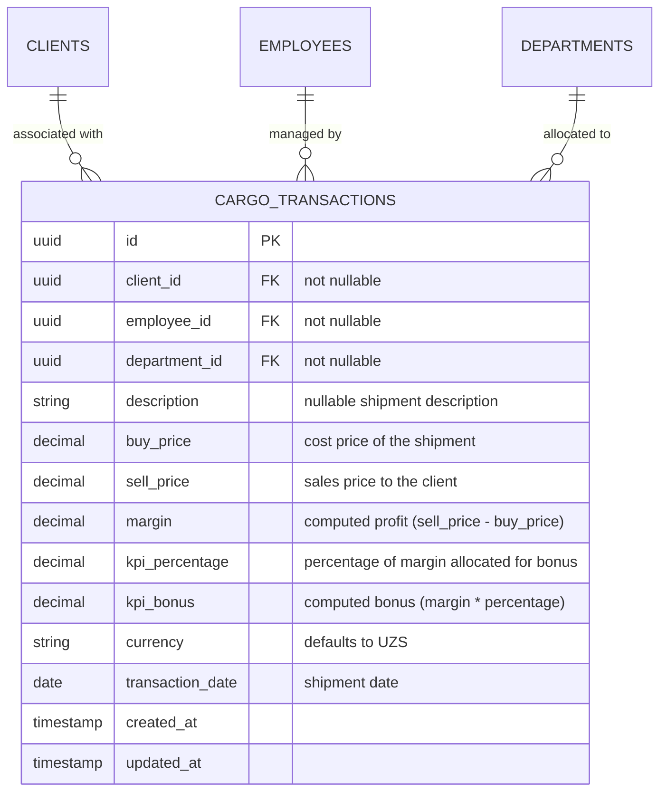

# Yaqeen Backend - Shipments (Cargo Transactions) API Documentation

This document provides complete, detailed, and professional specifications of the **Shipments API** (managed under the `cargo_transactions` ledger) for the **Yaqeen Backend**. It outlines the core architectural changes, database schemas, RBAC access controls, business logic algorithms, and endpoint details.

---

## 1. Architectural Overview & Conceptual Design

In the Yaqeen system, shipments are represented as cargo transactions. Previously, client details in shipments were entered as free-text strings. To prevent data inconsistency and support automated reporting, client and shipment records are now directly connected.

The system utilizes the client's unique UUID (`client_id`) as a foreign key on the shipment record. All user-facing details (such as client name, client company) are resolved dynamically at query time using standard relational database joins, ensuring a single source of truth.



---

## 2. Access Control & RBAC Permissions

Shipment endpoints are protected by the `JwtAuthGuard` and `RolesGuard`. The permission identifier for shipments is `cargo_kpi`.

| Role         | Permissions                  | Description                                                                       |
| :----------- | :--------------------------- | :-------------------------------------------------------------------------------- |
| **CEO**      | Create, Read, Update, Delete | Full administrative access to shipment ledgers and financial performance metrics. |
| **ROP**      | Create, Read, Update, Delete | Complete operational control for their departments and sales teams.               |
| **EMPLOYEE** | Read                         | View access to search and check shipment performance histories.                   |

---

## 3. Database Schema Specification

### Table name: `cargo_transactions`

| Column             | Data Type       | Constraints                                                             | Description                                                                                   |
| :----------------- | :-------------- | :---------------------------------------------------------------------- | :-------------------------------------------------------------------------------------------- |
| `id`               | `uuid`          | Primary Key, Default: `uuid_generate_v4()`                              | Unique transaction identifier                                                                 |
| `client_id`        | `uuid`          | Foreign Key (`clients.id`), `notNullable()`, `onDelete('RESTRICT')`     | Linked client record                                                                          |
| `employee_id`      | `uuid`          | Foreign Key (`employees.id`), `notNullable()`, `onDelete('RESTRICT')`   | Linked employee record                                                                        |
| `department_id`    | `uuid`          | Foreign Key (`departments.id`), `notNullable()`, `onDelete('RESTRICT')` | Linked department record                                                                      |
| `description`      | `text`          | Nullable                                                                | Brief note/description of the cargo shipment                                                  |
| `buy_price`        | `decimal(12,2)` | Default: `0.00`, Not Nullable                                           | Supplier cost in transaction currency                                                         |
| `sell_price`       | `decimal(12,2)` | Default: `0.00`, Not Nullable                                           | Customer sales price in transaction currency                                                  |
| `margin`           | `decimal(12,2)` | Default: `0.00`, Not Nullable                                           | Calculated gross margin: `sell_price - buy_price`                                             |
| `kpi_percentage`   | `decimal(5,2)`  | Default: `0.00`, Not Nullable                                           | KPI percentage rate for the department                                                        |
| `kpi_bonus`        | `decimal(12,2)` | Default: `0.00`, Not Nullable                                           | Calculated employee bonus: `margin * kpi_percentage`                                          |
| `currency`         | `string(3)`     | Default: `'UZS'`, Not Nullable                                          | ISO currency code (`UZS`, `USD`, `RUB`, `RMB`, `CNY`)                                         |
| `status`           | `string(50)`    | Default: `'Waiting'`, Not Nullable                                      | Shipment status stage: `'Waiting'`, `'In Transit'`, `'Border'`, `'At Station'`, `'Delivered'` |
| `transaction_date` | `date`          | Not Nullable                                                            | Ledger transaction date                                                                       |
| `created_at`       | `timestamp`     | Default: `now()`                                                        | Audit timestamp                                                                               |
| `updated_at`       | `timestamp`     | Default: `now()`                                                        | Audit timestamp                                                                               |

---

## 4. Business Logic Rules & Calculations

1. **Client Reference Integrity**:
   - The database prevents orphaned shipments by enforcing a `RESTRICT` policy on deletions. You cannot delete a `client` that has associated `cargo_transactions`.
2. **Gross Margin Calculation**:
   - Gross margin is automatically calculated: `margin = sell_price - buy_price`.
   - Margin is allowed to be negative if a shipment is sold at a loss.
3. **KPI Bonus Allocation**:
   - KPI bonus is calculated automatically based on the department of the shipment: `kpi_bonus = margin * (kpi_percentage / 100)`.
   - The `kpi_percentage` is determined based on the target department:
     - Department `sborniy`: **10%**
     - Department `sales`: **10%**
     - Other departments: **0%** (unless custom configured)
4. **Shipment Status Transition Lifecycle**:
   - Every shipment record undergoes standard status transitions tracked via the `status` field.
   - Initial default stage on creation is `'Waiting'`.
   - Allowed status stage values are strictly validated: `'Waiting'`, `'In Transit'`, `'Border'`, `'At Station'`, and `'Delivered'`.

---

## 5. REST API Endpoint Specifications

---

### 5.1. Create Shipment (Log Cargo Transaction)

Registers a new cargo shipment transaction under the specified employee, department, and client.

- **Endpoint:** `POST /cargo-kpi/transactions`
- **Guards:** `JwtAuthGuard`, `RolesGuard`
- **Allowed Roles:** `CEO`, `ROP`

#### Request Body (JSON)

```json
{
  "employee_id": "caefa548-bb21-48cf-8332-7371c1aae407",
  "department_id": "a3b1c2d4-e5f6-7890-abcd-ef1234567890",
  "client_id": "8a32d184-e421-4f9e-bf41-b4ef213a80ef",
  "description": "Premium Electronics Import #994",
  "buy_price": 3000,
  "sell_price": 5000,
  "currency": "USD",
  "transaction_date": "2026-07-26"
}
```

#### Success Response (201 Created)

```json
{
  "id": "27c1a84f-e28a-4d2c-80bf-c53ae8910bcf",
  "employee_id": "caefa548-bb21-48cf-8332-7371c1aae407",
  "employee_name": "Jasur Yoldoshev",
  "department_id": "a3b1c2d4-e5f6-7890-abcd-ef1234567890",
  "department_name": "sales",
  "client_id": "8a32d184-e421-4f9e-bf41-b4ef213a80ef",
  "client_name": "Shaxzod Rashiov",
  "client_company": "Yaqeen LLC",
  "description": "Premium Electronics Import #994",
  "buy_price": 3000,
  "sell_price": 5000,
  "margin": 2000,
  "kpi_percentage": 10,
  "kpi_bonus": 200,
  "currency": "USD",
  "transaction_date": "2026-07-26T00:00:00.000Z",
  "created_at": "2026-07-26T08:50:00.000Z"
}
```

---

### 5.2. List Shipments

Retrieves a paginated list of shipments, sorted by transaction date in descending order. Supports filtering by employee, department, and date ranges.

- **Endpoint:** `GET /cargo-kpi/transactions`
- **Guards:** `JwtAuthGuard`, `RolesGuard`
- **Allowed Roles:** `CEO`, `ROP`, `EMPLOYEE`

#### Query Parameters

- `employee_id` (UUID, Optional) - Filter by employee
- `department_id` (UUID, Optional) - Filter by department
- `start_date` (YYYY-MM-DD, Optional) - Filter by start date inclusive
- `end_date` (YYYY-MM-DD, Optional) - Filter by end date inclusive
- `page` (number, Optional, Default: 1)
- `limit` (number, Optional, Default: 20)

#### Success Response (200 OK)

```json
{
  "data": [
    {
      "id": "27c1a84f-e28a-4d2c-80bf-c53ae8910bcf",
      "employee_id": "caefa548-bb21-48cf-8332-7371c1aae407",
      "employee_name": "Jasur Yoldoshev",
      "department_id": "a3b1c2d4-e5f6-7890-abcd-ef1234567890",
      "department_name": "sales",
      "client_id": "8a32d184-e421-4f9e-bf41-b4ef213a80ef",
      "client_name": "Shaxzod Rashiov",
      "client_company": "Yaqeen LLC",
      "description": "Premium Electronics Import #994",
      "buy_price": 3000,
      "sell_price": 5000,
      "margin": 2000,
      "kpi_percentage": 10,
      "kpi_bonus": 200,
      "currency": "USD",
      "transaction_date": "2026-07-26T00:00:00.000Z",
      "created_at": "2026-07-26T08:50:00.000Z"
    }
  ],
  "pagination": {
    "total": 1,
    "page": 1,
    "limit": 20,
    "totalPages": 1
  }
}
```

---

### 5.3. Get Shipment by ID

Retrieves details of a single shipment.

- **Endpoint:** `GET /cargo-kpi/transactions/:id`
- **Guards:** `JwtAuthGuard`, `RolesGuard`
- **Allowed Roles:** `CEO`, `ROP`, `EMPLOYEE`

---

### 5.4. Update Shipment

Updates shipment fields dynamically. Recalculates `margin` and `kpi_bonus` automatically if prices or departments are updated.

- **Endpoint:** `PUT /cargo-kpi/transactions/:id`
- **Guards:** `JwtAuthGuard`, `RolesGuard`
- **Allowed Roles:** `CEO`, `ROP`

---

### 5.5. Update Shipment Status Stage

Updates the current logistics lifecycle status stage of a specific cargo shipment transaction.

- **Endpoint:** `PUT /cargo-kpi/transactions/:id`
- **Guards:** `JwtAuthGuard`, `RolesGuard`
- **Allowed Roles:** `CEO`, `ROP`

#### Request Body (JSON)

```json
{
  "status": "In Transit"
}
```

#### Allowed Status Values

- `"Waiting"`
- `"In Transit"`
- `"Border"`
- `"At Station"`
- `"Delivered"`

#### Success Response (200 OK)

```json
{
  "id": "27c1a84f-e28a-4d2c-80bf-c53ae8910bcf",
  "client_id": "8a32d184-e421-4f9e-bf41-b4ef213a80ef",
  "status": "In Transit",
  "updated_at": "2026-07-27T00:52:00.000Z"
}
```

---

### 5.6. Delete Shipment

Removes a shipment record from the database.

- **Endpoint:** `DELETE /cargo-kpi/transactions/:id`
- **Guards:** `JwtAuthGuard`, `RolesGuard`
- **Allowed Roles:** `CEO`, `ROP`
- **Success Response:** `204 No Content`

---

## 6. Error Codes & Trouble Resolution

The following business error keys are returned in the response body payload (under `location` and `message` key properties) during failures:

| HTTP Status         | Error Key / Location         | Scenario                                                                                                  |
| :------------------ | :--------------------------- | :-------------------------------------------------------------------------------------------------------- |
| **404 Not Found**   | `client_not_found`           | The provided `client_id` UUID does not reference any existing client.                                     |
| **404 Not Found**   | `employee_not_found`         | The provided `employee_id` UUID does not reference any existing employee.                                 |
| **404 Not Found**   | `department_not_found`       | The provided `department_id` UUID does not reference any existing department.                             |
| **404 Not Found**   | `transaction_not_found`      | The target shipment transaction record does not exist.                                                    |
| **400 Bad Request** | (Standard validation fields) | Invalid UUID format, negative pricing parameters, or invalid currency code (must be `UZS`, `USD`, `RUB`). |
